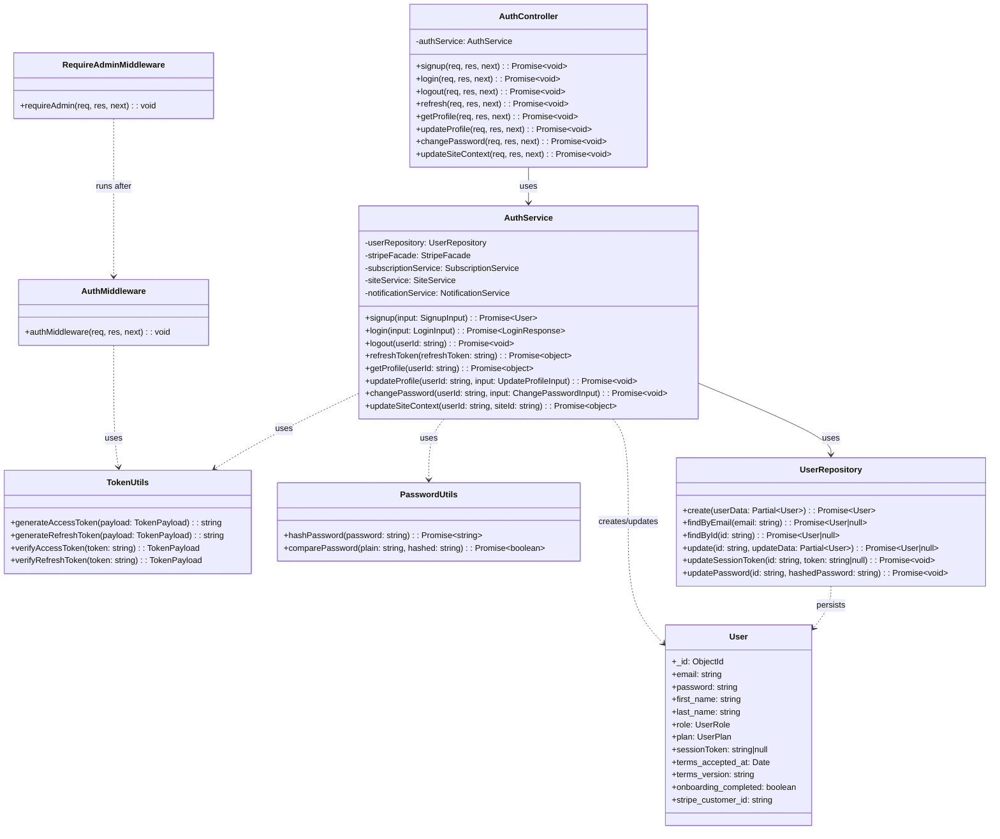
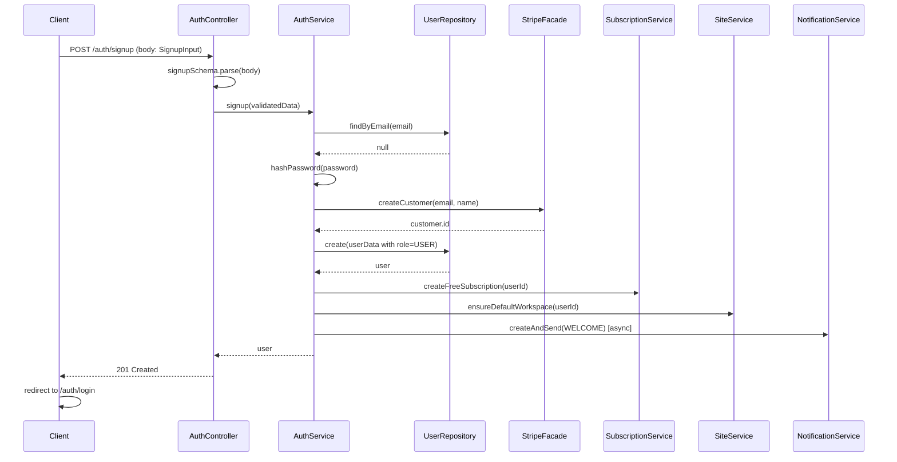

# PRD: Admin & Signup – Authentication (Full-Stack)

**Product Requirements Document**  
**Scope:** Authentication, signup, roles (User / Admin), and authorization  
**Status:** Current state documented  
**Last updated:** 2025-03

---

## 1. Purpose and scope

This document describes the **current** authentication and admin-signup behaviour of BlogForAll: use cases, functional and non-functional requirements, constraints, infrastructure, data model, code design (UML), endpoints, solution design, and full-stack implementation.

| In scope | Out of scope |
|----------|----------------|
| Signup (customer), login, logout, refresh, profile, change password, site context | OAuth / social login, SAML, Cognito/SSO |
| JWT-based session (access + refresh), session token in DB | Password reset flow (token fields exist, flow not implemented) |
| Terms acceptance at signup, welcome email | Marketing campaigns |
| User role (customer) vs Admin role (product owner) | Fine-grained RBAC beyond admin/user |
| Admin guard (frontend), requireAdmin (backend) | Default admin seed script (design only; implement per deploy) |

---

## 2. Use cases

| ID | Use case | Actor | Precondition | Flow | Postcondition |
|----|----------|--------|--------------|------|----------------|
| UC-1 | **Sign up** | Guest | Valid email, password ≥8 chars, T&C accepted | Submit signup form → backend creates user (role=USER), Stripe customer, free subscription, default workspace; enqueues welcome email → 201 → redirect to login | User exists; can log in |
| UC-2 | **Log in** | Guest | Account exists | Submit email/password → backend validates → returns access + refresh tokens, user payload, requiresSiteCreation if no sites → frontend stores tokens and user, redirects per onboarding/dashboard | Session established; JWT in header for API |
| UC-3 | **Log out** | Authenticated user | Valid access token | POST /auth/logout with Bearer → backend clears sessionToken → frontend clears store and storage | Session invalidated |
| UC-4 | **Refresh token** | Client (with refresh token) | Refresh token valid, matches DB sessionToken | POST /auth/refresh with refresh_token → new access token (and optionally refresh) | New access token for continued access |
| UC-5 | **Get profile** | Authenticated user | Valid access token | GET /auth/profile → backend returns user profile (id, email, name, plan, role) | Profile displayed |
| UC-6 | **Update profile** | Authenticated user | Valid access token | PUT /auth/profile with first_name, last_name, phone_number | Profile updated |
| UC-7 | **Change password** | Authenticated user | Valid access token, knows old password | PUT /auth/change-password with old_password, new_password → backend verifies, hashes new, updates | Password changed; session can be invalidated (optional) |
| UC-8 | **Update site context** | Authenticated user | Valid access token | PUT /auth/site-context with site_id → new access token with currentSiteId | Switched workspace in token |
| UC-9 | **Access admin-only resource** | Admin | role=admin in token | Request with Bearer → authMiddleware → requireAdmin → 403 if not admin | Admin routes protected |

**Obvious constraints**

- No separate “admin signup” flow: all signups create **USER**; admin is assigned via DB/seed or future bootstrap.
- Email unique; one account per email.
- Access token 15m; refresh 7d; refresh validated against DB sessionToken.
- Frontend uses same signup form for invite flow (invite token in sessionStorage/redirect preserved).

---

## 3. Functional requirements

| ID | Requirement | Implementation |
|----|-------------|----------------|
| FR-1 | User can sign up with email, password, name; must accept T&C | signupSchema: accept_terms literal true; terms_accepted_at, terms_version stored |
| FR-2 | User can log in with email and password | loginSchema; AuthService.login; returns tokens + user + requiresSiteCreation |
| FR-3 | User can log out | logout clears sessionToken; frontend clears auth store and storage |
| FR-4 | Client can refresh access token using refresh token | refresh endpoint; verify refresh JWT and DB sessionToken; issue new access token |
| FR-5 | User can read and update profile (name, phone) | GET/PUT /auth/profile; updateProfileSchema |
| FR-6 | User can change password (old + new) | PUT /auth/change-password; changePasswordSchema; bcrypt compare and hash |
| FR-7 | User can switch current workspace (site context) | PUT /auth/site-context; new JWT with currentSiteId |
| FR-8 | New signups receive welcome email (best-effort, non-blocking) | NotificationService.createAndSend(WELCOME) via queue after signup; setImmediate so signup does not wait |
| FR-9 | Role (user vs admin) is enforced on admin-only routes | requireAdmin middleware; role in JWT; frontend AdminGuard and useIsAdmin |

---

## 4. Non-functional requirements

| ID | NFR | Measure |
|----|-----|--------|
| NFR-1 | **Security** | Passwords bcrypt cost 10; secrets in env; Bearer only; HTTPS in production; generic “Invalid credentials” on login failure |
| NFR-2 | **Performance** | Login/signup minimal DB calls; role in JWT to avoid DB on every request; welcome email async (queue) |
| NFR-3 | **Reliability** | Signup succeeds even if Stripe/subscription/workspace/welcome email fail (log and continue); refresh validated against DB |
| NFR-4 | **Auditability** | Log signup, login success/failure, logout; no passwords or tokens in logs |
| NFR-5 | **Usability** | Clear validation errors (Zod); redirect after signup to login with message; first-time flow (requiresSiteCreation) to create workspace before invite |

---

## 5. Infrastructure and technology

### 5.1 How authentication fits in the system

- **No SSO/Cognito.** Authentication is **custom JWT-based** implemented in the backend.
- **Backend:** Node.js (Express), TypeScript, MongoDB (Mongoose), tsyringe (DI). Auth routes under `/api/v1/auth/*`.
- **Frontend:** Next.js (App Router), React, Zustand (persisted auth store), axios (API client with refresh interceptor).
- **External services used by auth:**  
  - **Stripe** – create customer on signup; subscription creation (free plan).  
  - **Brevo** – welcome email via Notification Service (Bull queue + Redis).  
  - **MongoDB** – User, sessionToken, subscriptions, sites.

### 5.2 High-level architecture

```
┌─────────────────────────────────────────────────────────────────────────────┐
│  Client (Next.js)                                                            │
│  /auth/signup, /auth/login → AuthService (axios) → Bearer token in header   │
│  Zustand (auth store) + persist; useAuth, useIsAdmin; AdminGuard             │
└─────────────────────────────────────────────────────────────────────────────┘
                                        │
                                        ▼
┌─────────────────────────────────────────────────────────────────────────────┐
│  API Gateway / Express (backend)                                             │
│  /api/v1/auth/*  → authRouter → AuthController                              │
│  authMiddleware (JWT verify, set req.user); requireAdmin (role === ADMIN)   │
└─────────────────────────────────────────────────────────────────────────────┘
                                        │
          ┌─────────────────────────────┼─────────────────────────────┐
          ▼                             ▼                             ▼
┌──────────────────┐    ┌──────────────────────┐    ┌────────────────────────┐
│  AuthService     │    │  UserRepository      │    │  NotificationService    │
│  signup, login, │    │  create, findByEmail │    │  createAndSend (WELCOME) │
│  refresh, etc.   │    │  findById, update,   │    │  (async queue)          │
│  + StripeFacade  │    │  updateSessionToken │    │  + SiteService          │
│  + Subscription  │    └──────────────────────┘    │  ensureDefaultWorkspace │
│  + SiteService   │                                 └────────────────────────┘
└──────────────────┘
          │
          ▼
┌──────────────────┐    ┌──────────────────────┐    ┌────────────────────────┐
│  password.ts     │    │  token.ts (JWT)       │    │  MongoDB (User, etc.)   │
│  bcrypt hash/    │    │  ACCESS_SECRET,      │    │  Redis (Bull queue)     │
│  compare         │    │  REFRESH_SECRET      │    │  Stripe API             │
└──────────────────┘    └──────────────────────┘    └────────────────────────┘
```

### 5.3 Technology summary

| Layer | Technology |
|--------|------------|
| Auth identity/session | Custom JWT (jsonwebtoken); no Cognito, no SAML, no OAuth for login |
| Password hashing | bcrypt, 10 rounds |
| Backend runtime | Node.js, Express, TypeScript |
| Database | MongoDB (Mongoose) – User, Subscription, Site, etc. |
| Queue | Bull + Redis – welcome email job |
| Payments | Stripe – customer + subscription on signup |
| Email | Brevo – transactional (welcome) via notification module |
| Frontend auth state | Zustand with persist (localStorage); cookie auth-token for middleware |

---

## 6. Data model

### 6.1 User (Mongoose)

| Field | Type | Required | Default | Notes |
|-------|------|----------|---------|-------|
| _id | ObjectId | yes | - | |
| email | string | yes | - | unique, lowercase |
| password | string | yes | - | bcrypt hash |
| first_name | string | yes | - | |
| last_name | string | yes | - | |
| phone_number | string | no | - | |
| role | enum | yes | USER | USER \| ADMIN |
| plan | enum | yes | FREE | UserPlan |
| sessionToken | string | no | null | current refresh token for validation |
| resetPasswordToken | string | no | - | (reset flow not implemented) |
| resetPasswordExpires | Date | no | - | |
| apiKeys | array | - | [] | { name, accessKeyId, hashedSecret, ... } |
| stripe_customer_id | string | no | - | |
| onboarding_completed | boolean | yes | false | |
| terms_accepted_at | Date | no | - | Set at signup |
| terms_version | string | no | - | e.g. "2025-01" |
| created_at | Date | yes | Date.now | |
| updated_at | Date | yes | Date.now | |

### 6.2 Signup request (API body)

| Field | Type | Required | Validation |
|-------|------|----------|------------|
| email | string | yes | valid email |
| password | string | yes | min 8 |
| first_name | string | yes | min 1 |
| last_name | string | yes | min 1 |
| phone_number | string | no | - |
| accept_terms | boolean | yes | must be true |
| terms_version | string | no | - |

### 6.3 Token payload (JWT)

| Claim | Description |
|-------|-------------|
| userId | User _id string |
| email | User email |
| currentSiteId | Active workspace/site id (optional) |
| role | "user" \| "admin" (optional; used by requireAdmin) |

---

## 7. Code design – UML

### 7.1 Auth module class diagram



### 7.2 Sequence – Signup



### 7.3 Sequence – Login (with role in token)

```mermaid
sequenceDiagram
    participant C as Client
    participant AC as AuthController
    participant AS as AuthService
    participant UR as UserRepository
    participant Site as SiteService
    participant Token as TokenUtils

    C->>AC: POST /auth/login (email, password)
    AC->>AS: login(validatedData)
    AS->>UR: findByEmail(email)
    UR-->>AS: user
    AS->>AS: comparePassword(password, user.password)
    AS->>Site: getSitesByUser(userId)
    Site-->>AS: sites[]
    AS->>Token: generateAccessToken({ userId, email, currentSiteId, role })
    AS->>Token: generateRefreshToken(same payload)
    AS->>UR: updateSessionToken(userId, refreshToken)
    AS-->>AC: LoginResponse (tokens, user, requiresSiteCreation)
    AC-->>C: 200 { data: LoginResponse }
    C->>C: setTokens, setUser; redirect (onboarding or dashboard)
```

---

## 8. Endpoints

Base path: **/api/v1** (e.g. POST /api/v1/auth/signup).

| Method | Path | Auth | Body / response | Purpose |
|--------|------|------|-----------------|---------|
| POST | /auth/signup | No | Body: SignupRequest. Response: 201, no body | Register new user (role=USER) |
| POST | /auth/login | No | Body: { email, password }. Response: 200 { data: LoginResponse } | Login; returns tokens, user, requiresSiteCreation |
| POST | /auth/refresh | No | Body: { refresh_token }. Response: 200 { data: { access_token, ... } } | Issue new access token |
| POST | /auth/logout | Bearer | Response: 204 | Invalidate session (clear sessionToken) |
| GET | /auth/profile | Bearer | Response: 200 { data: profile } | Get current user profile (id, email, name, plan, role) |
| PUT | /auth/profile | Bearer | Body: UpdateProfileRequest. Response: 204 | Update name, phone |
| PUT | /auth/change-password | Bearer | Body: { old_password, new_password }. Response: 204 | Change password |
| PUT | /auth/site-context | Bearer | Body: { site_id }. Response: 200 { data: { access_token, ... } } | Set current site; new token with currentSiteId |

Admin-only routes (future): use `authMiddleware` then `requireAdmin`; return 403 if role !== ADMIN.

---

## 9. Solution design (flows)

### 9.1 Signup flow (full stack)

1. User opens `/auth/signup`; optional `?invite=...` for workspace invite.
2. Frontend: form (email, password, first_name, last_name, phone_number, accept_terms); terms_version e.g. "2025-01".
3. On submit: validate (including accept_terms true); if invite token, store in sessionStorage; call `AuthService.signup` (POST /api/v1/auth/signup).
4. Backend: Zod signupSchema; AuthService.signup: findByEmail → hashPassword → Stripe customer → UserRepository.create (role USER) → createFreeSubscription → ensureDefaultWorkspace → enqueue welcome email (setImmediate); return 201.
5. Frontend: on success, redirect to `/auth/login` with message; if invite was stored, redirect param to `/invitations/accept?token=...`.

### 9.2 Login flow (full stack)

1. User opens `/auth/login`; optional `?redirect=...` and `?message=...`.
2. Frontend: form (email, password); submit → AuthService.login (POST /api/v1/auth/login).
3. Backend: Zod loginSchema; findByEmail → comparePassword → getSitesByUser (no ensureDefaultWorkspace so first-time can see create-site); generate access + refresh with userId, email, currentSiteId, role; updateSessionToken; return tokens, user, requiresSiteCreation.
4. Frontend: setTokens (Zustand + localStorage + cookie); setUser; if requiresSiteCreation → redirect /onboarding/create-site; else onboarding status/sites → /onboarding, /onboarding/create-site, /onboarding/invite, or /dashboard; else redirect query or /dashboard.

### 9.3 Admin access

- **Backend:** Any admin-only route: `authMiddleware` then `requireAdmin`. requireAdmin checks `req.user.role === UserRole.ADMIN`; else 403.
- **Frontend:** Admin-only pages wrapped in `AdminGuard`; uses `useIsAdmin()` (from `user.role === USER_ROLE.ADMIN`). Non-admin redirected to `/dashboard` (or custom redirectTo).

---

## 10. Non-functional considerations

| Area | Approach |
|------|----------|
| **Security** | Bcrypt 10; ACCESS_SECRET / REFRESH_SECRET from env; Bearer only; no password/token in logs; generic login error message. |
| **Performance** | Role in JWT to avoid DB for admin check; signup continues on Stripe/subscription/workspace/email failure; welcome email async. |
| **Error handling** | Zod for validation (400); UnauthorizedError 401; ForbiddenError 403; BadRequestError for duplicate email / validation. |
| **Audit** | Log signup, login success/failure, logout (userId/email, no secrets). |
| **Constraints** | Single tenant; no Cognito/SSO; admin created out-of-band (seed/DB); password reset fields present but flow not implemented. |

---

## 11. Frontend implementation summary

| Concern | Implementation |
|--------|----------------|
| **Auth state** | Zustand store (accessToken, refreshToken, user, currentSiteId, isAuthenticated); persist to localStorage; cookie `auth-token` for middleware. |
| **API client** | Axios; request interceptor adds `Authorization: Bearer <access_token>`; response interceptor on 401 tries refresh then retry or redirect to /auth/login. |
| **Signup** | `frontend/app/auth/signup/page.tsx` – SignupForm with accept_terms, terms_version "2025-01"; useAuth().signupAsync; redirect to login with optional invite redirect. |
| **Login** | `frontend/app/auth/login/page.tsx` – useAuth().login; onSuccess handles requiresSiteCreation and redirect. |
| **Role / admin** | `useIsAdmin()` from store (`user?.role === 'admin'`); `AdminGuard` for admin-only pages; role from login/profile. |
| **Profile / password** | AuthService.getProfile, updateProfile, changePassword; used from profile/settings pages. |

---

## 12. Backend file reference

| Layer | Path |
|-------|------|
| Routes | `backend/src/modules/auth/routes/auth.router.ts` |
| Controller | `backend/src/modules/auth/controllers/auth.controller.ts` |
| Service | `backend/src/modules/auth/services/auth.service.ts` |
| Repository | `backend/src/modules/auth/repositories/user.repository.ts` |
| Validation | `backend/src/modules/auth/validations/auth.validation.ts` |
| Interfaces | `backend/src/modules/auth/interfaces/auth.interface.ts` |
| User schema | `backend/src/shared/schemas/user.schema.ts` |
| Auth middleware | `backend/src/shared/middlewares/auth.middleware.ts` (authMiddleware, requireAdmin) |
| Token | `backend/src/shared/utils/token.ts` |
| Password | `backend/src/shared/utils/password.ts` |
| Constants | `backend/src/shared/constants/index.ts` (UserRole, UserPlan) |

---

## 13. Related docs

- **PRD_AUTHENTICATION.md** – Broader auth PRD (terms, welcome email, first-time flow, default admin options).
- **PRD_NOTIFICATION_SERVICE.md** – Welcome email and templates.
- **PRD_WORKSPACE_AND_USER_ACCESS.md** – Sites, onboarding, invite flow.
