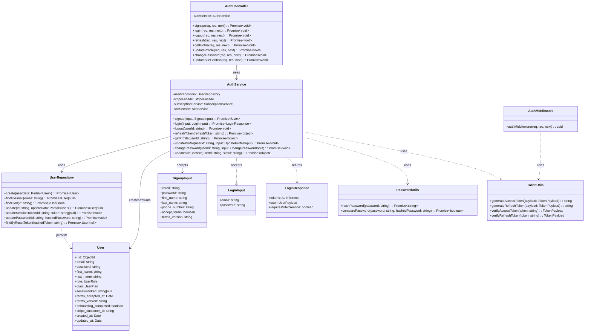

# PRD: Authentication and Authorization

**Product Requirements Document**  
**Status:** Draft  
**Last updated:** 2025-03-05

---

## 1. Overview

### 1.1 Purpose

Define and document Bloggr’s **authentication and authorization** system: current behaviour, required changes (terms acceptance, welcome email, first-time login flow, roles, default admin), and non-functional requirements (security, performance, error handling, audit logging).

### 1.2 Scope

| In scope | Out of scope (for this PRD) |
|----------|-----------------------------|
| Signup, login, logout, refresh, profile, change password | OAuth / social login (future) |
| JWT-based session (access + refresh), session token in DB | SSO / SAML |
| Terms and conditions acceptance at signup | Full legal document versioning UI |
| Welcome email on signup | Marketing / drip campaigns |
| First-time login flow (create workspace before invite step) | Full onboarding wizard redesign |
| User role (customer) vs Admin role (product owner / super admin) | Fine-grained RBAC beyond admin/user |
| Default admin for initial system setup | Multi-tenant admin isolation |
| Security, rate limiting, error handling, audit logs | Penetration testing procedures |

### 1.3 Goals

- **Security:** Credentials and sessions are protected; auth endpoints are hardened and auditable.
- **Clarity:** New users accept terms, receive a welcome email, and see a predictable first-time flow (create workspace → invite step).
- **Separation of concerns:** Customer (user) and product owner (admin) roles are explicit; admin-only operations are protected.
- **Operability:** First deployment can create a default admin; critical auth events are logged for audit and debugging.

---

## 2. Current State (Documented)

### 2.1 Backend

| Component | Implementation |
|-----------|----------------|
| **Routes** | `POST /auth/signup`, `POST /auth/login`, `POST /auth/refresh` (public); `POST /auth/logout`, `GET /auth/profile`, `PUT /auth/profile`, `PUT /auth/change-password`, `PUT /auth/site-context` (protected via `authMiddleware`). |
| **Signup** | Validates email, password (min 8), first_name, last_name, optional phone_number (Zod). Creates Stripe customer, user with `UserPlan.FREE` and default `UserRole.USER`, free subscription, and default workspace via `SiteService.ensureDefaultWorkspace`. No terms acceptance; no welcome email. |
| **Login** | Validates email + password. If user has no sites, calls `ensureDefaultWorkspace` so user always has at least one site after login. Returns JWT access + refresh, user payload, and `requiresSiteCreation: boolean` (true when user had no sites before ensure). Session token stored in DB for refresh validation. |
| **Tokens** | Access: 15m, signed with `ACCESS_SECRET`. Refresh: 7d, signed with `REFRESH_SECRET`. Payload: `userId`, `email`, `currentSiteId`. Refresh validated against `user.sessionToken`. |
| **Auth middleware** | Extracts Bearer token, verifies access JWT, sets `req.user = { userId, email, currentSiteId }`. No role check. |
| **User model** | `User` (Mongoose): email, password (bcrypt, 10 rounds), first_name, last_name, phone_number, **role** (enum `UserRole.USER` \| `UserRole.ADMIN`, default USER), plan, sessionToken, resetPasswordToken/Expires, apiKeys, stripe_customer_id, onboarding_completed. |
| **Profile / change password** | Profile: get/update name and phone. Change password: verify old password, hash and store new. |

### 2.2 Frontend

| Component | Implementation |
|-----------|----------------|
| **Login** | `AuthService.login` → store tokens and user in Zustand; read `redirect` query; else OnboardingService.getStatus → if requiresOnboarding → `/onboarding`; else SiteService.getSites() → if no sites → `/onboarding/create-site`; else if !blogforall_invite_prompt_seen → `/onboarding/invite`; else `/dashboard`. |
| **Signup** | `AuthService.signup` → redirect to login (with optional invite token in sessionStorage and redirect to `/invitations/accept?token=...`). No terms checkbox; no welcome email trigger. |
| **Dashboard layout** | Checks onboarding status and sites; if no sites → `/onboarding/create-site`; validates currentSiteId and sets first site if needed. |

### 2.3 Known Issue: First-Time Login and Create-Workspace Order

- **Behaviour today:** On login, the backend ensures a default workspace when the user has no sites. So when the frontend calls `SiteService.getSites()`, the user often already has one site and is sent to `/onboarding/invite` (if invite prompt not seen) or `/dashboard`. New users therefore **do not see the “create your first workspace” screen** before the team-invite step.
- **Desired behaviour:** New users should see the **create first workspace** step (with option to name it or skip to default) **before** the optional invite step. This may require (a) not auto-creating a default workspace on login and relying on frontend to send users to create-site first, or (b) a “first-time workspace setup” flag and UI that shows create-site then invite in order, or (c) using login response `requiresSiteCreation` and sending users with that flag to create-site before any other post-login route.

---

## 3. Functional Requirements

### 3.1 Terms and Conditions at Signup

- New users **must** accept Terms and Conditions (and optionally Privacy Policy) before signup is allowed.
- **Backend:** Signup API accepts a field e.g. `accepted_terms_at` (ISO timestamp) or `terms_version` + acceptance flag; validate presence and optionally version. Store on user (e.g. `terms_accepted_at`, `terms_version`) for audit.
- **Frontend:** Signup form includes required checkbox(es) “I accept the Terms and Conditions [and Privacy Policy]”; submit only when checked; send acceptance timestamp or version with signup payload.
- **Compliance:** Retain acceptance timestamp and version for audit; link to current terms/privacy URLs (configurable).

### 3.2 Welcome Email on Successful Signup

- On **successful** signup, send a **welcome email** to the new user’s email address.
- Use the existing **Notification Service** (Brevo, async queue): e.g. `NotificationService.createAndSend({ channel: EMAIL, type: WELCOME, recipientEmail, templateKey: 'welcome', templateParams: { first_name, ... } })`.
- Do not block signup response on email delivery; treat welcome email as best-effort (queue and retry per notification PRD).
- Add `WELCOME` (or equivalent) to email template registry and Brevo template mapping.

### 3.3 First-Time Login: Create Workspace Before Invite Step

- **Requirement:** When a user logs in for the first time (or has never completed “create first workspace” and “invite” steps), show **create first workspace** (or “name your workspace” / skip to default) **before** showing the optional **invite team** step.
- **Options (to be decided):**
  - **A.** Backend: Do **not** call `ensureDefaultWorkspace` on login when user has zero sites; return `requiresSiteCreation: true`. Frontend: if `requiresSiteCreation` or `sites.length === 0`, redirect to `/onboarding/create-site` first; after create (or skip), then show `/onboarding/invite` then dashboard.
  - **B.** Frontend: Track a flag e.g. `blogforall_create_workspace_seen` (or derive from “has user ever had zero sites after login”). First time: go to create-site → then invite → dashboard. Subsequent logins: use current logic.
  - **C.** Backend: Add user field e.g. `first_workspace_created_at` or `onboarding_workspace_step_completed`. When absent and user has no sites, return `requiresSiteCreation`; when absent and user has sites (e.g. auto-created default), still return a flag like `show_create_workspace_step: true` so frontend can show create-site UI (prefill default name, allow edit or skip). Frontend: if `show_create_workspace_step`, go to create-site first, then invite, then dashboard.
- **Recommendation:** Option A or C so that the “create first workspace” screen is always shown once before invite, with skip/default-name supported.

### 3.4 User Roles: Admin vs User

- **User (customer):** Default role for all signups. Can use dashboard, manage own workspaces, blogs, billing, profile. Cannot access admin-only endpoints or UI.
- **Admin (product owner / super admin):** Can access admin-only routes and UI (e.g. system settings, user list, feature flags, support tools). Intended for product owner / internal ops, not per-customer admins.
- **Backend:**
  - `User` schema already has `role: UserRole` (USER \| ADMIN). Keep default `USER` for new signups.
  - Add **admin middleware** (e.g. `requireAdmin`): after `authMiddleware`, assert `req.user.role === UserRole.ADMIN` (role must be loaded from DB or from token if role is added to JWT). If not admin, return 403.
  - Optionally include `role` in JWT payload so middleware can authorize without DB hit; then refresh token and login must set role in token.
- **Frontend:** Admin-only pages/routes check user role (from profile or token); redirect or hide admin nav if not admin.

### 3.5 Default Admin on First Setup

- When the **system is first set up** (e.g. no user exists, or no admin exists), a **default admin** account may be created.
- **Options:**
  - **Seed script:** One-time script or CLI that creates a user with `role: UserRole.ADMIN` from env vars (e.g. `ADMIN_EMAIL`, `ADMIN_PASSWORD`, `ADMIN_FIRST_NAME`, `ADMIN_LAST_NAME`). Run manually or in deployment.
  - **Bootstrap endpoint:** Protected by a one-time secret or “bootstrap key” in env; when no admin exists, allows creating the first admin (then disables or requires bootstrap key to be removed). Use with caution to avoid exposure.
  - **First user as admin:** First user ever created gets `role: ADMIN`; all subsequent signups get `USER`. Simple but may be undesirable if first signup is a test account.
- **Recommendation:** Document seed script or bootstrap endpoint; store credentials securely (env/secrets); do not commit default passwords.

---

## 4. Security

### 4.1 Credentials and Storage

- **Passwords:** Bcrypt with cost 10; never logged or returned in API responses. Enforce minimum length (e.g. 8) and complexity in validation (optional: strength rules).
- **Secrets:** `ACCESS_SECRET`, `REFRESH_SECRET` from env; never in client or logs. Rotate periodically; support multiple refresh token versions if needed.
- **Session token:** Stored hashed or in full in DB; used to validate refresh token. Clear on logout; invalidate on password change (optional).

### 4.2 Tokens and Transport

- **Access token:** Short-lived (e.g. 15m); Bearer in `Authorization` header only; not in query or cookies if possible to avoid leakage.
- **Refresh token:** Long-lived (e.g. 7d); sent only on refresh endpoint; store in DB and bind to user; one-time use or family (optional). Clear on logout.
- **HTTPS:** All auth endpoints and frontend must use HTTPS in production.

### 4.3 Rate Limiting and Abuse

- **Login / signup:** Rate limit by IP and by email (e.g. 5–10 attempts per minute per IP; 3–5 per email) to reduce brute force and enumeration.
- **Refresh:** Rate limit per client or IP to avoid token theft abuse.
- Return generic error messages (e.g. “Invalid credentials”) on login failure to avoid user enumeration.

### 4.4 Input Validation and Errors

- Validate all auth inputs (email format, password length, terms acceptance) with Zod (or equivalent); return 400 with clear validation messages. Do not leak “email already exists” in signup; use generic “Registration failed” or “User already exists” as appropriate.
- Catch and map errors to appropriate HTTP status (401 Unauthorized, 403 Forbidden, 400 Bad Request); avoid 500 for business-rule failures. Do not expose stack traces or internal details to client.

### 4.5 Security Summary Table

| Area | Measure |
|------|--------|
| Passwords | Bcrypt cost 10; min length 8; never log or return. |
| Secrets | Env only; rotate; no client exposure. |
| Session | DB-backed refresh; clear on logout; optional invalidation on password change. |
| Transport | HTTPS; Bearer only for access token. |
| Rate limiting | Login/signup/refresh by IP and optionally by email. |
| Errors | Generic messages for auth failures; no user enumeration. |

---

## 5. Performance

- **Login:** Single user lookup + password compare + optional default workspace creation + token generation. Keep DB queries minimal (e.g. one user fetch, one site list or ensure).
- **Refresh:** One user lookup + token verify; issue new access token. No heavy work on refresh path.
- **Signup:** User create + Stripe customer + subscription + default workspace + welcome email (async). Consider doing Stripe/subscription/workspace in background if signup latency is critical; otherwise current “best effort” is acceptable.
- **Auth middleware:** Verify JWT only; do not load user from DB on every request unless role is required (then consider adding role to JWT to avoid DB).

---

## 6. Error Handling

- Use shared error types (`UnauthorizedError`, `ForbiddenError`, `BadRequestError`, `NotFoundError`) and map to HTTP status codes consistently.
- **Login:** 401 for invalid credentials; 400 for validation errors. Same message for “user not found” and “wrong password” to avoid enumeration.
- **Signup:** 400 for validation or “email already exists”; 201 on success. Do not return 500 for duplicate email.
- **Refresh:** 401 for invalid/expired refresh token; 400 for missing token.
- **Protected routes:** 401 when token missing/invalid/expired; 403 when role insufficient (e.g. admin required). Log auth failures for audit (see §7).

---

## 7. Audit Logs

- **Events to log (structured):** Signup (userId, email, timestamp, IP if available); Login success and failure (userId or email, success/fail, timestamp, IP); Logout (userId, timestamp); Password change (userId, timestamp); Refresh token use (userId); Failed auth attempts (endpoint, reason, IP, timestamp). Do not log passwords or tokens.
- **Storage:** Append-only log or audit table; retain per compliance needs (e.g. 90 days or 1 year). Optional: correlation ID for request tracing.
- **Admin actions:** When admin-only endpoints are added, log admin userId, action, resource, timestamp (and optionally IP) for audit.

---

## 8. Data Model and Schemas

### 8.1 User (Existing – Additions for T&C and Optional Role in Token)

| Field | Type | Requirement | Notes |
|-------|------|-------------|--------|
| email | string | required, unique | lowercase |
| password | string | required | bcrypt hash |
| first_name | string | required | |
| last_name | string | required | |
| phone_number | string | optional | |
| role | enum | required, default USER | USER \| ADMIN |
| plan | enum | required, default FREE | |
| sessionToken | string | optional, nullable | for refresh validation |
| terms_accepted_at | date | optional | set when user accepts T&C at signup |
| terms_version | string | optional | e.g. "2025-01" for audit |
| onboarding_completed | boolean | default false | |
| stripe_customer_id | string | optional | |
| created_at, updated_at | date | required | |

### 8.2 Signup Request (Extended)

| Field | Type | Requirement |
|-------|------|-------------|
| email | string | valid email |
| password | string | min 8 chars |
| first_name | last_name | non-empty |
| phone_number | string | optional |
| accept_terms | boolean | required, true |
| terms_version | string | optional, recommended for audit |

### 8.3 Token Payload (Optional Extension for Role)

- Current: `userId`, `email`, `currentSiteId`.
- Optional: add `role` so admin middleware can authorize without DB lookup. If added, refresh and login must set role from user document.

---

## 9. Architecture (High-Level)

```
┌─────────────────────────────────────────────────────────────────────────┐
│  Client (Next.js)                                                        │
│  Login / Signup forms → AuthService (API client) → POST /auth/login etc. │
└─────────────────────────────────────────────────────────────────────────┘
                                        │
                                        ▼
┌─────────────────────────────────────────────────────────────────────────┐
│  Auth Router (Express)                                                   │
│  Public: signup, login, refresh.  Protected: logout, profile,             │
│  change-password, site-context.  Middleware: authMiddleware [, requireAdmin] │
└─────────────────────────────────────────────────────────────────────────┘
                                        │
          ┌────────────────────────────┼────────────────────────────┐
          ▼                            ▼                              ▼
┌──────────────────┐    ┌──────────────────────┐    ┌────────────────────────┐
│  AuthService     │    │  UserRepository      │    │  NotificationService    │
│  signup, login,  │    │  create, findByEmail │    │  (welcome email, async) │
│  refresh, etc.   │    │  findById, update    │    │  + SiteService         │
│  + StripeFacade  │    │  updateSessionToken  │    │  ensureDefaultWorkspace │
│  + Subscription  │    └──────────────────────┘    └────────────────────────┘
└──────────────────┘
          │
          ▼
┌──────────────────┐    ┌──────────────────────┐
│  Password utils  │    │  Token utils (JWT)    │
│  hash, compare   │    │  generate, verify     │
└──────────────────┘    └──────────────────────┘
```

### 9.1 Class Diagram (UML)

The following diagram shows the main auth domain and application classes and their relationships.



**Sequence (signup):** Client → AuthController.signup → validate body (signupSchema) → AuthService.signup(SignupInput) → UserRepository.findByEmail → hashPassword → StripeFacade.createCustomer → UserRepository.create(User) → SubscriptionService.createFreeSubscription → SiteService.ensureDefaultWorkspace → return User.

**Sequence (login):** Client → AuthController.login → validate body (loginSchema) → AuthService.login(LoginInput) → UserRepository.findByEmail → comparePassword → SiteService.getSitesByUser / ensureDefaultWorkspace → TokenUtils.generateAccessToken, generateRefreshToken → UserRepository.updateSessionToken → return LoginResponse.

---

## 10. Implementation Phases (Suggested)

| Phase | Scope |
|-------|--------|
| **1 – PRD and design** | Document current state (this PRD); agree on first-time flow option (A/B/C) and default admin approach. |
| **2 – Terms and welcome** | Backend: signup schema + validation for terms; store terms_accepted_at/terms_version. Frontend: signup checkbox, send acceptance. Backend: trigger welcome email via NotificationService after signup. |
| **3 – First-time login flow** | Implement chosen option (e.g. A or C): ensure create-site is shown before invite; adjust backend ensureDefaultWorkspace and/or login response flags; frontend redirect order. |
| **4 – Roles and admin** | Backend: add requireAdmin middleware; optionally add role to JWT; protect admin routes. Frontend: role in profile/store; hide or restrict admin UI for non-admin. |
| **5 – Default admin** | Seed script or bootstrap endpoint; env vars for first admin; document in README/deploy. |
| **6 – Hardening** | Rate limiting on auth routes; audit logging for signup, login, logout, password change, refresh; security review. |

---

## 11. Open Points and References

- **First-time flow:** Decide option A, B, or C (§3.3) and implement.
- **Default admin:** Choose seed vs bootstrap vs first-user; document and secure.
- **JWT role:** Whether to add role to token to avoid DB in admin middleware.
- **Terms versioning:** Where to store current terms version (env, DB, or static) and how to link from signup UI.

**References**

- Current: `backend/src/modules/auth/`, `backend/src/shared/middlewares/auth.middleware.ts`, `backend/src/shared/utils/token.ts`, `backend/src/shared/utils/password.ts`, `frontend/lib/hooks/use-auth.ts`, `frontend/app/auth/login/page.tsx`, `frontend/app/auth/signup/page.tsx`.
- Notification PRD: `docs/PRD_NOTIFICATION_SERVICE.md` (welcome email, templates).
- Workspace PRD: `docs/PRD_WORKSPACE_AND_USER_ACCESS.md` (onboarding, create-site, invite).
