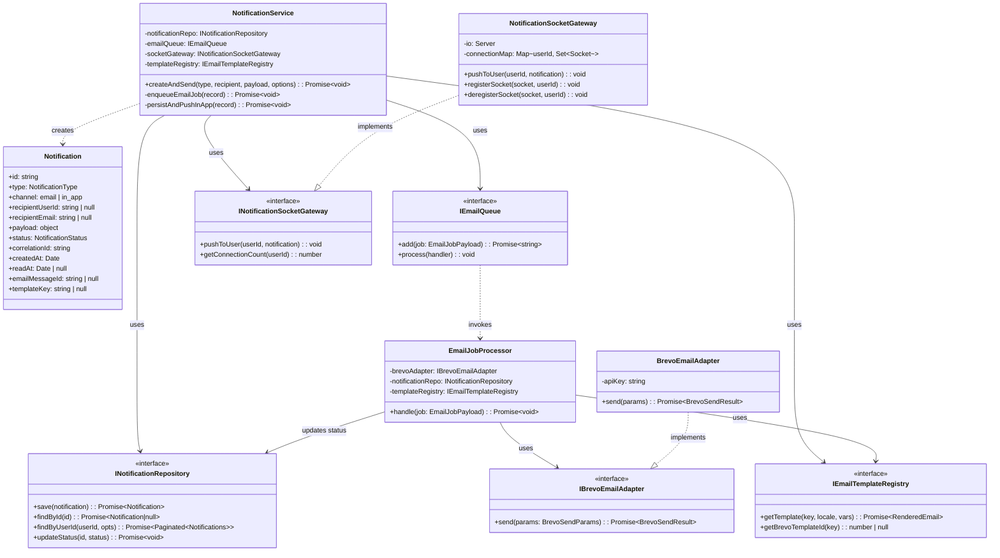
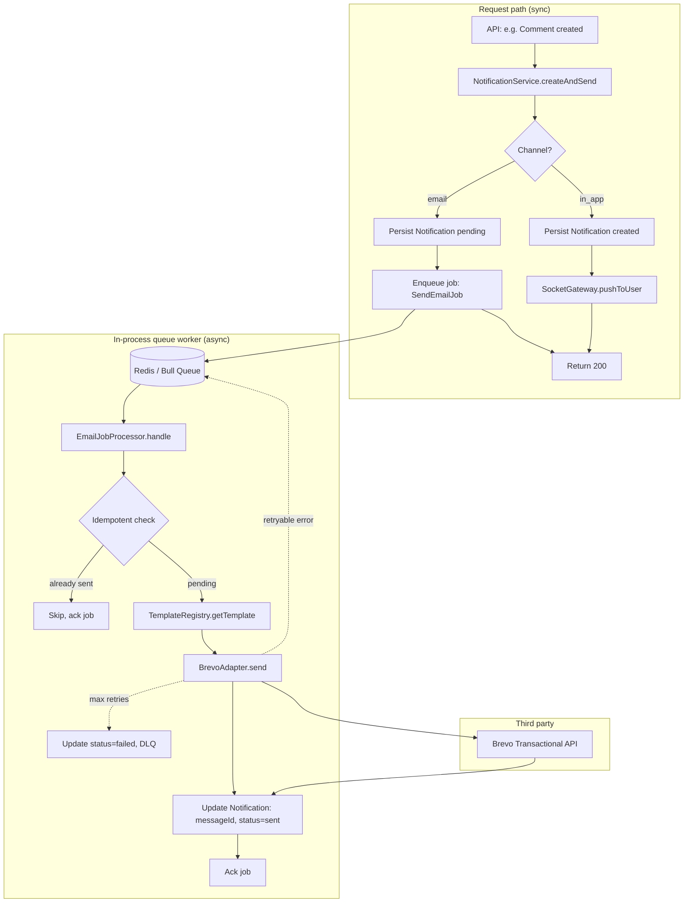
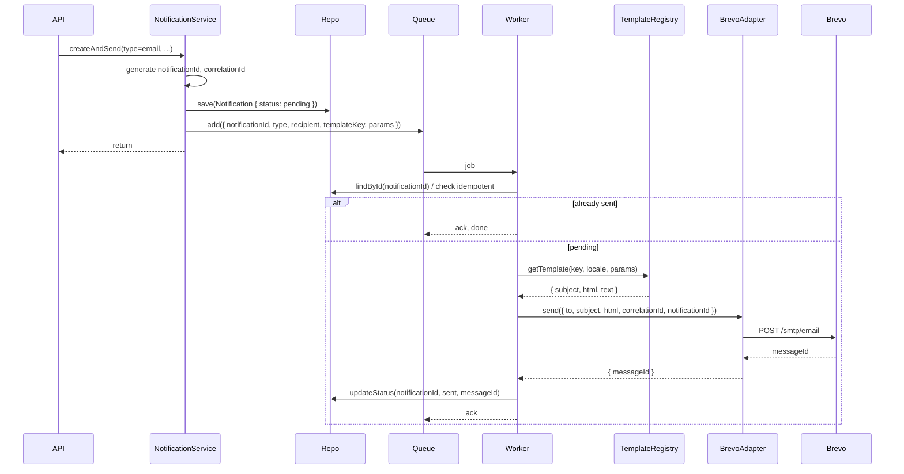
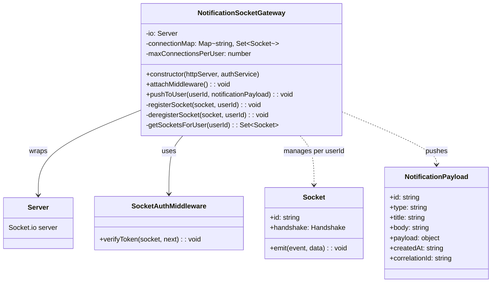
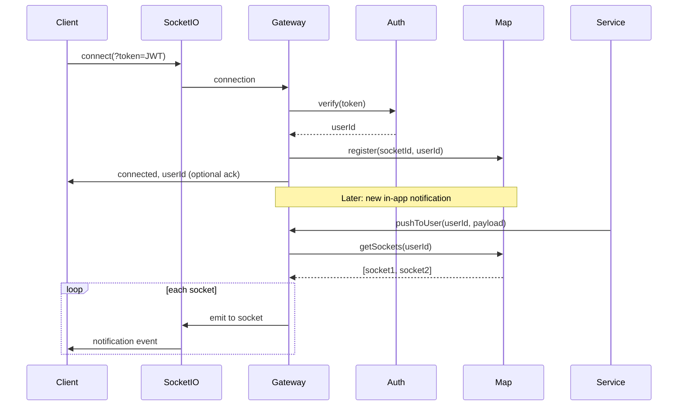
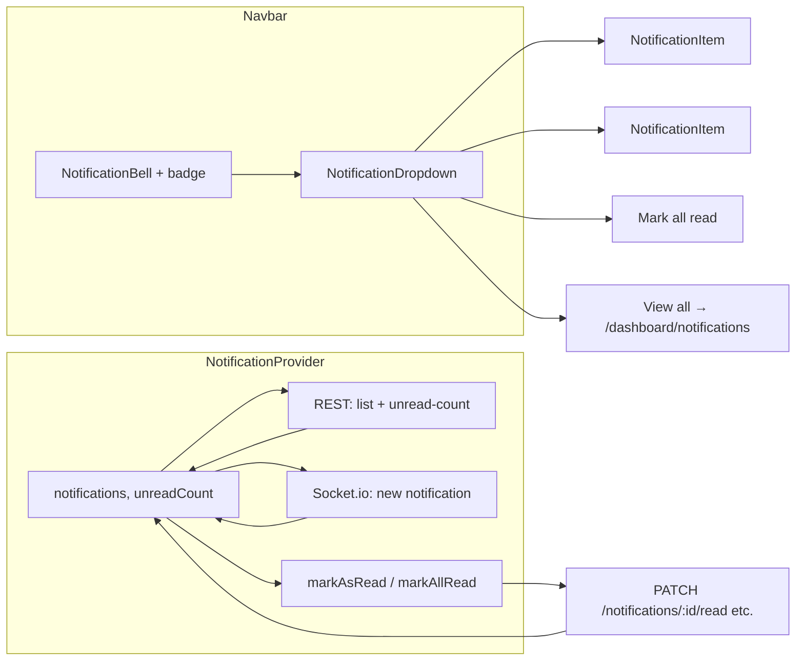

# PRD: Notification Service (Email + In-App)

**Product Requirements Document**  
**Status:** Draft  
**Last updated:** 2025-03-05

---

## 1. Overview

### 1.1 Purpose

Define a unified **Notification Service** for Bloggr that:

- **Email notifications** – Delivered via **Brevo** (transactional API), replacing the current SMTP/nodemailer approach.
- **In-app notifications** – Delivered in real time via **Socket.io** (WebSocket transport), with persistent storage and a traceable lifecycle.

The system must be **reliable**, **secure**, **performant**, and **traceable** so that every notification can be observed from creation to delivery (or failure).

### 1.2 Scope

| In scope | Out of scope (for this PRD) |
|----------|-----------------------------|
| Transactional email (invitations, password reset, comment alerts, etc.) via Brevo | Marketing / campaign emails (Brevo can support later) |
| In-app notification delivery via WebSocket | Push (e.g. browser/mobile push) |
| Persisted in-app notification model and API | Email template builder UI (templates in code or Brevo UI) |
| **UI for in-app notifications:** bell in navbar, dropdown/list, unread count, mark as read (see §6.9) | In-app email preview or email-specific UI |
| Traceability: correlation IDs, logs, metrics, lifecycle states | Full distributed tracing (e.g. OpenTelemetry) – optional extension |

### 1.3 Goals

- **Reliability:** Notifications are not lost; failures are retried and observable.
- **Security:** Only intended recipients receive notifications; channels are authenticated and rate-limited.
- **Performance:** Email sending does not block request paths; WebSocket layer scales and stays within limits.
- **Traceability:** Each notification has an identity and lifecycle that can be queried and correlated in logs/metrics.

---

## 2. Current State (Brief)

- **Email:** `EmailService` (nodemailer + SMTP); used for site invitations only. No correlation ID, no retries, no delivery tracking; failures are logged but not persisted.
- **In-app:** `NotificationProvider` (React context, in-memory). No backend model, no WebSocket, no persistence; notifications are never created from server events.

---

## 3. Notification Types (Initial Set)

| Type | Channel | Trigger (example) | Recipient |
|------|---------|-------------------|-----------|
| Site invitation | Email | User invites by email | Invitee email |
| Comment on my post | Email + In-app | Someone comments on user’s blog | Post author (user id) |
| Like on my post | In-app | Someone likes user’s blog | Post author (user id) |
| Invitation accepted | In-app | Invitee accepts | Inviter (user id) |
| New comment (for moderators) | In-app | Comment on site’s post | Site members with moderator+ role |
| Password reset | Email | User requests reset | User email |

Additional types can be added later; the architecture should support new types without changing core reliability/security/traceability design.

---

## 4. Architecture

### 4.1 High-Level Flow

```
┌─────────────────────────────────────────────────────────────────────────────┐
│                         APPLICATION (Express API)                             │
│  e.g. Comment created → NotificationService.createAndSend({ type, … })       │
└─────────────────────────────────────────────────────────────────────────────┘
                                        │
                                        ▼
┌─────────────────────────────────────────────────────────────────────────────┐
│                    NOTIFICATION SERVICE (backend)                             │
│  • Assigns notificationId + correlationId                                     │
│  • Email: persists pending → enqueues job (Bull/Redis in-process queue)     │
│  • In-app: persists → pushes via Socket.io to connected user(s)              │
└─────────────────────────────────────────────────────────────────────────────┘
           │                                    │
           ▼                                    ▼
┌──────────────────────┐            ┌──────────────────────────────────────────┐
│  EMAIL CHANNEL       │            │  IN-APP CHANNEL                          │
│  • In-process queue  │            │  • Notification document (MongoDB)       │
│    (Bull + Redis)    │            │  • Socket.io server (same process)       │
│  • Worker → Brevo API│            │  • Client: GET /notifications + Socket.io│
└──────────────────────┘            └──────────────────────────────────────────┘
           │                                        │
           ▼                                        ▼
    Brevo (messageId,          Frontend: NotificationProvider consumes
    webhooks)                  REST + Socket.io, shows bell + list
```

### 4.2 Core Components

1. **Notification domain model**  
   - Single model (or unified representation) for “a notification” with: `id`, `type`, `channel` (email | in_app), `recipient` (userId or email), `payload`, `status`, `correlationId`, timestamps, and channel-specific fields (e.g. `emailMessageId` for Brevo, `readAt` for in-app).

2. **Notification service (application layer)**  
   - `createAndSend(type, recipient, payload, options?)`  
   - Assigns `notificationId` and `correlationId` (e.g. UUID), persists in-app rows, enqueues or sends email via Brevo, and pushes to WebSocket when recipient is connected.

3. **Email delivery (Brevo)**  
   - Facade or adapter that calls Brevo Transactional API; accepts correlation ID and stores Brevo `messageId` for traceability; supports retries and optional queue.

4. **In-app delivery**  
   - Persist notification document; REST API for list/mark-read; WebSocket server that authenticates by JWT and pushes new notifications to the correct user(s).

5. **Observability**  
   - Every step logs `notificationId` and `correlationId`; lifecycle transitions (created → sent → delivered / failed) are logged and, where useful, emitted as metrics.

### 4.3 Class Diagram (UML)

The following diagram shows the main domain and application classes. Channels (email vs in-app) are handled by adapters; the queue is used for email only.



### 4.4 Architecture: In-Process Queue, Jobs, and Third-Party API (Brevo)

Email sending is fully asynchronous. The request path only enqueues a job; a worker consumes the queue and calls Brevo. All steps are traceable via `notificationId` and `correlationId`.



**Sequence (email only):**



### 4.5 Email Template Management (Single Point of Update)

To keep email content in one place and avoid scattering HTML across the codebase:

- **Single source of truth:** A **template registry** (e.g. `EmailTemplateRegistry`) owns all template resolution. Callers only pass a **template key** (e.g. `site_invitation`, `password_reset`, `comment_on_post`) and **variables**; they never build HTML themselves for sending.
- **Two modes (choose one or both):**
  - **Brevo template IDs:** For templates designed in Brevo’s UI, the registry maps `templateKey` → Brevo `templateId` and variable names. The worker calls Brevo with `templateId` + `params`; Brevo renders. Updates are done in Brevo only → single point of update in Brevo UI.
  - **Code-backed templates:** For templates kept in repo, the registry maps `templateKey` → a render function or file (e.g. Handlebars/EJS in `/templates/emails/site_invitation.hbs`). Variables are passed in; the registry returns `{ subject, html, text }`. Updates are done in code/templates → single point of update in version control.
- **Recommendation:** Use **Brevo templates** for all transactional emails so copy and layout changes don’t require code deploys; the registry only holds the mapping `templateKey → Brevo templateId` and variable names. Optionally keep a small set of code-backed templates for early development before Brevo templates exist.
- **Registry interface:** `getTemplate(key, locale?, vars) → { subject, html?, text?, brevoTemplateId?, brevoParams? }`. If `brevoTemplateId` is set, worker uses Brevo’s template API; otherwise uses `html`/`text` from registry (code-backed).

### 4.6 Data Retention Lifecycle

| Channel | Phase | Retention / Action |
|---------|--------|---------------------|
| **In-app** | **Unread** | Kept indefinitely until read or retention rule applies. |
| **In-app** | **Read** | Retained for **90 days** after `readAt`; then eligible for **soft delete** (mark `archivedAt`) or **hard delete** in a nightly job. Configurable (e.g. env `NOTIFICATION_RETENTION_DAYS_READ=90`). |
| **In-app** | **Archive** | Optional: move to `notification_archive` collection or cold storage after 90 days; main `notifications` collection trimmed for performance. |
| **Email** | **Metadata (our DB)** | Store only metadata: `notificationId`, `correlationId`, `recipient` (hash or id), `templateKey`, `status`, `emailMessageId` (Brevo), `createdAt`, `sentAt`, `failedAt`. **Do not** store full body in DB for retention; Brevo holds the actual email. |
| **Email** | **Metadata retention** | Retain email metadata for **1 year** for traceability and support; then **delete or anonymise** (e.g. null out recipient, keep notificationId/correlationId for logs). Configurable (e.g. `EMAIL_NOTIFICATION_METADATA_RETENTION_DAYS=365`). |
| **Email** | **Brevo** | Brevo’s own retention applies to their copies; we only use their API and optional webhooks. No duplicate body storage in our DB beyond what’s needed for retries (e.g. template key + params in job payload; job TTL e.g. 7 days). |

**Summary:**

- **In-app:** Read notifications retained 90 days, then archive or delete; unread kept until read (or same 90-day rule from `createdAt` if you want a cap).
- **Email:** No body retention in our DB; metadata only, 1 year, then delete/anonymise; job payload (template key + params) can have a short TTL (e.g. 7 days) so retries are bounded.

---

## 5. Email Notifications (Brevo)

### 5.1 Why Brevo

- Transactional API with `messageId` and delivery events (webhooks) for traceability.
- Templates and sender management in one place; good deliverability and compliance (unsubscribe, etc.) when we add more email types.
- Fits existing “send one email per event” usage (e.g. invitation).

### 5.2 Integration Approach

- Use **Brevo Transactional Email API** (not SMTP) so every send returns a `messageId` that we store and can correlate with webhooks.
- **Facade:** `BrevoEmailAdapter` or `BrevoNotificationChannel` that:
  - Accepts: `to`, `subject`, `html`, `text`, `correlationId`, `notificationId`, optional `templateId` and template params.
  - Calls Brevo; stores returned `messageId` (and optionally campaign/id from response) on the notification record or in a dedicated `email_delivery` table for traceability.
  - Maps Brevo errors to retryable vs non-retryable; throws or returns result for caller/queue to handle.

### 5.3 Reliability

- **Async send:** Email is sent **asynchronously via an in-process queue** (Bull + Redis). The HTTP request enqueues a job and returns; a worker process (same Node app or same process) consumes the queue and calls Brevo. Jobs are persisted in Redis so they survive process restarts and can be retried.
- **Retries:** Configurable retries (e.g. 3) with exponential backoff for transient errors (5xx, rate limit 429). Use idempotency key = `notificationId` so the same logical email is not sent twice.
- **Dead letter:** After max retries, mark status `failed` and optionally move to a “dead letter” store (table or topic) for alerting and manual replay.
- **Idempotency:** Callers pass or service generates a stable `notificationId`; before calling Brevo, check if this `notificationId` already has `sent` or `delivered` to avoid duplicate sends.

### 5.4 Security

- **API key:** Brevo API key in env (e.g. `BREVO_API_KEY`); never in client or logs.
- **Input validation:** Validate `to` (email format, allowlist if needed), sanitize subject/html (no injection), limit size (e.g. 512 KB per email).
- **Rate limiting:** Per-recipient and global limits (e.g. 10 emails/minute per user, 100/minute per app) to avoid abuse and stay within Brevo limits.
- **PII:** Log only `notificationId` and `correlationId` in structured logs; avoid logging full email body or recipient in plain text in production.

### 5.5 Performance

- Sending is off the critical path (queue or background).
- Optional batching: if we have many identical template emails in a short window, Brevo batch API could be used later; for MVP, one send per notification is acceptable.
- Timeout when calling Brevo (e.g. 10s); do not block worker indefinitely.

### 5.6 Traceability

- **Before send:** Log `notificationId`, `correlationId`, `type`, `recipientHash` (e.g. hash of email), `status=queued|sending`.
- **After send:** Store Brevo `messageId` on the notification (or email_delivery row); log `notificationId`, `correlationId`, `messageId`, `status=sent`, latency.
- **Webhooks (optional but recommended):** Subscribe to Brevo delivery/open/click/bounce; update status and log with same `notificationId`/`correlationId` so one can trace “invitation email → messageId → delivered/failed”.
- **Query:** Support “show me all logs/metrics for notificationId X” (and optionally correlationId) in your logging/monitoring tool.

---

## 6. In-App Notifications (WebSocket + Persistence)

### 6.1 Model (Persisted)

- **Collection/table:** `notifications` (or `in_app_notifications`).
- **Fields (conceptual):**  
  `id`, `userId` (recipient), `type`, `title`, `body`, `payload` (JSON: e.g. `blogId`, `commentId`, `siteId`), `readAt` (nullable), `createdAt`, `correlationId`, `sourceEventId` (e.g. comment id that triggered this).
- **Indexes:** `userId + createdAt` (list by user, newest first); `userId + readAt` (unread count).

### 6.2 Delivery Path

1. **Create:** API or internal service creates document with `readAt = null`, then calls WebSocket layer to “push to user”.
2. **REST:** `GET /api/v1/notifications` (paginated, for current user); `PATCH /api/v1/notifications/:id/read` (set `readAt`); optional `GET /api/v1/notifications/unread-count`.
3. **WebSocket:** On “new notification” event, backend looks up connected sockets for that `userId` and sends a message (e.g. `{ type: 'notification', payload: { id, type, title, body, ... } }`). Frontend appends to list and updates bell count.

### 6.3 WebSocket Design

- **Transport:** **Socket.io** (WebSocket under the hood, with fallbacks and reconnection built in). Namespace e.g. `/notifications` or default.
- **URL:** e.g. `wss://api.example.com` (Socket.io path) or same origin as API.
- **Authentication:** Client sends JWT in query param (e.g. `?token=...`) or in the first handshake/auth event. Server validates JWT, resolves `userId`, and associates the Socket.io socket with that user in a connection map (e.g. `userId → Set<Socket>`).
- **Authorization:** Server only pushes notifications for the authenticated user; no subscription to other users’ channels.
- **Ping/pong:** Keepalive to detect dead connections; close and remove from map after timeout.
- **Reconnection:** Client reconnects with same JWT; on connect, server may send “reconnect” ack. Client can then call `GET /notifications?since=<lastSeen>` to catch up missed notifications (if any).

### 6.4 Reliability

- **Persistence first:** Always persist the notification document before pushing over WebSocket. If WebSocket push fails or user is offline, they still get it via REST and see it when they open the app or poll.
- **At-most-once over WS:** We do not need to guarantee delivery over the socket; “missed” notifications are available via REST. So we don’t need a heavy queue for in-app; “write DB → emit to WS” is enough.
- **Connection limits:** Per-user limit (e.g. 2–3 concurrent sockets) to avoid abuse; drop oldest or reject new with 429.
- **Backpressure:** If a user has many unread notifications, consider pagination and not sending full history over WS; only “new” events.

### 6.5 Security

- **Auth:** Only authenticated connections (valid JWT); reject unauthenticated or expired tokens.
- **Isolation:** Map `userId` from JWT; push only that user’s notifications. Validate any server-side “subscribe” or “mark read” by userId.
- **Input:** Validate `type`, `title`, `body`, `payload` size and shape when creating notifications (server-side); no raw user input in `title`/`body` without sanitization.
- **Rate limiting:** Per-user rate on “create notification” (e.g. 100/min) and on REST `GET /notifications` to avoid scraping.

### 6.6 Performance

- **Scaling:** Single process can hold many connections (e.g. 10k); for more, use sticky sessions or a shared store (Redis pub/sub or adapter) so multiple API instances can push to the right process that holds the user’s socket.
- **Efficiency:** One message per notification; small JSON payload. No need to send full notification history over WS.
- **DB:** Indexes on `userId` and `createdAt`; optional TTL or archive for very old read notifications.

### 6.7 Traceability

- **Create:** Log `notificationId`, `correlationId`, `userId`, `type`, `status=created`.
- **Push:** When sending over WebSocket, log `notificationId`, `userId`, `connectionId` (if any), `status=pushed`; optionally log “user not connected” so we know it was delivery via REST only.
- **Read:** When user marks read (REST or via client action), log `notificationId`, `userId`, `status=read`, `readAt`.
- **Query:** “All events for notificationId X” or “all notifications for correlationId Y” (e.g. one comment creating one email + one in-app) in logs/metrics.

### 6.8 Socket.io: Class Diagram and Architecture

**Class diagram (Socket.io / in-app delivery):**



**Architecture: Socket.io flow and integration:**

```mermaid
flowchart TB
    subgraph Client["Frontend"]
        C1[NotificationProvider]
        C2[Socket.io client]
        C3[REST: GET /notifications]
        C1 --> C2
        C1 --> C3
    end

    subgraph API["Backend (same process)"]
        A1[Express API]
        A2[NotificationService]
        A3[NotificationSocketGateway]
        A4[Connection map: userId -> Set of Sockets]
        A1 --> A2
        A2 --> A3
        A3 --> A4
    end

    subgraph Events["Event flow"]
        E1[Business event: e.g. comment created]
        E2[NotificationService.createAndSend in_app]
        E3[Persist to DB]
        E4[Gateway.pushToUser userId, payload]
        E5[Lookup sockets for userId]
        E6[io.to(socketId).emit notification]
        E1 --> E2
        E2 --> E3
        E3 --> E4
        E4 --> E5
        E5 --> E6
    end

    C2 <-->|"WS + JWT (query or auth event)"| A3
    A3 --> A4
    E6 --> C2
    C2 --> C1
    C3 --> A1
```

**Sequence: connection and push:**



**Connection map (in-memory, single process):**

- Key: `userId` (string).
- Value: `Set<Socket>` (or list of socket ids) for that user.
- On connect: add socket to set for `userId`.
- On disconnect: remove socket from set; if set empty, remove key.
- Per-user cap: e.g. max 3 sockets; drop oldest or reject new with `connection_limit_exceeded`.
- For multi-instance scaling: replace in-memory map with Redis adapter so that `pushToUser` publishes to a channel `notify:userId` and the instance that holds that user’s socket consumes and emits (see Socket.io Redis adapter docs).

### 6.9 UI Integration (In-App Notifications)

How in-app notifications are exposed in the frontend: placement, components, data flow, and interactions.

#### 6.9.1 Placement and Entry Points

| Location | Purpose |
|----------|--------|
| **Navbar (global)** | Notification bell icon with unread count badge; primary entry for all authenticated users. Visible on dashboard, settings, and all protected layouts. |
| **Notification dropdown / panel** | Opens on bell click (or tap on mobile); shows a short list of recent notifications (e.g. last 10–20) with “Load more” or link to full page. |
| **Notifications page (optional)** | Dedicated route (e.g. `/dashboard/notifications`) for full list with pagination, filters (all / unread), and “Mark all as read”. |

- **Default:** Bell in navbar + dropdown is required; full notifications page is recommended for Phase 3 and can follow in a later phase.

#### 6.9.2 Components (Conceptual)

| Component | Responsibility |
|-----------|----------------|
| **NotificationBell** | Renders bell icon; fetches unread count via `GET /notifications/unread-count` (or from provider state); shows badge when count &gt; 0; opens dropdown on click; accessible (e.g. `aria-label`, keyboard). |
| **NotificationDropdown** | Panel below (or beside) bell; lists recent notifications from provider; “Mark all as read” action; “View all” link to `/dashboard/notifications`; closes on outside click or Escape. |
| **NotificationItem** | Single row: icon by type, title, body snippet, relative time; unread styling (e.g. bold); click → mark as read (if not read) and optional navigation (e.g. to blog, comment, or invitation). |
| **NotificationProvider (context)** | Holds list (or slice), unread count, Socket.io connection; exposes `notifications`, `unreadCount`, `markAsRead(id)`, `markAllRead()`, and optional `refetch`. Initial load via REST; real-time updates via Socket.io. |
| **Empty / loading / error states** | Empty: “No notifications”; loading: skeleton or spinner; error: short message and retry. |

#### 6.9.3 Data Flow

1. **Initial load (REST)**  
   - On mount (or when user is authenticated), `NotificationProvider` (or a hook) calls `GET /api/v1/notifications?limit=20&offset=0` and optionally `GET /api/v1/notifications/unread-count`.  
   - Store in context or state; use for bell badge and dropdown list.

2. **Real-time updates (WebSocket)**  
   - Provider (or a dedicated hook) establishes Socket.io connection with JWT (e.g. `?token=...` or auth event).  
   - On `notification` (or equivalent) event: append new notification to list, increment unread count, optionally show a small toast or highlight the bell.  
   - Reconnection: after reconnect, optionally call `GET /notifications?since=<lastCreatedAt>` to catch up; merge into list and update unread count.

3. **Mark as read**  
   - User clicks a notification (or “Mark all as read”): call `PATCH /api/v1/notifications/:id/read` or `POST /api/v1/notifications/mark-all-read`.  
   - Optimistically update local state (set `readAt` or remove from unread count); on error, revert or show message.

4. **Pagination (full page)**  
   - On `/dashboard/notifications`, use `GET /notifications?limit=20&offset=N` (or cursor); append or replace based on “load more” vs “refresh”.

#### 6.9.4 User Interactions

| Action | Behaviour |
|--------|-----------|
| Click bell | Open dropdown; focus first notification or “Mark all as read” for keyboard users. |
| Click notification item | Mark as read (if unread); navigate to target (e.g. blog post, comment, invite flow) when `payload` contains link/ID; close dropdown if in dropdown context. |
| “Mark all as read” | Call API; clear local unread count and mark all visible items read. |
| “View all” | Navigate to `/dashboard/notifications`; close dropdown. |
| Outside click / Escape | Close dropdown. |

#### 6.9.5 Visual and UX Guidelines

- **Unread:** Distinct styling (e.g. bold title, background tint, or dot) so unread items are scannable.  
- **Badge:** Show numeric unread count on bell when &gt; 0; cap display at “9+” if desired.  
- **Recency:** Show relative time (e.g. “2 min ago”, “Yesterday”); sort newest first.  
- **Type icon:** Optional icon per notification type (comment, like, invitation, etc.) for quick recognition.  
- **Empty state:** “You’re all caught up” or “No notifications yet” in dropdown and on full page.  
- **Mobile:** Dropdown may become a bottom sheet or full-screen list on small viewports; touch-friendly targets.

#### 6.9.6 Accessibility and Performance

- **A11y:** Bell has `aria-label` (e.g. “Notifications (3 unread)”); dropdown has `aria-expanded` and `aria-controls`; list is focusable and keyboard-navigable; focus trap in dropdown when open.  
- **Performance:** Virtualise or limit list length in dropdown (e.g. 20 items) to avoid large DOM; full page can use infinite scroll or pagination.  
- **Offline / reconnection:** If Socket.io disconnects, show connection status only if needed; REST remains source of truth so list and count stay valid after refetch.

#### 6.9.7 Summary Diagram (UI)



---

## 7. Cross-Cutting: Traceability

### 7.1 Identifiers

- **notificationId:** Unique per notification (e.g. UUID). Ties together: DB row, email send record, logs, and (for in-app) WebSocket push.
- **correlationId:** Optional but recommended; one per “business event” (e.g. “comment created”). One event can create multiple notifications (e.g. one email to author, one in-app to author). Same `correlationId` in all of them and in logs so we can trace the whole flow.

### 7.2 Lifecycle States (Email)

- `pending` – Created, not yet sent to Brevo.  
- `sending` – Request in flight.  
- `sent` – Brevo accepted; we have `messageId`.  
- `delivered` / `opened` / `clicked` – From webhooks if used.  
- `failed` – After retries or permanent error.  
- `bounced` – From webhook.

Store at least `pending | sent | failed` (and `messageId` when sent). Log every transition with `notificationId` and `correlationId`.

### 7.3 Lifecycle States (In-App)

- `created` – Document written.  
- `pushed` – Sent over WebSocket (optional to store; can infer from logs).  
- `read` – `readAt` set.

Log create and read; optionally log push.

### 7.4 Logging and Metrics

- **Structured logs:** Every notification action includes `notificationId`, and when available `correlationId`, `channel`, `type`, `userId` or hashed recipient. No PII in logs (e.g. hash email).
- **Metrics (examples):**  
  - Count by `type` and `channel` (created, sent, failed, read).  
  - Latency: time from create to sent (email), create to pushed (in-app).  
  - WebSocket: connected clients, reconnect rate.
- **Alerting:** Rate of `failed` above threshold; WebSocket disconnect spike; queue depth (if using queue) above threshold.

---

## 8. Security Summary

| Area | Measure |
|------|--------|
| Brevo | API key in env only; validate/sanitize content; rate limit per recipient and global. |
| WebSocket | JWT-only auth; associate connection with userId; push only that user’s notifications; per-user connection limit. |
| API | Auth on all notification endpoints; mark-read and list only for own userId. |
| Logs | No PII; use notificationId/correlationId for tracing. |

---

## 9. Reliability Summary

| Area | Measure |
|------|--------|
| Email | Async (queue or background); retries with backoff; idempotency by notificationId; dead letter after max retries; persist state (pending/sent/failed) and Brevo messageId. |
| In-app | Persist first; then push via WebSocket; no requirement for at-least-once over WS (REST is source of truth). |
| Observability | Log state transitions; metrics on success/failure and latency; optional Brevo webhooks for delivery. |

---

## 10. Performance Summary

| Area | Measure |
|------|--------|
| Email | Off critical path; timeout on Brevo call; optional batching later. |
| In-app | Indexed queries; small WS payloads; per-user connection limit; scale via sticky sessions or Redis adapter if multi-instance. |

---

## 11. Implementation Phases (Suggested)

| Phase | Scope |
|-------|--------|
| **1 – Foundation** | Notification model (DB); NotificationService.createAndSend; correlationId + notificationId everywhere; structured logging. |
| **2 – Email (Brevo)** | Brevo facade; replace invitation email with Brevo; store messageId; retries + idempotency; optional queue. |
| **3 – In-app (REST + WS) + UI** | REST list/mark-read; WebSocket server with JWT auth; push on create; frontend consume REST + WS and update existing NotificationProvider. **UI:** Notification bell in navbar, dropdown with recent list, unread count badge, mark-as-read; optional full notifications page. See §6.9 UI Integration. |
| **4 – Observability** | Metrics (counts, latency); optional Brevo webhooks; dashboards and alerts. |
| **5 – More types** | Comment/like/invitation-accepted notifications; password reset email; etc. |

---

## 12. Discussion and Tradeoffs

### 12.1 Email: Queue (decided)

- **Chosen approach:** **In-process queue (Bull + Redis).** All email sends are enqueued as jobs; a worker in the same Node process (or same app) consumes the queue and calls Brevo. Jobs are persisted in Redis for retries and survival across restarts. No fire-and-forget or cron polling.

### 12.2 WebSocket: Socket.io (decided)

- **Chosen transport:** **Socket.io** (WebSocket with fallbacks and reconnection). Same process as the API; connection map in memory. For multi-instance scaling, use Socket.io Redis adapter so any instance can emit to a user whose socket is on another instance.

### 12.3 Fallback when WebSocket is unavailable

- **Long-polling:** Client polls `GET /notifications?since=...` every N seconds if WS is disconnected.  
- **Recommendation:** Implement REST list + “since” (or cursor); frontend uses WS when connected and falls back to polling when not. No need for long-polling if “poll every 30s” is acceptable.

### 12.4 Traceability depth

- **Minimum:** notificationId in DB and in logs; one log line per create/send/read.  
- **Richer:** correlationId for multi-channel flows; Brevo messageId stored and webhooks updating status; OpenTelemetry trace ID for full distributed trace.  
- **Recommendation:** Implement notificationId + correlationId + structured logs + stored messageId (email) in Phase 1–2; add webhooks and metrics in Phase 4; optional distributed tracing later.

### 12.5 Idempotency key

- Callers can pass an idempotency key (e.g. `invitationId` for “invitation email”) so that duplicate events (e.g. double-click) do not send two emails. NotificationService can use that as part of notificationId or a unique index (notificationId, idempotencyKey) and skip create if already sent.

---

## 13. Open Points

- [ ] Exact Brevo template IDs and variable names for each template key (invitation, password reset, comment alert).
- [ ] Whether to keep a small code-backed template set for dev before Brevo templates exist.
- [ ] Preference: per-user “email me for comments” vs “in-app only” (future).

---

## 14. References

- [Brevo – Send a transactional email](https://developers.brevo.com/docs/send-a-transactional-email)
- [Brevo – Webhooks (events)](https://developers.brevo.com/docs/webhooks) – for delivery/bounce
- [Socket.io – Server API](https://socket.io/docs/v4/server-api/) – transport for in-app notifications
- [Socket.io – Redis adapter](https://socket.io/docs/v4/redis-adapter/) – for multi-instance scaling
- [Bull – Redis-based queue](https://github.com/OptimalBits/bull) – in-process job queue for email
- Current: `backend/src/shared/services/email.service.ts`, `frontend/components/notifications/notification-provider.tsx`
- Gaps doc: `docs/FEATURE_GAPS.md` (§5 In-App Notifications)
