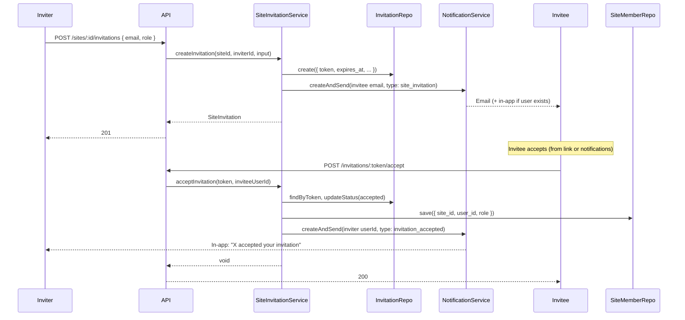

# PRD: Workspace and User Access

**Product Requirements Document**  
**Status:** Draft  
**Last updated:** 2025-03-05

---

## 1. Overview

### 1.1 Purpose

Define **Workspace** (product term; backend entity: **Site**) and **user access** behaviour for BlogForAll so that:

- Every user has at least one workspace (created at signup or given a default).
- Workspaces support roles (**View**, **Edit**, **All**), full CRUD (create, read, update, delete), and **invitations** for users with or without accounts.
- **Notifications** drive invite and response flows (invitee notified when invited; inviter notified when invite is accepted/rejected).
- **Onboarding** includes an optional, skippable “invite teammates” step after first workspace creation and on first login.

This PRD aligns with the existing notification service (email via Brevo, in-app via Socket.io) and applies the same design discipline: config in global env, clear interfaces, validation middleware, and explicit error types.

### 1.2 Scope

| In scope | Out of scope (for this PRD) |
|----------|-----------------------------|
| Workspace CRUD (create, read, update, delete) and UI | Workspace-level billing or usage-based limits (covered elsewhere) |
| Roles: View, Edit, All (mapped to existing owner/admin/editor/viewer) | Custom permission matrix beyond these three tiers |
| Invite by email (with or without account); accept/reject | SSO / SAML / directory sync |
| Notifications: invite sent → invitee; invite responded → inviter; workspace events → members until removed | Push / mobile notifications |
| Workspace management UI: invite state, role edit, member stats (e.g. posts created) | Advanced analytics or audit logs |
| Onboarding: optional create-first-workspace, optional invite step, first-login prompt | Full redesign of plan/billing onboarding |

### 1.3 Terminology

- **Workspace** – Product term; implemented as **Site** in backend (DB, API, code). PRD uses “workspace” for UX and “site” where referring to implementation.
- **View** – Read-only access (maps to `viewer`).
- **Edit** – Can create/edit content (maps to `editor`).
- **All** – Full access: manage members, invites, settings, delete workspace (maps to `owner` and `admin`; owner is creator, admin is granted “all” by owner).
- **Invitee** – User invited to a workspace (may or may not have an account yet).
- **Inviter** – User who sends the invitation.

---

## 2. Current State (Brief)

- **Workspace (Site):** Backend supports create, read, update, delete. Frontend supports create (onboarding + site switcher); **no UI for edit or delete**.
- **Roles:** Backend has `SiteMemberRole`: owner, admin, editor, viewer. Frontend shows and updates roles on members page; no “View / Edit / All” simplification.
- **Invitations:** Backend supports invite by email, token-based accept/reject; **invitee must already have an account** with matching email. No “invite-to-signup” flow. Email sent via current email service (not yet Notification Service).
- **Onboarding:** After plan complete, if user has 0 sites they are **redirected** to create-site (not skippable). No “invite teammates” step.
- **Notifications:** No server-driven notifications for “invitation sent” or “invitation accepted/rejected”; no workspace-scoped notifications for members.

---

## 3. Goals

- **Workspace for everyone:** User gets a workspace at signup (name chosen or default) or on first login if none exists.
- **Clear roles:** Expose View, Edit, All in UI; map cleanly to viewer, editor, owner/admin.
- **Invite anyone:** Support inviting by email whether or not the invitee has an account; invite-to-signup and post-signup “join workspace” from notifications.
- **Traceable, reliable notifications:** Use Notification Service (Brevo + in-app) for invite and response events; correlation and lifecycle as in notification PRD.
- **Manageable workspaces:** Single place to see workspace(s), members, invite state, roles, and basic member stats (e.g. posts created).
- **Friendly onboarding:** Optional create-first-workspace, optional invite step (skippable), and first-login prompt for invite.

---

## 4. Functional Requirements

### 4.1 Workspace Creation and Defaults

| ID | Requirement | Notes |
|----|-------------|--------|
| W1 | On **signup**, user either (a) creates a workspace with a name they choose, or (b) is assigned a **default workspace** (e.g. “{User’s name}’s Workspace” or “My Workspace”). | Configurable default name in env or constants. |
| W2 | If user completes signup without creating a workspace, a default workspace is **created automatically** (server-side) and the user is added as **owner**. | Ensures every user has at least one workspace. |
| W3 | **First login** (or when user has zero workspaces): show a prompt to create or name their first workspace; **skippable** (skip creates default workspace per W2). | Same as optional onboarding step; can be same UI. |

### 4.2 Workspace Roles

| ID | Requirement | Notes |
|----|-------------|--------|
| R1 | Every workspace has users with one of **View**, **Edit**, or **All**. |  |
| R2 | **View:** Can view workspace content (blogs, settings read-only). No create/edit/delete. | Maps to `viewer`. |
| R3 | **Edit:** Can create, edit, delete content (e.g. blogs, categories) within the workspace. Cannot manage members or workspace settings. | Maps to `editor`. |
| R4 | **All:** Can do everything Edit can, plus: invite/remove members, change roles, update workspace name/description, delete workspace. One **owner** per workspace (creator); others with full access are **admin**. | Maps to `owner` and `admin`. |
| R5 | Role changes are **immediate**; UI must show current role and allow “All” users to change other members’ roles (except owner). | Owner cannot be demoted or removed by others. |

**Role mapping (product → backend):**

| Product (UI) | Backend `SiteMemberRole` | Capabilities |
|--------------|--------------------------|--------------|
| View         | `viewer`                 | Read workspace content only |
| Edit         | `editor`                 | Create/edit/delete content (blogs, categories) |
| All          | `admin` or `owner`       | Edit + manage members, invites, workspace settings, delete workspace |

### 4.3 Workspace CRUD

| ID | Requirement | Notes |
|----|-------------|--------|
| C1 | **Create:** Already supported (onboarding, site switcher). Add creation at signup or default-workspace creation (W1–W3). |  |
| C2 | **Read:** List workspaces for the user; get one by id; include member count and invite counts when useful. |  |
| C3 | **Update:** User with “All” can update workspace **name** and **description**. Backend `PATCH /sites/:id` exists; add **frontend** (workspace settings or list detail). |  |
| C4 | **Delete:** User with “All” (owner or admin) can **delete** the workspace. Backend `DELETE /sites/:id` exists; add **frontend** (e.g. danger zone in workspace settings). Deletion removes all members and invitations; content (blogs) policy TBD (delete vs transfer). |  |

### 4.4 Invitations

| ID | Requirement | Notes |
|----|-------------|--------|
| I1 | User with **All** can **invite by email** and assign role (View, Edit, All). |  |
| I2 | **Invitee has account:** Send email with link to accept/reject. After login, invite appears in **in-app notifications**; user can accept or reject from notification or from invitation link. |  |
| I3 | **Invitee has no account:** Send email with **sign-up link** (e.g. `/signup?invite=<token>` or `invite=<token>` in query). After signup (same email), user is redirected or prompted to **accept the invite** (in-app notification or dedicated “Pending invites” view). |  |
| I4 | **Accept:** Invitation status → accepted; user added as member with assigned role; inviter and (optionally) other “All” users get **in-app notification** “{User} accepted your invitation to {Workspace}.” |  |
| I5 | **Reject:** Invitation status → rejected; inviter gets **in-app notification** “{User} declined your invitation to {Workspace}.” |  |
| I6 | **Invitee notification:** When an invitation is **sent**, the invitee receives (1) **email** (existing or new template) and (2) **in-app notification** once they have an account and the invite is still pending. |  |
| I7 | Invitations **expire** (e.g. 7 days configurable). Expired invites cannot be accepted; inviter may resend (new token). |  |
| I8 | **One pending invite per (workspace, email).** Resend replaces or extends existing pending invite. |  |

### 4.5 Workspace Notifications for Members

| ID | Requirement | Notes |
|----|-------------|--------|
| N1 | **Members** of a workspace receive **workspace-relevant notifications** (e.g. new comment on workspace blog, invite accepted, member added) **until they are removed** from the workspace. |  |
| N2 | When a user is **removed** from a workspace, they no longer receive workspace notifications; existing in-app notifications can remain but no new ones for that workspace. |  |

### 4.6 Workspace Management and Member Stats

| ID | Requirement | Notes |
|----|-------------|--------|
| M1 | **Workspace management** view: list of workspaces with actions (open, settings, delete for current workspace). |  |
| M2 | **Per-workspace:** List **members** with role, **invite state** (pending / accepted / rejected / expired), and ability to **edit role** (for “All” users). |  |
| M3 | **Member stats:** Show per-member **number of posts (blogs) created** in that workspace. Optional: last active, join date. |  |
| M4 | **Invite state:** Table or list showing pending invitations (email, role, sent date, expiry), with option to **resend** or **revoke**. |  |

### 4.7 Onboarding and First Login

| ID | Requirement | Notes |
|----|-------------|--------|
| O1 | After **plan selection** (or skip), user may **create first workspace** (name + optional description) or **skip**. If skip, backend creates default workspace (W2). |  |
| O2 | After **first workspace is created** (or default exists), show optional step: **“Invite your team”** – invite by email(s) and role(s). **Skippable**; skip goes to dashboard. |  |
| O3 | **First login** (e.g. user has no workspaces or never completed invite step): show same optional “Create workspace” and/or “Invite teammates” as above, skippable. |  |
| O4 | Invite step can be **revisited** from dashboard (e.g. “Invite members” from workspace members page). |  |

---

## 5. Architecture and Design

### 5.1 High-Level Flow

Workspace and invitation flows go through the site module; notification delivery is delegated to the Notification Service (see [PRD: Notification Service](./PRD_NOTIFICATION_SERVICE.md)).

```
┌─────────────────────────────────────────────────────────────────────────────────┐
│  CLIENT (Dashboard / Onboarding)                                                 │
│  Create workspace, list members, invite by email, accept/reject invite           │
└─────────────────────────────────────────────────────────────────────────────────┘
                                        │
                                        ▼
┌─────────────────────────────────────────────────────────────────────────────────┐
│  EXPRESS API (auth middleware, validation middleware, site-access where needed)   │
│  /sites, /sites/:id, /sites/:id/members, /sites/:id/invitations, /invitations     │
└─────────────────────────────────────────────────────────────────────────────────┘
                                        │
          ┌─────────────────────────────┼─────────────────────────────┐
          ▼                             ▼                             ▼
┌──────────────────┐         ┌──────────────────────┐      ┌─────────────────────┐
│  SiteService     │         │  SiteInvitation      │      │  SiteMemberService   │
│  CRUD workspace  │         │  Service             │      │  list, update role,  │
│  default create  │         │  create, accept,       │      │  remove, stats       │
│                  │         │  reject, resend      │      │                      │
└──────────────────┘         └──────────────────────┘      └─────────────────────┘
          │                             │                             │
          │                             │  on send / accept / reject  │
          │                             ▼                             │
          │                  ┌──────────────────────┐                 │
          │                  │  NotificationService │                 │
          │                  │  createAndSend       │                 │
          │                  │  (email + in-app)    │                 │
          │                  └──────────────────────┘                 │
          │                             │                             │
          ▼                             ▼                             ▼
┌─────────────────────────────────────────────────────────────────────────────────┐
│  PERSISTENCE                                                                     │
│  SiteRepository, SiteMemberRepository, SiteInvitationRepository (MongoDB)       │
└─────────────────────────────────────────────────────────────────────────────────┘
```

### 5.2 Core Components

1. **SiteService** – Workspace CRUD; create default workspace when user has none; ensure slug uniqueness.
2. **SiteMemberService** – List members for a site; update role (except owner); remove member; aggregate member stats (e.g. posts count).
3. **SiteInvitationService** – Create invitation (token, expiry); accept (validate token + email match, add member, update status); reject (update status); resend (new token). Calls **NotificationService** for invite email + in-app to invitee, and in-app to inviter on accept/reject.
4. **SiteRepository, SiteMemberRepository, SiteInvitationRepository** – Persistence; invariants (one owner per site, unique member per site, one pending invite per site+email).
5. **NotificationService** – Shared service; invoked by SiteInvitationService for “invitation sent”, “invitation accepted”, “invitation rejected” (and optionally “member removed”). Email via Brevo (queue); in-app via Socket.io.

### 5.3 Class Diagram (UML)

Main domain and application classes; integration with Notification Service for invite/response notifications.

```mermaid
classDiagram
    class SiteService {
        -siteRepo: ISiteRepository
        -siteMemberRepo: ISiteMemberRepository
        +create(userId, input): Promise~Site~
        +findById(id): Promise~Site|null~
        +findByUserId(userId): Promise~Site[]~
        +update(id, userId, input): Promise~Site|null~
        +delete(id, userId): Promise~void~
        +createDefaultWorkspace(userId, defaultName?): Promise~Site~
    }

    class ISiteRepository {
        <<interface>>
        +save(site): Promise~Site~
        +findById(id): Promise~Site|null~
        +findByOwner(ownerId): Promise~Site[]~
        +update(id, data): Promise~Site|null~
        +delete(id): Promise~void~
    }

    class Site {
        +id: string
        +name: string
        +description: string
        +slug: string
        +owner: string
        +created_at: Date
        +updated_at: Date
    }

    class SiteInvitationService {
        -invitationRepo: ISiteInvitationRepository
        -siteRepo: ISiteRepository
        -siteMemberRepo: ISiteMemberRepository
        -userRepo: IUserRepository
        -notificationService: INotificationService
        +createInvitation(siteId, invitedBy, input): Promise~SiteInvitation~
        +acceptInvitation(token, userId): Promise~void~
        +rejectInvitation(token, userId): Promise~void~
        +resendInvitation(token, invitedBy): Promise~SiteInvitation~
        +getPendingByEmail(email): Promise~SiteInvitation[]~
    }

    class ISiteInvitationRepository {
        <<interface>>
        +create(data): Promise~SiteInvitation~
        +findByToken(token): Promise~SiteInvitation|null~
        +findBySiteAndEmail(siteId, email, status): Promise~SiteInvitation|null~
        +updateStatus(token, status): Promise~void~
    }

    class SiteInvitation {
        +id: string
        +site_id: string
        +email: string
        +role: SiteMemberRole
        +token: string
        +status: InvitationStatus
        +invited_by: string
        +expires_at: Date
        +accepted_at: Date | null
    }

    class SiteMemberService {
        -siteMemberRepo: ISiteMemberRepository
        -siteRepo: ISiteRepository
        -blogRepo: IBlogRepository
        +listMembers(siteId, userId): Promise~MemberWithStats[]~
        +updateRole(siteId, memberUserId, newRole, requesterUserId): Promise~void~
        +removeMember(siteId, memberUserId, requesterUserId): Promise~void~
        +getRequesterRole(siteId, userId): Promise~SiteMemberRole|null~
    }

    class ISiteMemberRepository {
        <<interface>>
        +findBySiteAndUser(siteId, userId): Promise~SiteMember|null~
        +findBySite(siteId): Promise~SiteMember[]~
        +save(member): Promise~SiteMember~
        +updateRole(siteId, userId, role): Promise~void~
        +delete(siteId, userId): Promise~void~
    }

    class SiteMember {
        +id: string
        +site_id: string
        +user_id: string
        +role: SiteMemberRole
        +joined_at: Date
    }

    class INotificationService {
        <<interface>>
        +createAndSend(input): Promise~CreateNotificationResult~
    }

    SiteService --> ISiteRepository : uses
    SiteService --> ISiteMemberRepository : uses
    SiteService ..> Site : creates

    SiteInvitationService --> ISiteInvitationRepository : uses
    SiteInvitationService --> ISiteRepository : uses
    SiteInvitationService --> ISiteMemberRepository : uses
    SiteInvitationService --> INotificationService : invite sent / accepted / rejected
    SiteInvitationService ..> SiteInvitation : creates

    SiteMemberService --> ISiteMemberRepository : uses
    SiteMemberService --> ISiteRepository : uses
    SiteMemberService ..> SiteMember : manages
```



### 5.4 Invitation Flow (Sequence)

End-to-end: inviter sends invite → invitee gets email (+ in-app if has account) → invitee accepts → inviter gets in-app notification.



---

## 6. Data Model and Schemas

### 6.1 Collections and Fields

All collections live in MongoDB. Field names and types align with existing backend schemas (`shared/schemas/site.schema.ts`, `site-member.schema.ts`, `site-invitation.schema.ts`).

#### Site (workspace)

| Field         | Type     | Required | Description |
|---------------|----------|----------|-------------|
| _id           | ObjectId | yes      | Primary key |
| name          | string   | yes      | Display name; max 100 chars |
| description   | string   | no       | Optional; max 500 chars |
| slug          | string   | yes      | URL-friendly, unique, lowercase, match `^[a-z0-9-]+$` |
| owner         | string   | yes      | User ID of workspace creator (and initial owner) |
| created_at    | Date     | yes      | Creation time |
| updated_at    | Date     | yes      | Last update time |

**Indexes:** `owner` (list by owner); `slug` unique.

#### SiteMember

| Field      | Type     | Required | Description |
|------------|----------|----------|-------------|
| _id        | ObjectId | yes      | Primary key |
| site_id    | string   | yes      | Reference to Site._id |
| user_id    | string   | yes      | User ID |
| role       | enum     | yes      | owner | admin | editor | viewer |
| joined_at  | Date     | yes      | When user joined |
| created_at | Date     | yes      | Record creation |
| updated_at | Date     | yes      | Last update |

**Indexes:** `(site_id, user_id)` unique; `user_id` (sites for user); `(site_id, role)` (members by role).

#### SiteInvitation

| Field       | Type     | Required | Description |
|-------------|----------|----------|-------------|
| _id         | ObjectId | yes      | Primary key |
| site_id     | string   | yes      | Reference to Site._id |
| email       | string   | yes      | Invitee email (lowercase) |
| role        | enum     | yes      | Role to assign on accept (not owner) |
| token       | string   | yes      | Unique token for accept/reject link |
| status      | enum     | yes      | pending | accepted | rejected | expired |
| invited_by  | string   | yes      | User ID of inviter |
| expires_at  | Date     | yes      | Expiry; configurable (e.g. 7 days) |
| accepted_at | Date     | no       | Set when status = accepted |
| created_at  | Date     | yes      | Creation time |
| updated_at  | Date     | yes      | Last update |

**Indexes:** `token` unique; `(site_id, email, status)` (pending invite per site+email); `(email, status)` (user’s pending invites); `expires_at` (cleanup).

### 6.2 Invariants

- **One owner per site:** Exactly one `SiteMember` per site with `role = owner`; owner is set at site creation and cannot be changed via normal role update (only transfer-ownership if implemented).
- **Unique member per site:** At most one `SiteMember` per `(site_id, user_id)`.
- **One pending invite per (site, email):** Before creating a new invitation, revoke or let expire any existing pending invitation for the same `site_id` and `email`; or treat “resend” as update token and expiry of existing row.
- **Token single-use:** After accept or reject, `status` is updated; token cannot be used again.
- **Expiry:** Accept is only allowed when `expires_at > now`; otherwise mark expired and reject.

### 6.3 Optional Extensions

- **Member stats:** `MemberWithStats` can add `posts_count` (and optionally `last_active_at`) by aggregating from Blog collection (e.g. count where `site_id` and `author` or equivalent match). No new collection; computed at query time or cached.
- **Invite type:** Optional field `invite_type: 'existing_user' | 'signup'` for analytics; does not change behaviour.

---

## 7. Reliability

### 7.1 Invitation and Accept/Reject

| Measure | Description |
|---------|-------------|
| **Idempotency of accept** | Accept is idempotent by token: once status is `accepted`, further calls with same token return success or “already accepted” without creating duplicate members. |
| **Token single-use** | Each token is valid for one accept or one reject; status transition is final (no revert). |
| **Expiry check** | Before accept, check `expires_at`; if expired, set status `expired` and return error so client and inviter can resend. |
| **Atomicity** | Accept flow: update invitation status + create SiteMember in a transaction or ordered sequence so that partial failure does not leave invitation “accepted” without a member (or use compensating logic). |

### 7.2 Notification Delivery (Delegate to Notification Service)

| Measure | Description |
|---------|-------------|
| **Email** | Invitation and signup emails are sent via Notification Service (Brevo + queue). Reliability follows [PRD: Notification Service](./PRD_NOTIFICATION_SERVICE.md): retries, idempotency by notificationId, dead letter after max retries. |
| **In-app** | Invite and response notifications are created via `NotificationService.createAndSend` (in-app channel). Persistence-first; if user is offline, they see the notification on next load or when Socket.io reconnects. |
| **Correlation** | Use a shared `correlationId` (e.g. invitation id or a new UUID) when sending “invitation sent” and “invitation accepted/rejected” so all related notifications can be traced. |

### 7.3 Workspace and Member Operations

| Measure | Description |
|---------|-------------|
| **Default workspace** | If user has zero workspaces (after signup or first login), create default workspace in the same request or a dedicated “ensure default” step so the user never remains without a workspace. |
| **Delete workspace** | Delete is irreversible in this design; optionally soft-delete (e.g. `deleted_at`) and cascade to members/invitations for recovery window. |
| **Concurrent role updates** | Use optimistic locking (e.g. `updated_at`) or unique constraints so that concurrent role updates do not corrupt state. |

### 7.4 Reliability Summary

| Area | Measure |
|------|--------|
| **Invitations** | Token single-use; expiry enforced; idempotent accept; atomic status + member creation where possible. |
| **Notifications** | Delegate to Notification Service; correlationId for invite/response chain; email retries and idempotency per notification PRD. |
| **Workspace CRUD** | Default workspace guarantee when user has none; delete policy (hard or soft) defined and documented. |
| **Observability** | Log invitation and accept/reject events with invitationId/siteId/userId; no PII in logs (e.g. hash email). |

---

## 8. Security

### 8.1 Authentication and Authorization

| Measure | Description |
|---------|-------------|
| **Auth on all routes** | All workspace, member, and invitation endpoints require authenticated user (JWT); auth middleware runs first. |
| **Role checks** | Only **All** (owner or admin) can: create/update/delete invitations, update/remove members, update workspace, delete workspace. Use `SiteMemberService.getRequesterRole(siteId, userId)` or equivalent; reject with 403 if not owner/admin. |
| **Owner protection** | Owner cannot be removed or demoted by another member; only owner can transfer ownership (if implemented) or delete workspace. |
| **Invitation accept/reject** | Accept and reject require valid token; **accept** additionally requires that the authenticated user’s email matches the invitation’s email (case-insensitive). Reject does not require email match (any authenticated user with the link could reject on behalf of that email; optional: restrict reject to same email). |

### 8.2 Token and Input Validation

| Measure | Description |
|---------|-------------|
| **Token** | Invitation token is long random value (e.g. 32 bytes hex); stored in DB; not guessable. Validate token format and existence before proceeding. |
| **Input validation** | Validate all inputs with Zod (or equivalent): invite body (email format, role enum); accept/reject params (token presence and format); workspace create/update (name length, slug pattern). Use validation middleware; controllers use `req.validatedBody` / `req.validatedParams`. |
| **Email** | Normalize email (lowercase, trim); reject invalid format; optional allowlist/blocklist for invite abuse. |
| **Slug** | Workspace slug: only `[a-z0-9-]`; unique globally; prevent reserved values (e.g. `api`, `admin`). |

### 8.3 Rate Limiting and Abuse

| Measure | Description |
|---------|-------------|
| **Invite rate limits** | Per-workspace and/or per-user limit (e.g. 20 invites per workspace per day, 50 per user per day) to prevent spam and stay within email/notification limits. |
| **Accept/reject by token** | Rate limit by token or by IP for accept/reject endpoints to prevent brute-force or token enumeration. |
| **Default workspace** | Limit creation of default workspace to once per user (e.g. only when user has zero workspaces). |

### 8.4 PII and Logging

| Measure | Description |
|---------|-------------|
| **Logs** | Do not log full email addresses or invitation tokens in plain text. Log `siteId`, `invitationId`, `userId` (or hash), and action (invite_created, invite_accepted, invite_rejected). Use correlationId for tracing. |
| **Errors** | Do not expose internal details (e.g. DB errors) to client; map to generic messages; log details server-side only. |

### 8.5 Security Summary

| Area | Measure |
|------|--------|
| **API** | Auth on all endpoints; role checks (All for invite/member/workspace mutating actions); owner protected from removal/demotion. |
| **Invitations** | Valid token; email match for accept; long random token; expiry enforced. |
| **Input** | Zod (or equivalent) validation; normalized email; slug pattern and uniqueness. |
| **Rate limiting** | Per-workspace and per-user invite limits; optional rate limit on accept/reject. |
| **Logs** | No PII; use ids and correlationId for tracing. |

---

## 9. User Interface Flows and Pages

### 9.1 Flow: Signup → Workspace → Optional Invite

```
Signup (email, password, name)
    → Plan selection (or skip)
    → [NEW] Create first workspace (name, description) OR Skip
        → If Skip: backend creates default workspace
    → [NEW] Invite teammates (emails + roles) OR Skip
    → Dashboard
```

### 9.2 Flow: First Login (No Workspace or Incomplete Onboarding)

```
Login
    → If no workspaces: prompt "Create your first workspace" (name, description) OR Skip (default workspace created)
    → If never saw invite step (optional): "Invite your team?" OR Skip
    → Dashboard
```

### 9.3 Flow: Invite (Invitee Has No Account)

```
Inviter: Members → Invite → Enter email, role → Send
    → Invitee receives email: "You're invited to {Workspace}. Sign up to join."
    → Invitee clicks link → Signup (email pre-filled, invite token in URL/state)
    → After signup → Redirect to Dashboard or "Pending invites"
    → In-app notification: "You've been invited to {Workspace} as {Role}"
    → Invitee: Accept or Reject
    → If Accept: added as member; inviter gets in-app "Accepted"
    → If Reject: inviter gets in-app "Declined"
```

### 9.4 Flow: Invite (Invitee Has Account)

```
Inviter: Members → Invite → Enter email, role → Send
    → Invitee receives email: "You're invited to {Workspace}. Accept or decline."
    → Invitee: clicks link (with token) → Login if needed → Accept/Reject page or in-app
    → In-app notification: "You've been invited to {Workspace} as {Role}"
    → Accept → member; inviter notified. Reject → inviter notified.
```

### 9.5 Page Definitions

#### 9.5.1 Workspace List / Management

| Page | Route (suggestion) | Purpose | Key elements |
|------|--------------------|---------|----------------|
| Workspace list / settings | `/dashboard/workspaces` or `/dashboard/sites` | List all workspaces; open, edit, delete. | Table or cards: name, description, member count, “Settings”, “Delete”. “Create workspace” button. Breadcrumb: Dashboard > Workspaces. |

#### 9.5.2 Workspace Settings (Single)

| Page | Route | Purpose | Key elements |
|------|-------|---------|----------------|
| Workspace settings | `/dashboard/workspaces/[id]/settings` or `/dashboard/sites/[id]/settings` | Edit name, description; danger zone (delete). | Form: name, description. “Save”. “Delete workspace” with confirmation (type name or confirm). Only for All role. |

#### 9.5.3 Members and Invites

| Page | Route | Purpose | Key elements |
|------|-------|---------|----------------|
| Members | `/dashboard/workspaces/[id]/members` (or under sites) | Members list with role, stats; pending invites; invite button. | Tabs or sections: “Members” (table: name/email, role, posts count, role dropdown, remove); “Pending invites” (email, role, sent, expiry, resend, revoke). “Invite member” opens modal/sheet (email, role, send). |

#### 9.5.4 Onboarding

| Page | Route | Purpose | Key elements |
|------|-------|---------|----------------|
| Create first workspace | `/onboarding/create-workspace` or keep `create-site` | Name, description; primary CTA “Create”; secondary “Skip” (creates default). | Heading, form, Skip link. |
| Invite teammates | `/onboarding/invite` or inline step after create-workspace | Optional step: add email(s), role(s), “Send invites”; “Skip for now”. | List of email+role rows, Add more, Send, Skip. |

#### 9.5.5 Invitations (Invitee)

| Page | Route | Purpose | Key elements |
|------|-------|---------|----------------|
| Pending invites | `/dashboard/invitations` or inside notifications | List pending workspace invites; Accept / Reject per invite. | Cards or list: workspace name, role, inviter, Accept, Reject. |
| Accept invite (by token) | `/invitations/accept?token=...` or `/join?token=...` | When user lands from email link; if not logged in → login/signup then redirect back. If logged in → show invite summary and Accept/Reject. | Workspace name, role, inviter; Accept, Reject. |

### 9.6 Navigation and Entry Points

- **Site/workspace switcher** (existing): Add “Workspace settings” or “Manage workspaces” that goes to workspace list.
- **Dashboard sidebar:** “Workspaces” or “Sites” → list; from list, “Members” per workspace.
- **Notifications:** Invitation and response notifications link to “Pending invites” or “Members” page.
- **Onboarding:** After plan (or skip), redirect to create-workspace step; then invite step; then dashboard.

---

## 10. Data and API (Summary)

### 10.1 Backend Alignment

- **Workspace** = existing **Site** (name, description, slug, owner). No schema change required for View/Edit/All; they are presentation of existing roles.
- **Roles:** Keep `SiteMemberRole` (owner, admin, editor, viewer). Map in API/UI as: viewer → View, editor → Edit, owner/admin → All.
- **Invitations:** Existing `SiteInvitation` (site_id, email, role, token, status, invited_by, expires_at). Extend or add:
  - Optional: `invite_type` or flag for “invite-to-signup” (no account yet) for analytics/UX.
  - Expiry: already present; consider 7 days default (config in env).
- **Member stats:** New endpoint or extend members list: e.g. `GET /sites/:id/members` returns `posts_count` per member (count blogs where author or site matches). Backend can add aggregation or a small stats service.

### 10.2 Notifications Integration

- **Event: Invitation sent**  
  - **To invitee:** Email (Brevo) + in-app (if user exists and is logged in). Template: “You’ve been invited to {workspace} as {role}. Accept or decline.”
  - **Invite-to-signup:** Email only (no in-app until after signup); email links to signup with token.

- **Event: Invitation accepted**  
  - **To inviter:** In-app: “{Invitee} accepted your invitation to {Workspace}.”

- **Event: Invitation rejected**  
  - **To inviter:** In-app: “{Invitee} declined your invitation to {Workspace}.”

- **Event: Member removed**  
  - **To removed user:** In-app: “You have been removed from {Workspace}.” (Optional.)

Use **Notification Service** (`createAndSend`), correlation IDs, and existing email/in-app channels. Template keys and payloads defined in notification module (single place for template keys).

### 10.3 Config and Constants

- **Default workspace name:** e.g. `env.workspace.defaultName` or constant `DEFAULT_WORKSPACE_NAME` (from env).
- **Invitation expiry days:** e.g. `env.workspace.invitationExpiryDays` or constant (e.g. 7).
- **Application of notification PRD:** Workspace-related config in **global env** (`shared/config/env.ts`); workspace module uses **interfaces** in `modules/site/interfaces` (or `workspace` if renamed); **validation middleware** for invite body and query params; **error types** from `shared/errors` (BadRequestError, NotFoundError, ForbiddenError).

---

## 11. Non-Functional and Design Notes

### 11.1 Security (High-Level)

- Only **All** (owner/admin) can invite, remove members, change roles, update workspace, delete workspace.
- **Owner** cannot be removed or demoted by another member.
- Accept/reject invitation only with **valid token** and (for accept) **matching email** for logged-in user.
- Invite-to-signup: signup with email that matches pending invite; after verification, treat as same user for accept flow.

### 11.2 Applying Notification PRD Learnings

Apply the same patterns used in the Notification Service PRD and implementation:

- **Config:** Workspace-related env (e.g. default workspace name, invitation expiry days) in **global env** (`shared/config/env.ts`); no `process.env` inside workspace/site module.
- **Interfaces:** All DTOs and request/response shapes in **module interfaces folder** (e.g. `modules/site/interfaces/`): `CreateInvitationInput`, `InvitationResponse`, `WorkspaceMemberWithStats`, `AcceptInvitationInput`, etc. Naming: `*Input`, `*Output`, `*Result` as in notification module.
- **Validation:** Zod schemas for invite body (email, role), accept/reject params (token); **validation middleware** (`validateBody`, `validateParams`) on routes; controllers use `req.validatedBody` / `req.validatedParams`; **no redundant auth check** in controller (auth middleware already enforces user).
- **Errors:** Use shared error types (`BadRequestError`, `NotFoundError`, `ForbiddenError`); in try/catch use `catch (error: unknown)` and rethrow or wrap with `AppError` where appropriate.
- **Pseudocode:** Add brief **pseudocode flow comments** above each service and controller function for maintainability.
- **Facades:** Any third-party or cross-cutting integration (e.g. calling Notification Service for invite/response notifications) via clear boundaries; keep workspace logic in workspace service, notification dispatch in one place.

### 11.3 Accessibility and Responsiveness

- All new pages and modals: keyboard navigable, labels for form fields, focus management in modals.
- Workspace list and members table: responsive (stack on small screens or horizontal scroll).

---

## 12. Open Points and Future Work

| Topic | Decision / Note |
|-------|------------------|
| Workspace deletion and blogs | Decide: delete all blogs in workspace vs soft-delete vs “transfer” to owner. |
| Moderator role | Out of scope for this PRD; can add later for comment moderation. |
| Invite rate limits | Consider per-workspace or per-user limits to prevent abuse. |
| Resend invite | Resend = new token and new expiry; optional “Resend” button in pending invites list. |
| “All” vs “Owner”/“Admin” in API | Expose as “all” in UI; API can keep owner/admin for backward compatibility. |

---

## 13. References

- [PRD: Notification Service](./PRD_NOTIFICATION_SERVICE.md) – Email (Brevo), in-app (Socket.io), queue, templates, retention.
- [Feature Gaps](./FEATURE_GAPS.md) – Workspace management, invitations, onboarding, notifications.
- Backend: `modules/site`, `shared/schemas/site*.schema.ts`, `shared/constants` (SiteMemberRole, InvitationStatus).
