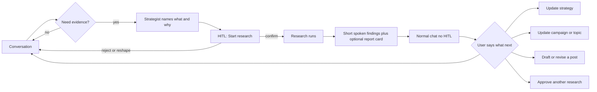

# Requirements — Strategist coworker and Framer publish

**Status:** Draft  
**Date:** 2026-08-24  
**Product:** Bloggr  
**Experience contract (do not replace):** [`architecture/v0.5/22-ai-strategist-experience.md`](./architecture/v0.5/22-ai-strategist-experience.md)  
**CI design:** [`architecture/v0.5/19-conversation-intelligence.md`](./architecture/v0.5/19-conversation-intelligence.md), [`PRD_CONVERSATION_INTELLIGENCE.md`](./PRD_CONVERSATION_INTELLIGENCE.md)  
**Strategic hierarchy:** [`architecture/v0.5/21-strategic-intelligence.md`](./architecture/v0.5/21-strategic-intelligence.md)

This file is the product requirements for (1) choosing Framer when publishing and (2) the writer-as-strategist coworker loop, including research HITL policy and how Conversation Intelligence helps. Implementation is split later; this document locks use cases and decisions.

---

## 1. North star

The user talks to a **human-feeling strategist coworker** (COO-adjacent): understands the business and the current strategic problem, coordinates campaigns that actually serve goals, remembers people and preferences, researches when it matters, and never dumps a wall of text.

Publishing is part of that job. When Framer is a live CMS, the user can **choose Bloggr, Framer, or both** from posts and from the AI draft/results flow.

---

## 2. Current baseline

Honest starting point so requirements do not pretend missing work is done.

### 2.1 Publish

Backend already routes `bloggr` / `framer` via `PublishRouterService`. Frontend `PublishDestinationPicker` is checkbox multi-select and **only renders when Framer is connected**. It is wired on:

- Posts list / new / edit
- Scheduled post create / edit and campaign schedule
- AI draft editor (`blog-draft-result-editor.tsx`)
- Chat HITL and Approvals (`blogs_publish` / `blogs_schedule`)

If Framer is disconnected, publish is silently Bloggr-only — easy to miss.

### 2.2 Writer

Production chat is **orchestratorv2** on `/dashboard` (not a separate writer page). Memory, lite/full research, campaign/strategy/post tools, and **two-step** writing HITL exist today (`writing_request_research` then `writing_confirm_research` before draft).

Doc 22 still specifies a **research findings card** plus **outline HITL**. v2 dropped outline HITL and dumps research as markdown in chat. Founder vs marketer is **tone in the prompt only**.

**Conversation Intelligence** (`ci.analyze.v1`) is implemented for the v0.5 graph and is **not** on the v2 chat path.

---

## 3. Decisions (locked)

1. **Publish control:** one shared multi-select everywhere (Bloggr + Framer can both be on). A single dropdown is only enough if “both” is an explicit option. When Framer is missing, show a Connect CTA — do not silently publish to Bloggr only.
2. **Research HITL:** approve **before** research only. After results, conversation only — no `writing_confirm_research`. Draft when write intent is clear on a later turn (CI helps classify).
3. **Outline HITL:** stay dropped. Research card is optional to open, not a gate.
4. **Roles:** company role (founder / marketer / …) shapes **how findings are said**. Workspace role (owner / admin / editor / viewer) shapes **who can approve writes**. No separate founder dashboard in this doc.
5. **CI:** document as the interpretation layer for v2. Implement after HITL/research-card policy so plan consumes a structured `ConversationContext` instead of re-guessing intent.

---

## 4. Part A — Publish to Framer

### 4.1 Goal

On every path where a post can go live or be scheduled, the user can **see destinations and choose** when an external CMS is connected. If Framer is not connected, they get a clear next step — not a silent Bloggr publish.

### 4.2 Surfaces in scope

- Posts list publish
- Post new / edit (when status is Published or Scheduled)
- Scheduled post create / edit
- Campaign schedule
- AI **results panel** draft editor (Publish / Schedule)
- AI chat HITL + Approvals (`blogs_publish` / `blogs_schedule`)

### 4.3 Use cases

| ID | Use case | Notes |
|----|----------|--------|
| P1 | Choose destinations on posts list | Modal or dropdown; Bloggr, Framer, or both |
| P2 | Choose destinations on post new/edit | Same control; required if Framer connected |
| P3 | Choose destinations on AI results Publish / Schedule | Same control as posts; do not hide behind “open full editor” |
| P4 | Choose destinations when AI asks to publish/schedule | HITL card + Approvals page |
| P5 | Framer not connected | CTA: Connect Framer (open configure dialog) instead of silent Bloggr-only |
| P6 | Last-used destinations remembered | Per workspace default; overridable per post |
| P7 | Framer-only | Uncheck Bloggr; post stays draft in Bloggr, live on Framer |
| P8 | Schedule to Framer | Destinations stored on schedule; honored at fire time |
| P9 | See publish outcome | Success/fail per destination; Framer URL when available |
| P10 | Retry failed Framer delivery | From post or Framer manage page |
| P11 | Republish / update existing Framer item | Same CMS item, not a duplicate |
| P12 | Unpublish / take down Framer item | Missing today |
| P13 | Incomplete field map | Warn before publish; do not send a broken item |
| P14 | Disconnect after schedule | Schedule still defined; fire-time skip + notify if Framer gone |
| P15 | Permission | Viewer cannot publish; editor+ can |
| P16 | AI never suggests Framer if disconnected | Already a skill rule; keep as acceptance |

### 4.4 Out of scope (first ship of this doc)

WordPress / Webflow / Ghost. Unpublish from token review pages.

---

## 5. Part B — Writer as strategist coworker

### 5.1 Persona

You are a **strategist hired to move a business**. You sound like a sharp coworker: warm, brief, one thread at a time. You have opinions when the strategy is weak. You do not narrate tools, JSON, or pipelines.

### 5.2 What good feels like

- Conversational: short turns, one question when you need an answer.
- Carry the user: say what you heard, what it implies, what you want to do next.
- Never dump. Long artifacts (research report, draft, campaign) live in cards / the results panel; chat stays the discussion.
- Strategic: campaigns must map to a **business goal** and a **current problem**, not a content calendar for its own sake.
- Convenient: offer the next useful move (research, draft, adjust campaign, publish) without a menu of capabilities.

### 5.3 Memory (short + long)

| ID | Use case |
|----|----------|
| M1 | Remember facts the user said in this thread (short-term) |
| M2 | Remember preferences, tendencies, working style across threads (long-term, per user + workspace) |
| M3 | Remember important business data said in passing (audience, offer, competitor, constraint) |
| M4 | If a remark looks like a **business-knowledge type we missed**, propose saving it (strategically — not a form after every sentence) |
| M5 | Same for strategy / campaign fields: “that sounds like a positioning change — want me to update the strategy?” |
| M6 | Do not re-ask known facts; reference them naturally |
| M7 | Forget / correct when the user says we got it wrong |
| M8 | Workspace-shared beliefs vs personal preferences stay distinct |

### 5.4 Understanding the business and the problem

| ID | Use case |
|----|----------|
| S1 | First (or thin) workspace: interview like a strategist — goal, who it’s for, what is stuck — not a 20-field wizard |
| S2 | Restate the **current strategic problem** in one sentence and confirm |
| S3 | Refuse or reshape a campaign that does not serve a goal (“this is a topic list, not a campaign”) |
| S4 | After a draft or review, say in one line how it fits goal / audience / CTA |
| S5 | Proactive opener: unfinished onboarding, approvals, at-risk campaign, knowledge gap — never a capability dump |

### 5.5 Campaigns and posts from conversation

| ID | Use case |
|----|----------|
| C1 | Discuss → propose a campaign in plain language → user confirms → create |
| C2 | Generate / edit roadmap topics that serve the campaign means |
| C3 | Start or add a post to a campaign from chat |
| C4 | Edit a campaign topic (angle, title, sequence) from conversation |
| C5 | Use AI to draft posts only after intent is clear (discuss ≠ write) |
| C6 | User can reject, rework, or pause any create/update |
| C7 | Publish/schedule the draft from the **results panel** with destination choice (ties to Part A) |

### 5.6 Research loop (approve before, chat after)

**HITL is only the gate to spend research.** After findings land, the next turn is a normal conversation — no second confirmation card.

Today v2 does the opposite of what we want after research: a yellow `writing_confirm_research` card. That card goes away. Drafting is a later **conversational** intent (“write it”, “use this for the post”), not a HITL after the report.



| ID | Use case |
|----|----------|
| R1 | Strategist decides **what** to research and says why in one sentence |
| R2 | User can redirect the brief **before** approve: “look at competitors, not keywords” |
| R3 | **HITL before research only:** Start research / change the brief / not now. Costly work does not start until they approve |
| R4 | After results: **no HITL**. Findings are spoken in chat (3–6 sentences, role-aware). Full report is optional (card/panel), not a confirmation step |
| R5 | Role-aware **communication** (same UI): founder hears implication, priority, bet; marketer hears angle, proof, channel, CTA. Workspace role still gates who can approve writes |
| R6 | User can ask to research again; that is a **new** pre-research HITL with a tighter brief |
| R7 | Applying findings (strategy / campaign / topic / post) is conversational or a later write/update confirm — not a post-research checkpoint |
| R8 | Writing path: research returns → discuss. Draft starts only when the user (or CI) makes **write intent** clear. Discuss ≠ write. No auto-draft |
| R9 | Full report is a **card or panel artifact**, not a wall of markdown in the transcript |
| R10 | Re-open a past research package and discuss it |

**Where this differs from doc 22 §4 / §4.1:** this file is the product lock. Outline HITL stays dropped. Post-research Approve / Continue is removed. The findings **card** remains as an optional artifact, not a gate.

### 5.7 Conversation quality

| ID | Use case |
|----|----------|
| Q1 | One assistant bubble per turn; stages only in the rail |
| Q2 | One question per turn when asking |
| Q3 | Interrupt / change topic without losing the last useful artifact |
| Q4 | Voice/call: same capabilities; spoken replies stay short; artifacts stay visual |
| Q5 | Never expose tool names, skill load, or raw JSON |
| Q6 | Multi-member workspace: remember who you are talking to (preferences) while sharing workspace strategy |

---

## 6. Implied use cases (keep in this file)

- **Connect Framer mid-publish** (P5) and **field-map warning** (P13)
- **Per-destination status + retry + unpublish** (P9–P12)
- **Default destinations** (P6)
- **Apply-research as a first-class conversational move** (R7) — no second research HITL; CI + skills decide if they meant draft, update strategy, or keep talking
- **Business-knowledge catch from casual chat** (M4)
- **Campaign quality bar** (S3)
- **Research presentation by company role** (R5)
- **Doc 22 vs v2 drift:** drop post-research HITL and outline HITL; keep a findings card (optional to open), not a markdown dump
- **Wire Conversation Intelligence onto v2** — required to make “chat after research” reliable (see §7)

---

## 7. Conversation Intelligence (how it helps this goal)

CI already exists as design + code for the **v0.5 graph**. Production v2 chat **does not call it**. The agent infers intent from the raw message + playbooks, which is why it over-HITLs, dumps research, and misses implied “write this” vs “tell me more”.

**What CI is:** a layer **before** planning/skills. It interprets the turn; it does **not** run research, write posts, or save strategy.

```
User message
  → Memory retrieve (light)
  → Conversation Intelligence.analyze → ConversationContext
  → Orchestrator plan / agent (consumes context; no re-NLU)
  → Skills / tools / HITL only when the context says action is required
```

**Useful outputs:** communicative category (ask / act / brainstorm / feedback / preference / casual), `workflow_intent`, `action_required`, urgency, tone, entities, `requires_clarification` (only if a **blocking** slot is missing), `suggested_next_action`, memory candidates, response style (brevity).

### 7.1 How CI achieves the strategist coworker goal

| Goal from this doc | Without CI (v2 today) | With CI on v2 |
|--------------------|----------------------|---------------|
| Feel like a coworker, not a command parser | Agent guesses from wording; soft “we should write about X” often becomes idle chat or a surprise workflow | Communicative meaning wins: soft suggestion → planning; joke → casual; “this feels robotic” on an open draft → revise |
| Never dump / one question | Prompts ask for brevity; research mode still pastes the full report | `response_style.brevity` + role + urgency tell compose how long to talk; report stays an artifact |
| Approve **before** research | Agent can start or double-HITL inconsistently | `request_action` + `research` → plan proposes research → **one** HITL (R3). Casual/explain never triggers research |
| **Chat after** findings (no second HITL) | Hard-coded `writing_confirm_research` | After package exists, CI classifies the next human line: discuss → talk; “write it” → write skill; “update the campaign” → campaign update; “dig into competitors” → new pre-research HITL |
| Capture missed business fields (M4) | Weak / prompt-only | `update_preferences` / entities / memory candidates → “that sounds like audience — save it?” |
| Discuss ≠ write (C5, R8) | Second research card stands in for write intent | Write intent is a **later** CI classification, not a leftover research checkbox |
| Role-aware findings (R5) | System prompt tone only | CI already has tone/urgency/style; combine with company role so founder vs marketer hear different **emphasis**, same facts |
| Interrupt / change topic (Q3) | Easy to stay stuck in writing skill | New turn re-analyzed; `references_previous_context` vs new intent; plan can leave the pipeline |

### 7.2 How CI fits the research loop

1. User is talking. CI: brainstorm / explain → no research.
2. Strategist (or user) wants evidence. CI: `request_action` + research + enough topic → **HITL: Start research** (scope shown).
3. Research runs. Findings spoken + optional report card. **No approval chip.**
4. Next user message goes through CI again:
   - “What does that mean for us?” → explain / discuss
   - “Write the post” → `create_content` / start write (separate from research)
   - “Put this in the campaign” → campaign update
   - “Look again at pricing pages” → new research HITL
   - “I prefer shorter posts” → memory candidate, no workflow

CI is how “they have to chat once the result shows” stays **smart** instead of the agent either stalling for another Confirm or auto-drafting.

### 7.3 What CI will not do

- Execute research, drafts, or publishes
- Replace Memory Manager or business-knowledge writes
- Replace workspace permission checks
- Need a second dashboard

### 7.4 Sequencing

Requirements can ship without CI (change HITL policy + findings card + converse-first copy). **CI on v2 is the enabler** that makes post-research chat, implied write, and memory-catch reliable. Wiring CI is a named follow-on in this file, not a blocker for the requirements themselves.

---

## 8. Acceptance principles

- Every in-scope publish surface either shows the shared destination control (Framer connected) or a Connect CTA (Framer missing).
- Framer-only publish does not force a Bloggr public post.
- Research never starts without an explicit Start research (or equivalent) approval.
- After research, the transcript has spoken findings and optionally a report card — **no** post-research confirmation chip.
- Draft generation does not start from “research finished”; it starts from write intent.
- Chat stays short; long artifacts stay in cards or the results panel.
- AI never mentions or offers Framer when the workspace is disconnected.

---

## 9. Implementation tracks (after this file is agreed)

Not in scope for writing this document. Later work splits into:

1. **Publish UX completeness** — P5–P16 gaps (Connect CTA, defaults, status, retry, republish, unpublish, field-map warning).
2. **Writer conversation** — research presentation card, remove `writing_confirm_research`, apply-research as conversation, memory catch (M4/M5).
3. **Conversation Intelligence on v2** — analyze each turn; consume `ConversationContext` in the agent/plan so post-research chat and discuss ≠ write are reliable.
