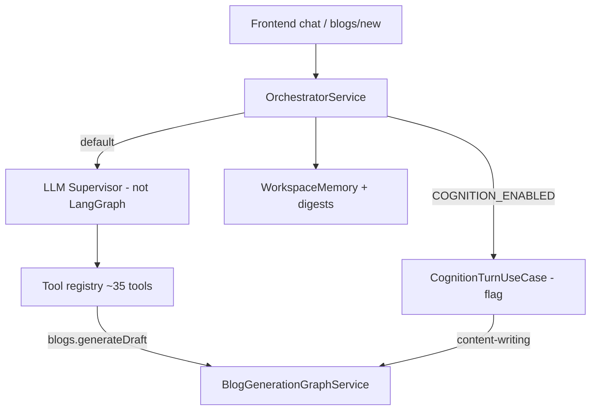
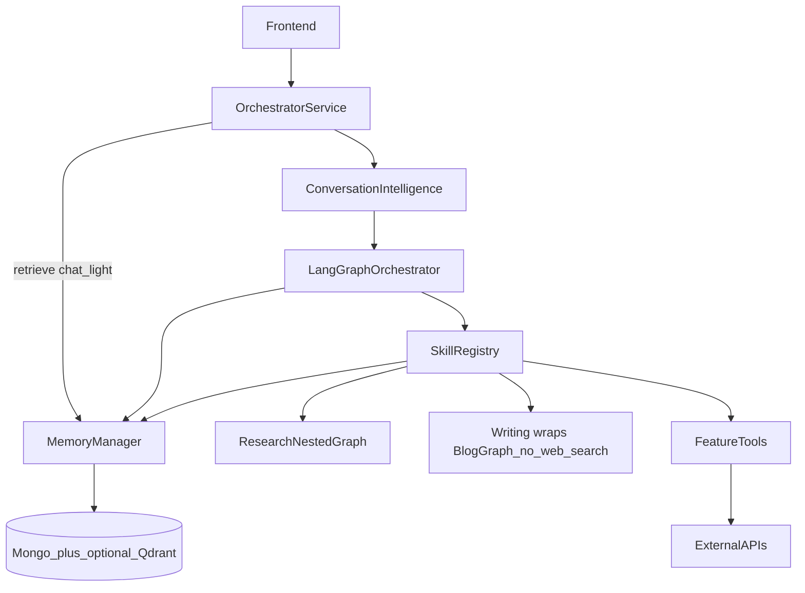

# 01 — High-Level Architecture

## 1. Purpose

This document defines Bloggr’s target system architecture for an AI content platform that behaves like a **content strategist**, not a text generator.

v0.5 evolves the existing Blogforall monorepo in place. We reuse proven pieces (tool registry, workspace memory, blog LangGraph, review runner) and replace the dual-brain chat stack with **one LangGraph orchestrator**.

---

## 2. Architectural thesis

### What we are building

```
User
  ↓
Conversation Intelligence       ← interpret communication (not execute)
  ↓
Structured ConversationContext
  ↓
LangGraph Orchestrator          ← plan, skill select, recovery
  ↓
Skills                          ← domain capabilities (may use LLM + deterministic logic)
  ↓
Tools                           ← thin, single-responsibility adapters
  ↓
External Services               ← OpenAI, Tavily, CMS, storage, analytics APIs
```

### What we are not building

| Anti-pattern | Why reject |
|--------------|------------|
| Multi-agent peer chat | Unbounded latency, ownership fights, hard to test, prompt spaghetti |
| Pure ChatGPT wrapper | No strategy → research package → outline → write → review discipline |
| Writer that also searches | Breaks provenance; reintroduces hallucination; collapses Research differentiator |
| Monolithic “do everything” prompt | Undebuggable; cannot replace stages independently |
| Memory-as-a-skill | Memory is infrastructure via **Memory Manager**, not a peer skill |
| Orchestrator writes DB / indexes | Orchestrator only retrieve + emit remember candidates |
| Literal command-only NLU | Soft suggestions and feedback must map to communicative intent |
| Conversation Intelligence as a skill | CI interprets only; never runs workflows |

### Differentiator: Research Package

Bloggr’s edge is not “better prose prompts.” It is a **Research Skill** that builds a structured **Research Package** (evidence graph, provenance, contradictions, coverage) before Writing runs. See [16-research-pipeline.md](./16-research-pipeline.md).

Conversational understanding is owned by **Conversation Intelligence** ([19-conversation-intelligence.md](./19-conversation-intelligence.md)) — before the orchestrator. Long-term strategist memory depends on the **Memory Manager** ([18-memory-manager.md](./18-memory-manager.md)). Post-draft quality is owned by the **Content Optimization Skill** — [17-content-optimization.md](./17-content-optimization.md).

### Challenge: supervisor-with-tools (today’s default)

Today’s production chat ([`OrchestratorGraphService`](../../../backend/src/modules/orchestrator/ai/orchestrator-graph.service.ts)) is an LLM supervisor that calls tools like `blogs.generateDraft`. That works for ops (list, publish, schedule) but **collapses the content pipeline into one opaque tool**. Strategy, research quality, outline approval, and review loops are not first-class workflow stages.

**Preferable:** keep tools for CRUD/ops; promote content work to **skills** invoked by a typed LangGraph state machine. The orchestrator plans *which stage next*; skills execute *how*. Research uses a **nested** graph so the orchestrator is not bloated with 14 research phases.

---

## 3. Layer model

| Layer | Responsibility | LLM? |
|-------|----------------|------|
| **API / OrchestratorService** | Auth, threads, persistence, streaming, approvals; invokes CI then graph | No |
| **Conversation Intelligence** | Communicative intent, affect, ambiguity, initiative → `ConversationContext` | Yes (structured analyze) |
| **LangGraph Orchestrator** | Planning, skill selection, recovery, human interrupts (consumes CI) | Yes (small, structured) |
| **Skills** | Strategy, research, writing, optimize, publish, analytics, conversation | Often yes + deterministic |
| **Tools** | Single action against a service | No (except rare generative tools being phased into skills) |
| **Memory Manager** | Retrieve, evaluate, store, summarize across layers | Async remember; sync retrieve |
| **Domain services** | Blog CRUD, campaigns, categories | No |
| **External** | LLM providers, search, CMS, vector DB | — |

---

## 4. Current state (as of v0.5 docs)



**Facts:**

- Real LangGraph exists only for blog generation (`validate → research → draft → review`).
- Cognition has skill folders and planner anti-tool-happy logic, but is behind a flag and incomplete (research/seo/editing poorly wired).
- Memory is already rich (workspace, digests, semantic, context packs).

---

## 5. Target state (v0.5 architecture)



**Modes (same graph, different planning policy):**

| Mode | Behavior |
|------|----------|
| `chat` | Clarify, list, explain, light ops via Publishing/Conversation |
| `quick_draft` | Research `lite` → Writing draft → Content Optimization (Writing never searches) |
| `strategist_pipeline` | Strategy → Research `full` → Outline → Write → Content Optimization → Improve* → Publish? |
| `onboarding` | Constrained interview → workspace memory |

---

## 6. Content workflow philosophy

Generation must never be Idea → Article.

```
Conversation Intelligence (communicative intent)
  → Strategy
  → Research Package (nested 14-phase skill)
  → Outline
  → Write (consumes package; never searches)
  → Content Optimization (validators + planner; not a rewrite)
  → Improve via Writing (bounded)
  → Re-optimize / quality gate
  → Publish (optional, confirmed)
```

Every stage is independently replaceable (different model, different tool, different heuristic).

**MVP pragmatism:** `quick_draft` uses Research `depth: lite` then Writing — still a Package, still no writer-side search. Full strategist uses Research `full`.

---

## 7. Engineering principles

**Prioritize**

- Deterministic execution wherever possible (routers, gates, scoring heuristics)
- Modular, replaceable skills
- Type-safe workflow state (`Annotation` + Zod)
- Reusable tools (`domain.action`)
- **Provenance of research** (every fact → source → confidence)
- **Explainability** (coverage scores, contradictions surfaced to Writing / Content Optimization)
- Observability (node/skill/phase spans + token cost)
- **Content quality for search + AI retrieval (GAO)** via Content Optimization Skill
- Scalability and future extensibility (providers, MCP, CMS, memory backends)
- **Memory as KMS** (Memory Manager; contextual retrieve; async remember)
- **Conversation Intelligence** before orchestration (communicative ≠ literal)

**Avoid**

- Unnecessary LLM calls
- Nested “orchestrators inside orchestrators” (nested **skill** graphs for Research/Writing are intentional)
- Tight coupling between skills
- Duplicated / inline prompt spaghetti
- Passing free-form prompts in graph state
- Writing that silently web-searches
- Literal-only intent that ignores implied actions
---

## 8. Technology choices

| Concern | Choice | Notes |
|---------|--------|-------|
| Orchestration | LangGraph (`@langchain/langgraph`) | Already in backend deps |
| LLM access | LangChain Chat models | Multi-provider behind factory |
| Language | TypeScript / Node | Existing monorepo |
| DI | tsyringe | Match current backend |
| Persistence | MongoDB (+ Redis checkpoint optional) | Existing |
| Search | Tavily (MVP) | Swap via Research tools |
| Memory SoR | MongoDB | Optional Qdrant RetrievalIndex behind Memory Manager |

Designed for future: MCP tool adapters, additional publishing platforms, alternate memory providers — without changing orchestrator node contracts.

---

## 9. Assumptions (challenge these)

1. **One workspace = one brand context** — multi-brand agency pack is post-MVP ([20](./20-go-to-market-architecture.md)); never mix brands in one thread/memory retrieve.
2. **HTML is the draft format** — matches current blog editor; markdown is normalized away.
3. **Human confirmation stays for destructive ops** — publish/delete/unpublish.
4. **Outline HITL is optional in MVP** — recommended default post-MVP.
5. **Analytics feedback loop is thin in MVP** — stats read + stub recommendations; closed loop later.
6. **Cognition module is absorb/delete, not a second product path** — after parity.

---

## 10. Success criteria for architecture

An engineer can:

1. Add a skill without editing orchestrator node internals (register + Zod I/O).
2. Swap Tavily for another search provider by changing one tool.
3. Run strategist pipeline with mocked skills in unit tests.
4. Trace a turn: user message → CI.analyze → plan → skill → tools → reply with costs.
5. Explain where strategy lives in state vs where prose is produced.

---

## Next

- Components: [02-component-diagram.md](./02-component-diagram.md)
- Migration: [MIGRATION.md](./MIGRATION.md)
