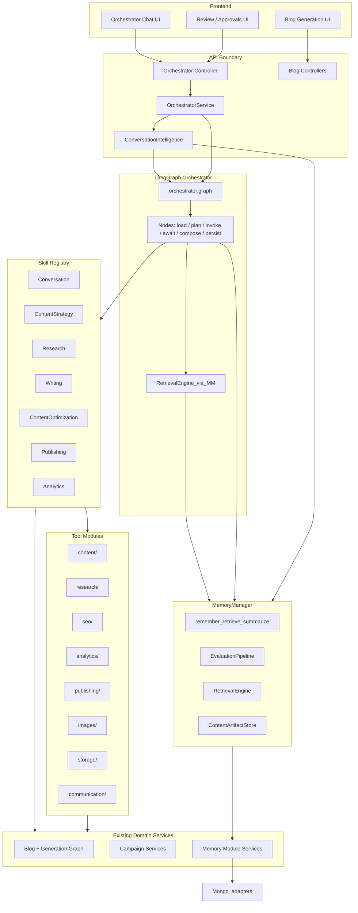
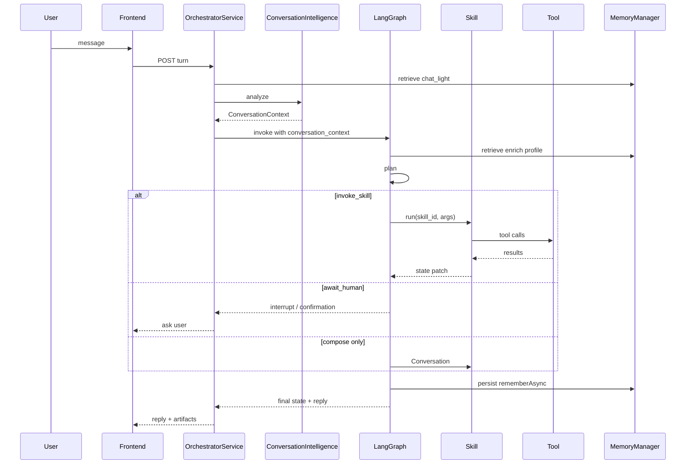

# 02 — Component Diagram

## 1. System components

---

## 2. Component responsibilities

### 2.1 OrchestratorService (API-facing)

**Path (existing):** `backend/src/modules/orchestrator/services/orchestrator.service.ts`

- Thread/message persistence
- Approval / confirmation lifecycle
- Mode routing (onboarding vs active)
- **Conversation Intelligence** `analyze` before graph invoke
- Invokes compiled LangGraph for a turn (target) with `conversation_context`
- Streams progress events to the client
- Does **not** contain domain skill prompts

### 2.1b Conversation Intelligence

**Path (target):** `orchestrator/ai/conversation-intelligence/`  
**Canonical:** [19-conversation-intelligence.md](./19-conversation-intelligence.md)

- Communicative intent, action, affect, ambiguity, mode, initiative
- Emits `ConversationContext` only
- May use `MemoryManager.retrieve(chat_light)`
- **Never** invokes Skills/Tools or starts content workflows

### 2.2 LangGraph Orchestrator

**Path (target):** `backend/src/modules/orchestrator/ai/graph/`

| Piece | Role |
|-------|------|
| `orchestrator.graph.ts` | Compiles `StateGraph`, exports `invoke` / `stream` |
| `state.ts` | `Annotation.Root` for `OrchestratorState` |
| `edges.ts` | Conditional edges after plan/skill |
| `nodes/*` | Pure-ish node functions: `(state, config) → partial state` |

**Owns:** planning (from `ConversationContext`), skill dispatch, human interrupt, recovery, reply composition coordination.

**Does not own:** raw NLU / communicative classification (CI), SEO analysis, web research, HTML drafting, CMS publish side effects.

### 2.3 Memory Manager + RetrievalEngine

**Path (target):** `orchestrator/ai/memory/manager/` + `retrieval/retrieval-engine.ts`  
**Evolves:** `context-pack-builder.service.ts` becomes an adapter behind RetrievalEngine.

Orchestrator/skills call `MemoryManager.retrieve(profile)` for budgeted slices across Session, Workspace, User Preference, Knowledge, Learning, Content Intelligence, plus artifact refs. See [18](./18-memory-manager.md).

### 2.4 SkillRegistry

**Path (target):** `backend/src/modules/orchestrator/ai/skills/registry.ts`

- Registers skills by id
- Validates input against skill Zod schema
- Invokes skill `run(ctx)` → `SkillResult`
- Emits progress events
- Maps failures to typed skill errors for the orchestrator recover path

### 2.5 Skills (seven)

| Skill | Primary job | Typical tools / deps |
|-------|-------------|----------------------|
| Conversation | Clarify, guide, summarize, explain | None / light memory read |
| ContentStrategy | Structured strategy object | Workspace memory, strategy engine |
| Research | Research Package via 14-phase nested graph | `search.web`, fetch/extract; see [16](./16-research-pipeline.md) |
| Writing | Outline / draft / revise from Package + strategy | Blog generation graph (**no** web search) |
| Content Optimization | Nested validators + GAO + planner | See [17](./17-content-optimization.md); wraps legacy review runner as adapter |
| Publishing | Format, publish, schedule, metadata | `blogs.publish`, schedule tools |
| Analytics | Metrics + recommendations | `blogs.statistics` (+ future GSC) |

See [06-skill-architecture.md](./06-skill-architecture.md).

### 2.6 Tools

Thin adapters registered in `OrchestratorToolRegistry`. Skills call tools; the orchestrator rarely calls tools directly except memory/confirmation plumbing during migration.

See [07-tool-architecture.md](./07-tool-architecture.md).

### 2.7 Memory Manager

Single facade for remember/retrieve/update/forget/summarize. Layers + artifact store documented in [18-memory-manager.md](./18-memory-manager.md) (index: [08](./08-memory-architecture.md)).

### 2.8 Blog generation graph (Writing only)

**Path (existing):** `backend/src/modules/blog/ai/blog-generation-graph.service.ts`

Becomes an **implementation detail of the Writing skill**. Product research is **not** this graph’s `research` node for new paths — Research Skill owns discovery. Target: Writing graph accepts external Research Package slices; retire embedded Tavily from the writer path.

HTTP analyze/generate endpoints should eventually call Research → Writing the same way chat does.

### 2.9 Research nested graph

**Path (target):** `orchestrator/ai/skills/research/pipeline/`

Fourteen phases documented in [16-research-pipeline.md](./16-research-pipeline.md). Invoked only through the Research skill entrypoint.

### 2.10 Content Optimization nested pipeline

**Path (target):** `orchestrator/ai/skills/content-optimization/`

Replaces Review. Validators/generators + Optimization Planner; orchestrator invokes skill once. See [17-content-optimization.md](./17-content-optimization.md).

---

## 3. Request path (chat turn)

---

## 4. Boundaries (hard rules)

1. **Skills never call other skills.** Only the orchestrator sequences skills.
2. **Tools never call the LLM for orchestration.** A tool may wrap an LLM only if it is a pure transform (rare); prefer skill-owned LLM calls.
3. **Nodes pass structured state**, never “here is the next system prompt for the next node.”
4. **Domain services stay free of orchestrator imports** where possible (skills/tools adapt).

---

## 5. Legacy components (migration)

| Component | Target fate |
|-----------|-------------|
| `OrchestratorGraphService` (supervisor) | Replaced by LangGraph; keep as fallback behind flag until parity |
| `CognitionTurnUseCase` / ConversationService | Absorb into Conversation Intelligence; remove flag path |
| Cognition empty scaffolds (`graph/nodes`, `infrastructure/langgraph`, …) | Delete in cleanup milestone |
| Session mode overlays | Become plan policies / prompt fragments registered by id |

---

## Next

- Folder structure: [03-folder-structure.md](./03-folder-structure.md)
