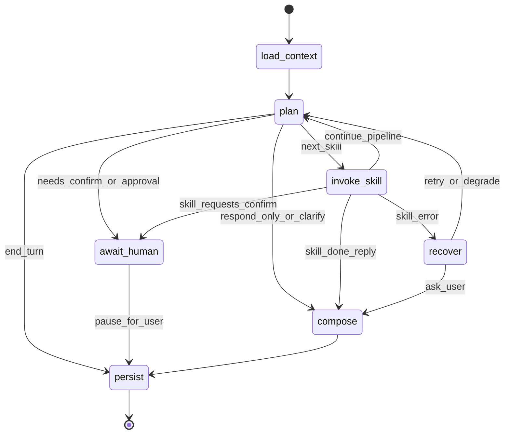

# 04 — LangGraph Workflow Design

## 1. Design goals

- One compiled `StateGraph` for all chat turns and content workflows.
- Orchestrator nodes stay small; domain work lives in skills.
- **NLU lives outside the graph** in Conversation Intelligence ([19](./19-conversation-intelligence.md)).
- Human-in-the-loop via interrupt / `await_human` for confirmations and optional stage approvals.
- Bounded loops (especially optimize → Writing revise → re-optimize).

---

## 2. Graph overview



**Pre-graph (OrchestratorService):**

```
retrieve(chat_light) → ConversationIntelligence.analyze → ConversationContext
  → graph.invoke({ conversation_context, ... })
```

The former `understand` node is **retired** (absorbed into CI).

---

## 3. Nodes

### 3.1 `load_context` (deterministic)

**Inputs:** `thread_id`, `workspace_id`, `user_id`, `message`, `conversation_context`  
**Does:**

- Call `MemoryManager.retrieve(profile)` for budgeted `memory_views` **only if** a richer profile than CI’s `chat_light` is required (e.g. `write_full`); otherwise reuse views already attached from turn entry
- Load session checkpoint / message tail (via MM / Session layer)
- Attach authoritative `current_time_iso`
- Ensure `conversation_context` is present on state (from turn entry)

**Retrieve policy (locked):** Turn entry always does `chat_light` for CI. `load_context` does **not** blindly re-fetch the same profile — enrich only when plan/profile needs more layers.

**Does not:** read Mongo collections directly, classify intent, or decide indexes  
**Returns:** identity + `memory_views` + session refs  
**LLM:** no

---

### 3.2 ~~`understand`~~ (retired)

Intent / communicative analysis runs in **Conversation Intelligence** before graph invoke. See [19](./19-conversation-intelligence.md).

Clarification: when `conversation_context.requires_clarification` → `plan` chooses `compose` (Conversation skill) without starting Research/Writing.

Migration: keep a thin `understand.ts` shim that no-ops if `conversation_context` already set.

---

### 3.3 `plan` (LLM structured + deterministic policy overlay)

**Does:**

- Consume `ConversationContext` (do **not** re-classify communicative intent from scratch)
- Choose `next`: `invoke_skill` | `await_human` | `compose` | `end`
- Choose `skill_id` + `skill_args`
- Advance `workflow_stage` for strategist pipeline
- Apply `suggested_next_action`, `urgency`, `response_style` as priors
- Enforce policies **before** trusting the model:

| Policy | Rule |
|--------|------|
| Anti-tool-happy | Prefer ask over skill when required slots missing |
| Clear action | If CI says `start_content_workflow` + topic present → do not idle-ack |
| One skill per turn (MVP chat) | Pipeline mode may chain within one user turn up to **`max_skills_per_turn` default 5** |
| Destructive | Always route publish/delete/unpublish through `await_human` |
| Optimize loop | Max 2 cycles (`optimize_count < 2`); gate: overall>=72 and no Critical |
| Strategy alert | Off-brand topic → compose warning before Writing |
| Preference | `emit_memory_candidate` → compose ack + enqueue candidates; no create workflow |

**Prompt:** [11](./11-prompts-and-context.md) § plan  
**Borrow:** cognition planner’s one-action-per-turn philosophy

---

### 3.4 `invoke_skill` (deterministic router)

**Does:**

- Resolve skill from registry
- Validate args with skill Zod schema
- Run skill with `SkillContext` (tools, MemoryManager, LLM)
- Merge `state_patch`; emit progress events

---

### 3.5 `await_human`

Interrupt for confirmations / approvals. On next user message, CI + `plan` resolve confirmation (reuse existing approval replay semantics).

---

### 3.6 `compose`

Produce user-facing reply (often Conversation skill). Honor `conversation_context.response_style` and `tone_preference`.

---

### 3.7 `persist`

Checkpoint + message write + enqueue `rememberAsync` for memory candidates.

---

### 3.8 `recover`

Map skill/tool errors → retry, degrade, or ask user.

---

## 4. Typical turns

### 4.1 Casual / explain

`CI → load → plan → compose → persist`

### 4.2 Clear create request

`CI (request_action) → load → plan → Strategy/Research/Writing… → compose → persist`

### 4.3 Clarify

`CI (requires_clarification) → load → plan → compose → persist`

### 4.4 Preference

`CI (update_preferences) → load → plan → compose + memory_candidates → persist/rememberAsync`

Typical ops path: `CI → load → plan → compose|invoke(Publishing/Conversation/Analytics) → persist`

---

## 5. Progress / streaming stages

| Stage label | Source |
|-------------|--------|
| `conversation_intelligence` | CI.analyze (pre-graph) |
| `planning` | plan node |
| `skill:*` | invoke_skill |
| `composing` | compose |
| ~~`understanding`~~ | retired |

---

## 6. Memory rule

Orchestrator nodes call Memory Manager only. No direct repository access from graph nodes. CI may retrieve `chat_light` before the graph.

---

## 7. Nesting limits

- **Orchestrator:** must not nest another supervisor; flat skill dispatch only.
- **Skills:** Research and Content Optimization may own nested graphs.
- **Conversation Intelligence:** not a nested graph skill — pre-orchestrator service.

---

## Next

- State: [05-state-schema.md](./05-state-schema.md)
- Conversation Intelligence: [19-conversation-intelligence.md](./19-conversation-intelligence.md)
- Execution flows: [09-execution-flow.md](./09-execution-flow.md)
