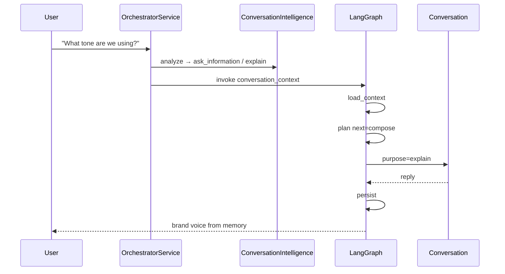
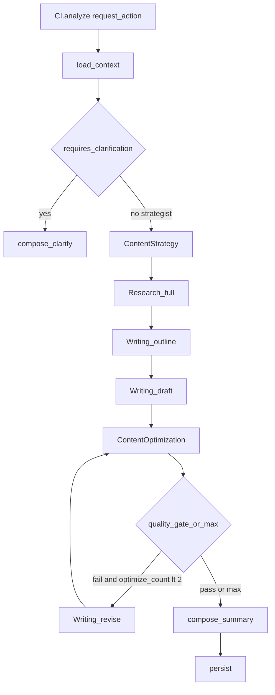
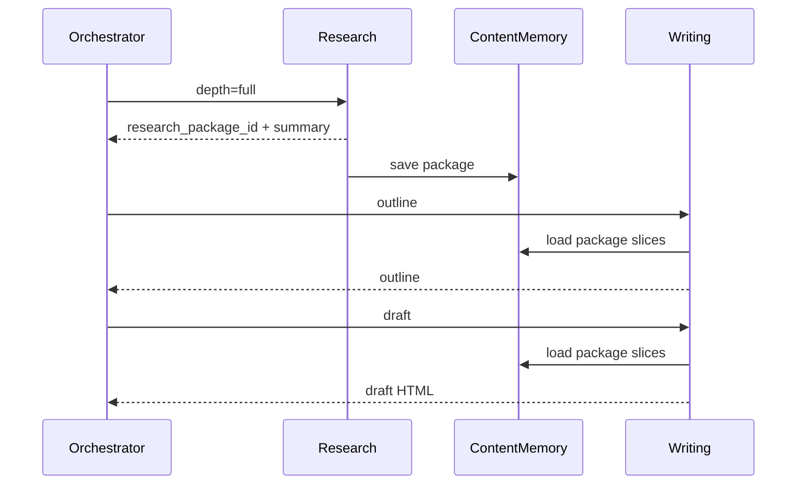
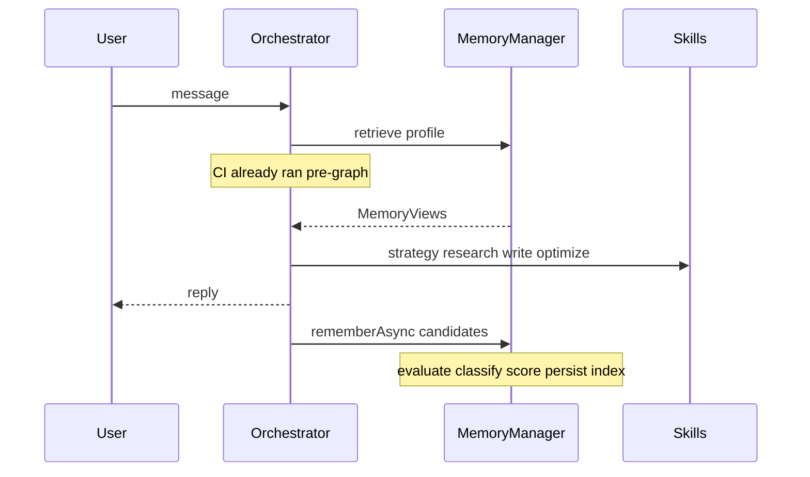
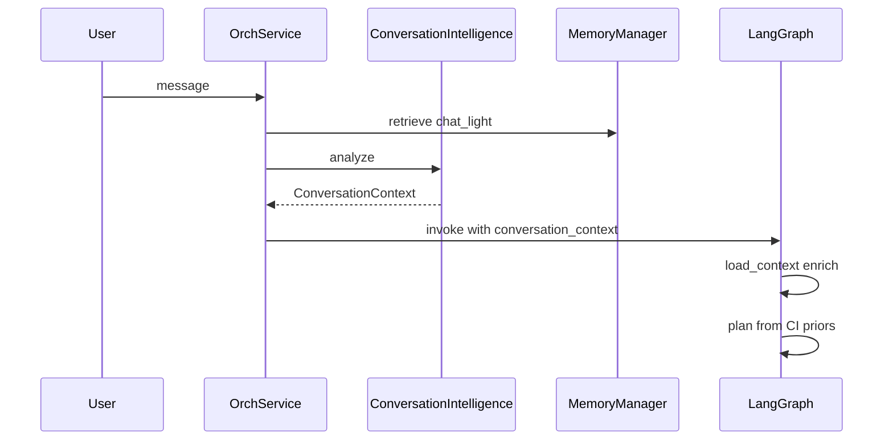

# 09 — Execution Flow

## 1. Casual chat turn



---

## 2. Strategist pipeline (create article)

User: “Write a high-quality post about remote payroll compliance for SMBs.”



**Research → Writing detail:**



**User-visible reply** includes: strategy angle, research coverage_score + source count, contradictions note if any, outline headings, preview link, SEO/GAO/overall scores + Critical plan items, offer to publish or deepen research.

**Publish** is a separate turn → `await_human` → Publishing.

---

## 3. Quick draft mode

User: “Quick draft: 5 tips for founders hiring remotely.”

```
CI.analyze → load_context (mode=quick_draft)
  → plan → Research depth=lite
  → Writing draft
  → Content Optimization
  → compose (preview_url) → persist
```

**No** Writing-embedded Tavily. Lite package still carries provenance (thinner).

---

## 4. Publish with confirmation

Unchanged: resolve blog_id → `await_human` → Publishing on explicit confirm. Exact tool names in confirmation payload.

---

## 5. Content Optimization → revise loop

```
Content Optimization (draft + Research Package + strategy)
  → quality_gate_passed?
  no + optimize_count < 2 → Writing revise(OptimizationPlan Critical+High) → Content Optimization
  yes → compose (scores + plan summary)
  no + optimize_count >= 2 → compose remaining Critical/High; ask user
```

Gate: `overall >= 72` AND zero Critical planner items. See [17](./17-content-optimization.md).

---

## 6. Strategy conflict

Warn via Conversation / `await_human` (`strategy_warning`) before Research/Writing if topic conflicts with workspace goals.

---

## 7. Research-only turn

User: “Research competitors on AI payroll blogging.”

```
CI.analyze (workflow_intent=research) → load_context → plan
  → Research depth=full
  → Conversation summarize package (coverage, competitor gaps, key sources)
  → persist package for later Writing
```

---

## 8. Analytics turn

```
Analytics → Conversation summarize recommendations
```

---

## 9. Failure path (research degraded)

```
Research tool/coverage failure
  → recover: degrade
  → ResearchPackage.degraded=true + disclosure + honest coverage_score
  → Writing may continue with package slices + soft language on gaps
  → compose discloses limitation to user
```

If Research fails completely and no package exists, **do not** let Writing invent sources — compose ask_user or abort_stage.

---

## 10. Onboarding

Legacy supervisor until ported; then Conversation + plan policy with `workspace.completeOnboarding` only.

---

## 11. Memory retrieve → act → remember (background)



Rules:

- Retrieve is sync on `load_context`
- Remember is async after reply (onboarding may sync)
- Skills do not write belief Mongo; Research Package facts may enqueue Knowledge candidates
- Optimization accept/reject enqueues Learning candidates
- Publish/stats may enqueue Content Intelligence candidates

See [18-memory-manager.md](./18-memory-manager.md).

## 12. Conversation Intelligence handoff



Clear actions start workflows. Casual / explain → compose only. Preferences → memory candidates. See [19](./19-conversation-intelligence.md).

## Next

- Errors: [10-error-recovery-and-retries.md](./10-error-recovery-and-retries.md)
- Research: [16-research-pipeline.md](./16-research-pipeline.md)
