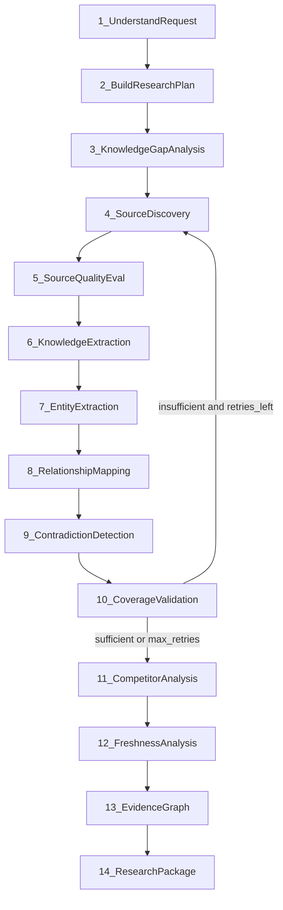
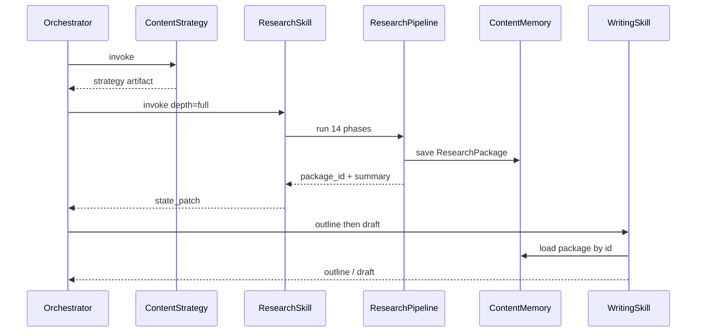

# 16 — Research Pipeline (Research Package Architecture)

**Status:** Canonical design for the Research Skill (v0.5 Research Package revision)  
**Parent skills doc:** [06-skill-architecture.md](./06-skill-architecture.md)  
**State models:** also mirrored in [05-state-schema.md](./05-state-schema.md)

---

## 1. Purpose

The Research Skill is a primary differentiator of Bloggr.

Its job is **not** to summarize search results into prose.

Its job is to build a **structured Research Package** — with provenance, confidence, freshness, contradictions, and an **Evidence Graph** — that Writing and Content Optimization consume to produce authoritative content.

```
Orchestrator invokes Research skill once
        ↓
Nested LangGraph (14 phases)
        ↓
Research Package persisted to Content Memory
        ↓
Writing / Content Optimization / Conversation consume package (by id + slices)
```

**Hard rule:** Writing never searches the web. If research is missing, the orchestrator schedules Research (or discloses degraded mode) — it does not let Writing invent sources.

---

## 2. Why a nested graph (not orchestrator phases)

| Approach | Verdict |
|----------|---------|
| 14 phases as orchestrator nodes | Rejected — bloats the only reasoning layer; couples product chat to research internals |
| Flat “search → stuff into prompt” | Rejected — no provenance, no coverage, no contradictions |
| **Nested StateGraph inside Research skill** | **Chosen** — orchestrator stays thin; Research is independently testable and replaceable |

The orchestrator only sees: `invoke_skill(research)` → `state.research_package_id` + summary.

---

## 3. Depth modes

| Mode | When | Behavior |
|------|------|----------|
| `full` | `strategist_pipeline` | All 14 phases; coverage retry max 1; up to ~12 sources; competitor cap 3 |
| `lite` | `quick_draft` | Phases 1–6, 10, 12–14; simplify/skip 7–9 and 11; fewer sources (~5); still emits a Package |

Both modes produce a `ResearchPackage`. Lite packages set `depth: "lite"` and may have lower `coverage_score`.

---

## 4. Pipeline overview



Lite mode: after P6, jump to P10 (light coverage) → P12 → P13 (simplified) → P14; P7–P9/P11 stubbed or minimal.

---

## 5. Phase specifications

### Phase 1 — Understand the Request

**Do not search yet.**

Determine:

- primary topic
- audience
- intent (informational / commercial / …)
- article depth
- desired freshness
- business context (from strategy + workspace memory)
- constraints (must-include / must-avoid)

**Output:** `ResearchBrief` on pipeline state.  
**LLM:** yes. **Tools:** none.

---

### Phase 2 — Build a Research Plan

Generate a structured plan that drives later stages — **not** raw search queries alone.

Include:

- questions that need answers
- concepts that need explaining
- comparisons required
- statistics required
- examples / case studies needed
- implementation guidance
- common mistakes
- best practices

**Output:** `ResearchPlan { questions[], concepts[], needs: { stats, examples, case_studies, … } }`  
**LLM:** yes. **Tools:** none.

---

### Phase 3 — Knowledge Gap Analysis

Compare plan against what we already have (workspace knowledge docs, prior Content Memory packages, strategy).

Explicitly list missing:

- definitions, benchmarks, statistics
- recent developments, expert opinions
- tutorials / implementation details, case studies

**Output:** `knowledge_gaps[]` with priority.  
**LLM:** yes (light). **Tools:** Content Memory / knowledge select (read-only).

---

### Phase 4 — Source Discovery

Select **source categories** by subject matter, then discover candidates.

| Domain | Prefer |
|--------|--------|
| Technical | Official docs, engineering blogs, GitHub, RFCs, papers |
| Business | Industry reports, surveys, company blogs, whitepapers, case studies |
| Health | Government, universities, medical journals |
| General | High-reputation publishers + primary sources |

**Output:** candidate `sources[]` (url, title, snippet, category).  
**Tools:** `search.web` (and future SERP/domain filters).  
**LLM:** category policy + query generation from gaps/plan.

---

### Phase 5 — Source Quality Evaluation

Score every source. Do not treat every website equally.

Factors:

- official documentation / peer reviewed / government / university
- engineering org / publication reputation
- recency, citations, author credibility

**Output:** `quality_score` (0–1) + `quality_rationale` per source; drop or demote below threshold.  
**LLM:** yes (structured). Deterministic heuristics first (TLD, known domains), then LLM refine.

---

### Phase 6 — Knowledge Extraction

**Do not summarize pages.**

Extract structured knowledge with provenance:

- definitions, facts, statistics, dates
- examples, quotations
- implementation notes, limitations
- `source_id`, `confidence`

**Output:** typed extraction arrays.  
**Tools:** optional `fetch.page` / extract (MVP may use search snippets + selective fetch).  
**LLM:** extraction over fetched/snippet text — schema-constrained.

---

### Phase 7 — Entity Extraction

Extract people, products, companies, technologies, concepts, standards.

**Output:** `entities[]` with aliases + type.  
**Lite:** skip or single-pass LLM over facts only.

---

### Phase 8 — Relationship Mapping

Semantic links, e.g. `Technology —supports→ Concept —improves→ Outcome`.

**Output:** `relationships[] { from, predicate, to, evidence_ids[] }`  
**Lite:** skip or minimal.

---

### Phase 9 — Contradiction Detection

Store disagreements explicitly:

- claim A / claim B
- supporting evidence
- confidence
- explanation

Writing must be able to acknowledge nuance rather than hide conflict.

**Output:** `contradictions[]`  
**Lite:** skip or flag only high-severity conflicts.

---

### Phase 10 — Coverage Validation

For each research question: `completed` | `partial` | `missing`.

If `coverage_score < **0.55**` (`coverage_min`, full depth only) and `coverage_retries < max` (MVP max **1**): return to Phase 4 with remaining gaps.

Lite depth: no coverage retry; emit honest `coverage_score` and continue.

Else continue (may still emit package with honest partial coverage).

---

### Phase 11 — Competitor Analysis

Analyze high-performing competing articles (cap **3** in MVP).

Extract: common headings/topics, average length, common examples, weaknesses, missing information, differentiation opportunities.

**Goal:** differentiate — not copy.  
**Lite:** skip.

---

### Phase 12 — Freshness Analysis

Classify facts/sources:

`evergreen` | `recent` | `breaking` | `historical` | `deprecated`

Influences Writing tone and Content Optimization authority / factual severity.

---

### Phase 13 — Evidence Graph

Assemble graph:

```
Claim → Supporting Evidence → Source
         ↘ Confidence
         ↘ Counterarguments
         ↘ Related Claims
```

MVP: JSON document (nodes + edges), not a graph database.

---

### Phase 14 — Research Package

Emit canonical `ResearchPackage`, persist via Content Memory, return id + summary to orchestrator.

---

## 6. Data models

### 6.1 Freshness and quality

```typescript
export type Freshness =
  | "evergreen"
  | "recent"
  | "breaking"
  | "historical"
  | "deprecated";

export type SourceCategory =
  | "official_docs"
  | "engineering_blog"
  | "github"
  | "rfc"
  | "paper"
  | "industry_report"
  | "survey"
  | "company_blog"
  | "whitepaper"
  | "case_study"
  | "government"
  | "university"
  | "medical_journal"
  | "news"
  | "other";

export interface ResearchSource {
  id: string;
  url: string;
  title: string;
  snippet?: string;
  category: SourceCategory;
  quality_score: number;       // 0–1
  quality_rationale?: string;
  freshness?: Freshness;
  retrieved_at: string;
}
```

### 6.2 Provenanced knowledge units

```typescript
export interface ProvenancedFact {
  id: string;
  kind: "definition" | "fact" | "statistic" | "example" | "quotation" | "implementation" | "limitation" | "opinion";
  text: string;
  value?: string;              // for statistics
  date?: string;
  source_id: string;
  confidence: number;          // 0–1
  freshness: Freshness;
  research_question_ids?: string[];
}

export interface ResearchEntity {
  id: string;
  name: string;
  type: "person" | "product" | "company" | "technology" | "concept" | "standard" | "other";
  aliases?: string[];
  source_ids?: string[];
}

export interface ResearchRelationship {
  id: string;
  from_entity_id: string;
  predicate: string;           // e.g. "supports", "improves", "depends_on"
  to_entity_id: string;
  evidence_ids?: string[];
}

export interface ResearchContradiction {
  id: string;
  claim_a: string;
  claim_b: string;
  evidence_a_ids: string[];
  evidence_b_ids: string[];
  confidence: number;
  explanation: string;
}

export interface CompetitorInsights {
  articles: Array<{
    url: string;
    title: string;
    headings: string[];
    approx_word_count?: number;
    topics: string[];
    strengths?: string[];
    weaknesses?: string[];
  }>;
  common_headings: string[];
  common_topics: string[];
  average_length?: number;
  differentiation_opportunities: string[];
  missing_in_competitors: string[];
}
```

### 6.3 Evidence graph

```typescript
export type EvidenceNodeType = "claim" | "evidence" | "source" | "entity";

export interface EvidenceNode {
  id: string;
  type: EvidenceNodeType;
  label: string;
  ref_id?: string;             // points to fact/source/entity id
  confidence?: number;
}

export type EvidenceEdgeType =
  | "supports"
  | "contradicts"
  | "related_to"
  | "mentions"
  | "attributed_to";

export interface EvidenceEdge {
  id: string;
  from: string;
  to: string;
  type: EvidenceEdgeType;
}

export interface EvidenceGraph {
  version: 1;
  nodes: EvidenceNode[];
  edges: EvidenceEdge[];
}
```

### 6.4 Coverage

```typescript
export interface CoverageItem {
  research_question_id: string;
  status: "completed" | "partial" | "missing";
  notes?: string;
}

export interface CoverageReport {
  items: CoverageItem[];
  coverage_score: number;      // 0–1
  completed_areas: string[];
  partial_areas: string[];
  missing_areas: string[];
}
```

### 6.5 Research Package (canonical output)

```typescript
export interface ResearchPackage {
  version: 2;
  id: string;
  workspace_id: string;
  created_at: string;
  depth: "lite" | "full";

  topic: string;
  audience: string;
  search_intent: string;
  freshness_requirement?: string;

  research_questions: Array<{ id: string; question: string; priority: number }>;
  knowledge_gaps: Array<{ id: string; description: string; priority: number }>;

  definitions: ProvenancedFact[];
  facts: ProvenancedFact[];
  statistics: ProvenancedFact[];
  examples: ProvenancedFact[];
  expert_opinions: ProvenancedFact[];
  recent_developments: ProvenancedFact[];

  entities: ResearchEntity[];
  relationships: ResearchRelationship[];
  contradictions: ResearchContradiction[];

  competitor_insights?: CompetitorInsights;
  evidence_graph: EvidenceGraph;
  sources: ResearchSource[];
  references: Array<{ source_id: string; url: string; title: string }>;

  coverage: CoverageReport;
  confidence_summary: {
    mean_source_quality: number;
    mean_fact_confidence: number;
    contradiction_count: number;
  };

  degraded?: boolean;
  disclosure?: string;
  strategy_id?: string;        // optional link to ContentStrategyArtifact
}
```

### 6.6 Pipeline state (nested graph)

```typescript
export interface ResearchPipelineState {
  brief?: ResearchBrief;
  plan?: ResearchPlan;
  knowledge_gaps: …;
  sources: ResearchSource[];
  extractions: ProvenancedFact[];
  entities: ResearchEntity[];
  relationships: ResearchRelationship[];
  contradictions: ResearchContradiction[];
  competitor_insights?: CompetitorInsights;
  coverage?: CoverageReport;
  evidence_graph?: EvidenceGraph;
  package?: ResearchPackage;
  coverage_retries: number;
  depth: "lite" | "full";
  errors: TurnError[];
}
```

### 6.7 Orchestrator state projection

```typescript
// On OrchestratorState — prefer ref + summary to avoid huge checkpoints
research_package_id?: string;
research_summary?: {
  topic: string;
  depth: "lite" | "full";
  coverage_score: number;
  source_count: number;
  contradiction_count: number;
  degraded?: boolean;
};
/** Optional hydrated slice for same-turn writing; prefer load-by-id */
research_package?: ResearchPackage;
```

`ResearchArtifact` (v0.5 initial flat shape) is **retired**.

---

## 7. Sequence: Research → Writing



Writing prompts receive **slices**: high-confidence facts, entities, contradictions, competitor gaps, CTA/angle from strategy — not raw SERP dumps.

---

## 8. Tools used per phase (MVP)

| Phase | Tools |
|-------|-------|
| 1–3 | Memory/knowledge read |
| 4 | `search.web` |
| 5 | none / domain heuristics |
| 6 | `search.web` results; optional `fetch.page` |
| 7–10, 12–14 | none (LLM + deterministic) |
| 11 | `search.web` (competitor queries) |

Future: `serp.features`, academic APIs, CMS competitor crawl — same phase contracts.

---

## 9. Progress events (client)

Map phases to coarse UI phases to avoid noise:

| Pipeline phases | Client phase |
|-----------------|--------------|
| 1–3 | `research_planning` |
| 4–6 | `research_gathering` |
| 7–10 | `research_structuring` |
| 11–14 | `research_packaging` |

---

## 10. Design decisions and trade-offs

| Decision | Benefit | Cost / risk |
|----------|---------|-------------|
| Nested research graph | Thin orchestrator; isolated tests | Two graphs to operate |
| Extract ≠ summarize | Authority + provenance | Latency and token cost |
| Evidence graph as JSON in Mongo | Simple MVP; portable | Weak graph queries until needed |
| Coverage retry max 1 | Bounded cost | May ship partial packages (honest `coverage_score`) |
| Competitor cap 3 | Enough for differentiation | May miss niche SERP leaders |
| Lite vs full depth | Fast path without lying about research | Lite quality lower — disclose in UI |
| Writing cannot call `search.web` | No silent writer-side hallucination | Orchestrator must always sequence Research first |

### Challenge: is 14 phases over-engineered?

For a wrapper: yes. For a strategist product: the phases are the product. MVP keeps **all** phases with **simpler algorithms** rather than deleting differentiators (entities/relationships as one-shot LLM JSON; evidence graph as claim→source edges).

### Challenge: full page fetch every source?

Not in MVP. Prefer ranked snippets + selective fetch for top-N by quality_score. Post-MVP: deeper fetch and citation verification.

---

## 11. Future evolution

1. Persistent graph store if cross-article entity queries become core
2. Human-in-the-loop on low-coverage packages before Writing
3. Domain-specific source allowlists per workspace
4. Continuous re-research for stale (`deprecated` / old `recent`) facts via Analytics
5. Split Phase 11 into its own skill if competitor intel becomes a standalone product surface

---

## 12. Related docs

- Skills: [06-skill-architecture.md](./06-skill-architecture.md)
- State: [05-state-schema.md](./05-state-schema.md)
- Flows: [09-execution-flow.md](./09-execution-flow.md)
- Prompts: [11-prompts-and-context.md](./11-prompts-and-context.md)
- Tools: [07-tool-architecture.md](./07-tool-architecture.md)
