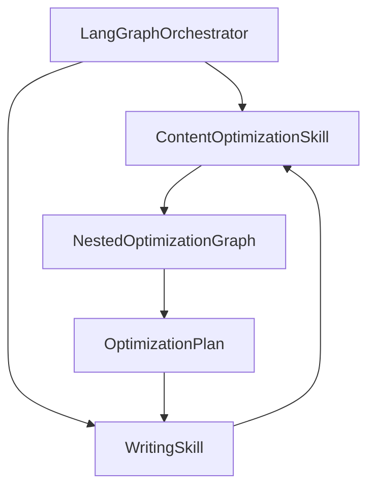
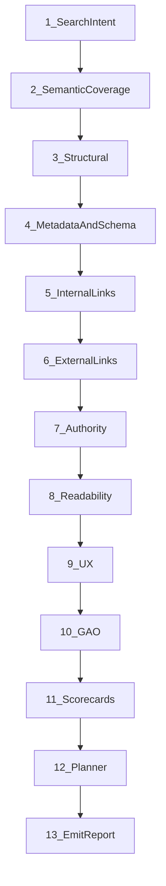
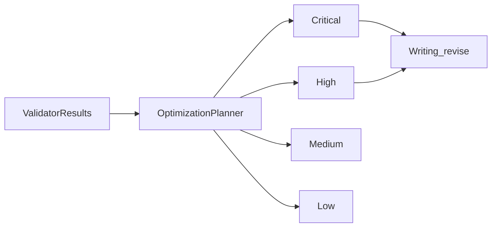

# 17 — Content Optimization Architecture

**Status:** Canonical design (v0.5 Content Optimization revision)  
**Product PRD:** [`docs/PRD_CONTENT_OPTIMIZATION.md`](../../PRD_CONTENT_OPTIMIZATION.md)  
**Replaces:** Review skill / combined SEO+GAO as orchestrator peers  
**Related:** [06-skill-architecture.md](./06-skill-architecture.md), [16-research-pipeline.md](./16-research-pipeline.md)

---

## 1. Design philosophy

Content Optimization is **not** an “SEO checker.”

It is an intelligent **Content Optimization Skill** that ensures every piece of content is:

- valuable for humans
- optimized for traditional search engines
- optimized for AI retrieval (ChatGPT, Gemini, Claude, Perplexity, Copilot, …)
- factually trustworthy and authoritative
- readable, engaging, and technically correct

Optimization runs as a **first-class post-draft pipeline** (and on revalidation). Strategy + Research Package feed validators as inputs. Pre-outline lite optimize is **post-MVP**.

**Hard rules:**

- Orchestrator invokes **only** `content_optimization` — never individual validators.
- The skill **reports and plans**; it does **not** rewrite the article (Writing applies the plan).
- Prefer **deterministic** checks; use LLM only where semantic judgment is required.

---

## 2. Skill composition

```
Content Optimization Skill
├── Search Intent Validator
├── Semantic Coverage Validator
├── Structural Validator          (deterministic)
├── Metadata Generator
├── Structured Data Generator
├── Internal Linking Engine
├── External Linking Engine
├── Authority Validator (E-E-A-T)
├── Readability Validator         (hybrid)
├── UX Validator
├── GAO Validator
├── Scorecard Assembler           (deterministic)
└── Optimization Planner
```



**Rejected:** separate SEO skill + GAO skill as orchestrator peers (sprawl).  
**Rejected:** keyword-density-only tooling.

---

## 3. Pipeline phases



### Phase 1 — Search Intent Validation

Determine whether the draft satisfies intended search intent:

- informational / commercial / transactional / navigational
- audience sophistication (beginner / intermediate / expert)
- expected depth and format

Detect **mismatches** vs strategy + user brief. **LLM.**

### Phase 2 — Semantic Coverage

Optimize for topical authority, not keyword density:

- primary topic, related entities, supporting concepts
- synonyms / common terminology / FAQs

Measure **semantic completeness** using draft + Research Package entities/concepts. **LLM** (+ package entity overlap heuristics).

### Phase 3 — Structural Optimization

**Deterministic** HTML/AST checks:

- single H1, heading hierarchy/progression
- paragraph / sentence length distributions
- presence of lists, tables, FAQs, summaries
- CTA placement heuristics

### Phase 4 — Metadata Generation

Generate and validate:

- SEO title, meta description, URL slug
- Open Graph / Twitter cards, canonical URL
- JSON-LD schema, social preview metadata

LLM drafts copy; **deterministic** length/charset/JSON-LD parse checks. Output lands in `metadata` artifact for Publishing.

### Phase 5 — Internal Linking

- Retrieve candidate articles from workspace content library (embeddings/title similarity)
- Recommend contextual anchors (cap 3–5 in MVP)
- Avoid over-linking

Deterministic retrieve + LLM contextual pick. **No auto-insert** without Writing apply.

### Phase 6 — External Linking

Prefer Research Package high-quality sources (official docs, gov, university, standards, reputable pubs). Rank/filter; avoid low-quality/redundant links. MVP: package references only.

### Phase 7 — Authority (E-E-A-T inspired)

Evaluate expertise, experience, authority, trustworthiness. Detect unsupported claims, weak evidence, missing citations, weak explanations — against Research Package evidence graph. **LLM** + package.

### Phase 8 — Readability

Deterministic: reading-level proxies, sentence/paragraph length, passive-voice heuristics. Light LLM: transition quality, clarity, scanning friendliness.

### Phase 9 — UX Validation

Opening hook, pacing, section flow, visual opportunities (tables/diagrams/code), information density, CTA effectiveness. **LLM.**  

**MVP lock:** thin/heuristic only — does **not** solely fail the quality gate. Full UX depth is post-MVP (see [14](./14-mvp-and-roadmap.md) §2).

### Phase 10 — GAO Validation

See §5. Hybrid.

### Phase 11 — Scorecard assembly

Deterministic aggregation into SEO / GAO / overall scorecards.

### Phase 12 — Optimization Planner

Merge validator outputs → prioritized `OptimizationPlan` (no rewrite).

### Phase 13 — Emit report

Persist `ContentOptimizationReport` + plan; return ids/summary to orchestrator.

---

## 4. Hybrid validation matrix

| Deterministic | LLM-required |
|---------------|--------------|
| H1 / heading hierarchy, lengths, lists/FAQ presence | Search intent match |
| Meta title/description length, slug charset, JSON-LD parse | Semantic coverage / topical authority |
| Flesch-style proxies, para/sentence length, passive heuristics | Authority, answerability, UX hook/pacing |
| Internal link count caps, broken-link checks | Contextual link placement quality |
| Score aggregation / quality gate | Planner merge narrative / dedupe explanations |

---

## 5. GAO (Generative AI Optimization)

Optimize for AI systems that retrieve and summarize web content (ChatGPT, Claude, Gemini, Perplexity, Copilot, future retrieval systems).

**Not a separate orchestrator skill** — a first-class sub-validator inside Content Optimization.

| Check | Question |
|-------|----------|
| Entity clarity | Are important concepts clearly introduced? |
| Definition coverage | Are technical terms explained before reuse? |
| Answerability | Does content directly answer likely questions (concise answer → detail)? |
| Chunkability | Can each H2 stand as a knowledge unit? |
| Entity relationships | Are relationships explicit (reuse Research Package relationships)? |
| Evidence validation | Are major claims backed by evidence/explanation/refs/confidence? |
| Citation readiness | How easily can another LLM quote/summarize accurately? |
| FAQ coverage | Are common questions addressed? |

Output: **GAO Scorecard** nested in the overall report.

---

## 6. Scorecards and overall quality

### SEO Scorecard metrics

Search Intent, Semantic Coverage, Heading Structure, Metadata, Internal Links, External Links, Authority, Readability, Images, Structured Data.

Each metric: `score` (0–100), `explanation`, `issues[]`, `recommendations[]`.

### GAO Scorecard metrics

Definition Coverage, Entity Clarity, Relationship Mapping, Evidence Support, Answerability, Chunkability, Citation Readiness, FAQ Coverage — each with reasoning.

### Overall Content Quality Score (fixed weights)

```
overall = 0.25*seo
        + 0.25*gao
        + 0.15*authority
        + 0.15*readability
        + 0.10*ux
        + 0.10*factual_confidence
```

`factual_confidence` = support rate of draft claims against Research Package evidence (Authority/GAO overlap).

**Quality gate (MVP):** `overall >= 72` **AND** zero Critical planner items.

**Stop conditions:** gate pass OR `optimize_count >= 2` OR user abort → compose with remaining plan.

---

## 7. Optimization Planner



**Priority examples**

| Priority | Examples |
|----------|----------|
| Critical | Search intent mismatch, unsupported claims, missing evidence |
| High | Weak introduction, missing FAQs, missing internal links |
| Medium | Long paragraphs, passive voice, weak transitions |
| Low | Minor readability, CTA refinement |

Merge overlapping recommendations by normalized `issue_key`; drop duplicates. Writing consumes **Critical + High** first (Medium/Low if token budget allows).

---

## 8. Iterative optimization loop

```
Article Draft
  → Content Optimization
  → Validator Reports + Scorecards
  → Optimization Planner
  → Writing Skill (revise)
  → Updated Draft
  → Revalidation (Content Optimization)
  → Quality Gate
  → Publish (optional, confirmed)
```

```mermaid
sequenceDiagram
  participant Orch as Orchestrator
  participant Opt as ContentOptimization
  participant W as Writing
  participant Pub as Publishing

  Orch->>Opt: optimize draft + package
  Opt-->>Orch: report + plan + gate
  alt gate fail and optimize_count lt 2
    Orch->>W: revise with plan
    W-->>Orch: updated draft
    Orch->>Opt: revalidate
  else gate pass or max loops
    Orch->>Orch: compose
    opt publish later
      Orch->>Pub: await_human then publish
    end
  end
```

---

## 9. Validator extensibility

```typescript
interface Validator {
  id: string;
  kind: "deterministic" | "llm" | "hybrid";
  run(ctx: OptimizationContext): Promise<ValidatorResult>;
}
```

Future validators (accessibility, localization, compliance, branding, legal) register in the skill pipeline **without** changing orchestrator edges.

---

## 10. Data models

```typescript
export type RecommendationPriority = "critical" | "high" | "medium" | "low";

export interface OptimizationRecommendation {
  id: string;
  issue_key: string;             // for dedupe
  priority: RecommendationPriority;
  dimension: string;             // seo | gao | authority | …
  message: string;
  target?: "title" | "excerpt" | "body" | "meta" | "structure" | "links";
  suggested_action?: string;
}

export interface ValidatorResult {
  validator_id: string;
  score?: number;                // 0–100 when applicable
  passed: boolean;
  issues: Array<{ code: string; severity: RecommendationPriority; message: string; evidence?: string }>;
  recommendations: OptimizationRecommendation[];
  metrics?: Record<string, number | string>;
  rationale?: string;
}

export interface MetricScore {
  name: string;
  score: number;
  explanation: string;
  issues: string[];
  recommendations: string[];
}

export interface SeoScorecard {
  version: 1;
  metrics: MetricScore[];        // intent, semantic, headings, metadata, links, …
  aggregate: number;
}

export interface GaoScorecard {
  version: 1;
  metrics: MetricScore[];        // definitions, entity clarity, answerability, …
  aggregate: number;
}

export interface AuthorityReport {
  expertise: number;
  experience: number;
  authority: number;
  trust: number;
  unsupported_claims: string[];
  recommendations: OptimizationRecommendation[];
}

export interface ReadabilityReport {
  reading_level?: number;
  avg_sentence_length: number;
  avg_paragraph_length: number;
  passive_voice_ratio?: number;
  aggregate: number;
  recommendations: OptimizationRecommendation[];
}

export interface UxReport {
  hook_quality: number;
  pacing: number;
  section_flow: number;
  cta_effectiveness: number;
  visual_opportunities: string[];
  aggregate: number;
  recommendations: OptimizationRecommendation[];
}

export interface OptimizationPlan {
  version: 1;
  critical: OptimizationRecommendation[];
  high: OptimizationRecommendation[];
  medium: OptimizationRecommendation[];
  low: OptimizationRecommendation[];
  writing_brief: string;         // condensed instructions for Writing revise
}

export interface QualityScorecard {
  seo: number;
  gao: number;
  authority: number;
  readability: number;
  ux: number;
  factual_confidence: number;
  overall: number;
  weights: {
    seo: 0.25; gao: 0.25; authority: 0.15;
    readability: 0.15; ux: 0.10; factual_confidence: 0.10;
  };
}

export interface ContentOptimizationReport {
  version: 1;
  id: string;
  draft_id?: string;
  research_package_id?: string;
  created_at: string;
  seo: SeoScorecard;
  gao: GaoScorecard;
  authority: AuthorityReport;
  readability: ReadabilityReport;
  ux: UxReport;
  validator_results: ValidatorResult[];
  plan: OptimizationPlan;
  quality: QualityScorecard;
  quality_gate_passed: boolean;
  metadata_suggestions?: ContentMetadata;
}

/** Alias for product language */
export type OverallContentQualityReport = ContentOptimizationReport;
```

**Orchestrator state projection**

```typescript
optimization_report_id?: string;
optimization_plan?: OptimizationPlan;
optimize_count: number;          // replaces improve_count for this loop
quality_gate_passed?: boolean;
metadata?: ContentMetadata;      // from generator
// review?: ReviewArtifact — RETIRED (alias only during migration)
```

---

## 11. Engineering trade-offs

| Decision | Benefit | Cost |
|----------|---------|------|
| One skill + internal validators | Thin orchestrator; extensible | Nested graph complexity |
| Report/plan ≠ rewrite | Clear ownership; testable Writing | Extra turn/latency |
| Fixed overall weights | Predictable gate | May need workspace tuning later |
| MVP lite linking | Ships without full graph | Weaker topical mesh initially |
| Wrap `blog-review.runner` as adapter | Faster bootstrap | Temporary dual shape until validators land |

---

## 12. MVP vs post-MVP

**MVP**

- Phases 1–4, 7–8, GAO core (answerability, chunkability, definitions, evidence)
- Planner + scorecards + iterative loop (`optimize_count < 2`)
- Structural + readability mostly deterministic
- External links from Research Package; internal link recommendations cap 3–5
- UX validator **thin/heuristic** (does not solely fail gate); full depth post-MVP
- Evolve [`blog-review.runner.ts`](../../../backend/src/modules/blog/ai/blog-review.runner.ts) as transitional LLM adapter

**Post-MVP**

- Full UX depth, image/alt scoring
- Richer internal linking graph
- Accessibility / localization / compliance validators
- Outline-time lite optimize
- Workspace-tunable quality weights

---

## 13. Folder structure (target)

```
skills/content-optimization/
  content-optimization.skill.ts
  schema.ts
  pipeline/optimization.graph.ts
  validators/{intent,semantic,structural,authority,readability,ux,gao}.ts
  generators/{metadata,structured-data,internal-links,external-links}.ts
  planner/optimization-planner.ts
  scoring/scorecards.ts
  prompts/
```

---

## Next

- Skills: [06-skill-architecture.md](./06-skill-architecture.md)
- State: [05-state-schema.md](./05-state-schema.md)
- Prompts: [11-prompts-and-context.md](./11-prompts-and-context.md)
- PRD: [`../../PRD_CONTENT_OPTIMIZATION.md`](../../PRD_CONTENT_OPTIMIZATION.md)
