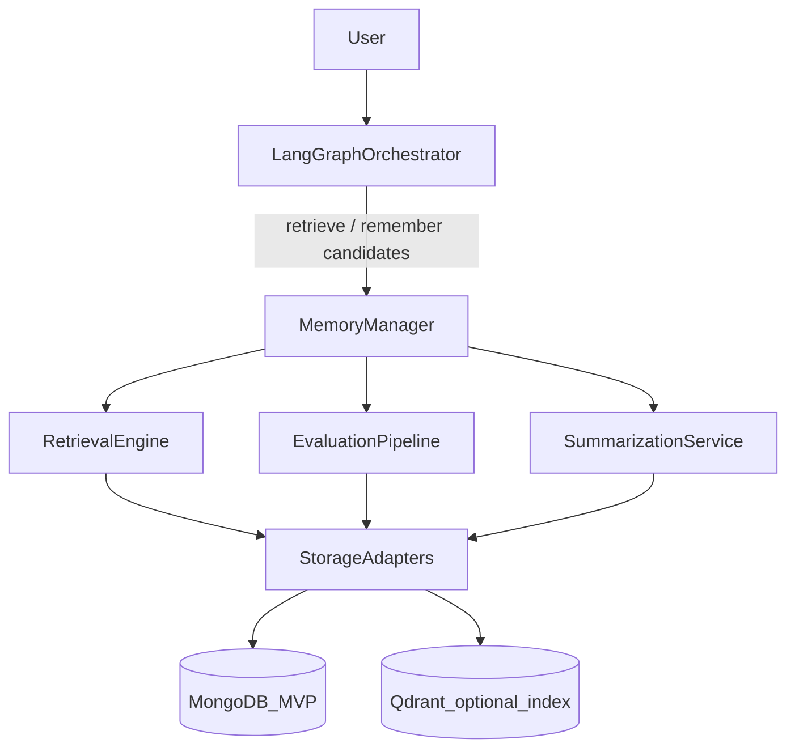
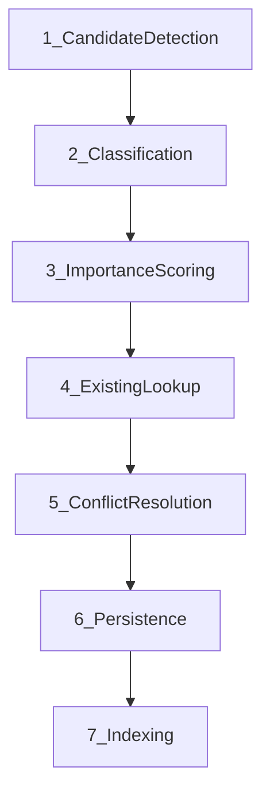
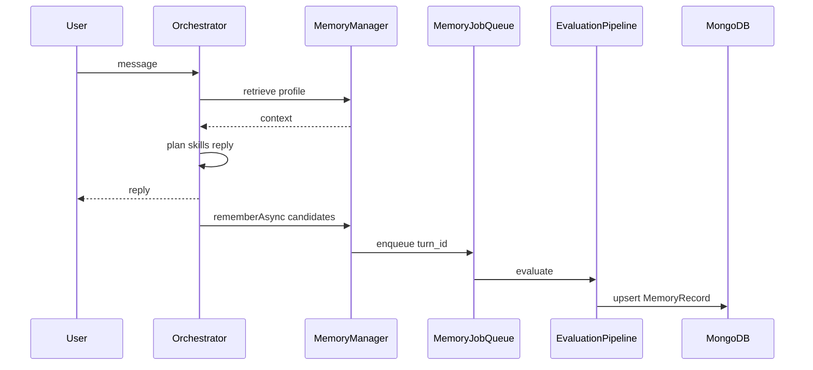

# 18 — Memory Manager Architecture

**Status:** Canonical design (v0.5 Memory Manager revision)  
**Product PRD:** [`docs/PRD_MEMORY_SYSTEM.md`](../../PRD_MEMORY_SYSTEM.md)  
**Index (short):** [08-memory-architecture.md](./08-memory-architecture.md)

---

## 1. Core philosophy

**Memory is not a database.** Memory is a **Knowledge Management System**.

The orchestrator must **never** decide:

- where memories are stored
- how memories are indexed
- how memories are retrieved
- how memories are updated / merged / expired

The orchestrator may only:

1. **Retrieve** contextual memory for the current turn/workflow (`retrieve`)
2. Emit **candidates** that might be worth remembering (`remember` / enqueue)

All storage, classification, conflict resolution, indexing, quality, and summarization belong to the **Memory Manager**.

**Rejected**

| Approach | Why |
|----------|-----|
| Memory as a LangGraph skill peer | Skills execute domain work; memory is infrastructure |
| Orchestrator writes Mongo / `workspace.updateMemory` directly | Couples reasoning to persistence; skips evaluation |
| Load all memories every turn | Token blowup; noise; not a strategist |
| Dump blogs/packages into “belief” layers | Artifacts ≠ memories — see Content Artifact Store |

---

## 2. High-level architecture

```
User
  ↓
Conversation Intelligence (optional chat_light retrieve)
  ↓
LangGraph Orchestrator
  ↓
Memory Manager
  ├── Retrieval Engine
  ├── Evaluation Pipeline (async remember)
  ├── Summarization Service
  └── Storage Adapters
        ↓
      MongoDB (MVP system of record)
        ↓
      Optional RetrievalIndex (existing Qdrant wrapper)
```

Preference updates detected by Conversation Intelligence become **memory candidates** — MM evaluates/persists; CI never writes beliefs. See [19](./19-conversation-intelligence.md).

### MVP belief writes (current code)

| Source | Into LTM? | Where it lives instead |
|--------|-----------|-------------------------|
| Explicit preference (“I prefer shorter…”) | Yes — `emit_memory_candidate` → `rememberAsync` | `memory_records` / preference layer |
| Onboarding brand / audience / goals | Yes — workspace strategic fields | WorkspaceMemory |
| Storytelling / anecdote in chat | No (MVP) | Thread messages only |
| Content Strategy artifact | No as belief (MVP) | In-turn `state.strategy`; Conversation summarizes |
| Blog draft / revise | Artifact, not belief | Blogs collection (Content Artifact Store) |



---

## 3. Memory Manager API

Only public surface for orchestrator and skills:

```typescript
interface MemoryManager {
  remember(candidate: MemoryCandidate): Promise<RememberResult>;
  /** Prefer enqueue after reply; sync allowed for onboarding required fields */
  rememberAsync(candidate: MemoryCandidate, opts?: { turn_id: string }): Promise<{ job_id: string }>;

  retrieve(context: RetrievalContext): Promise<MemoryRetrievalResult>;

  update(id: string, patch: MemoryUpdate): Promise<MemoryRecord>;
  forget(id: string, reason: string): Promise<void>;

  summarize(threadId: string): Promise<ConversationSummary>;

  /** Content artifacts — not belief layers */
  getArtifact(ref: ArtifactRef): Promise<unknown | null>;
}
```

Internals (not exposed): classify, score, lookup, conflict-resolve, persist, index, decay jobs.

---

## 4. Layered memory (+ artifact store)

### 4.1 Session Memory

**Purpose:** Everything required for the **current** conversation/workflow.  
**Contains:** workflow stage, draft/strategy/research/optimize **refs**, pending clarifications, active graph checkpoint, temporary execution data.  
**Lifetime:** single thread.  
**Store:** LangGraph checkpointer + Mongo threads/messages.  
**Retrieve:** always for active turn (`chat_light` / workflow profile).

### 4.2 Workspace Memory

**Purpose:** Persistent business context.  
**Contains:** company, products/services, audience, competitors, brand voice, writing style, publishing prefs, SEO strategy, business goals.  
**Lifetime:** workspace.  
**Store:** evolve existing Mongo `workspace_memory` document (structured).  
**Retrieve:** start of strategy / writing / optimize / onboarding.

### 4.3 User Preference Memory

**Purpose:** How **this user** prefers to interact with Bloggr (split from Workspace).  
**Contains:** concise vs detailed explanations, technical depth, conversational tone, anti-clickbait, examples preference, editing tendencies, preferred workflow.  
**Lifetime:** user × workspace.  
**Store:** `memory_records` with `layer: "user_preference"`.  
**Retrieve:** compose + writing tone decisions.

### 4.4 Knowledge Memory

**Purpose:** Reusable **factual** knowledge (not user-specific beliefs about “how I like to chat”).  
**Contains:** terminology, product/industry knowledge, research findings, evergreen facts, reusable insights.  
**Lifetime:** workspace (MVP); careful global later.  
**Store:** `memory_records` `layer: "knowledge"`.  
**Sources:** Research Package high-confidence facts; uploaded doc extractions.  
**Note:** Uploaded documents remain **knowledge sources** ([KNOWLEDGE.md](../../../backend/src/modules/cognition/domain/knowledge/KNOWLEDGE.md)); Knowledge Memory holds **extracted** reusable units.

### 4.5 Learning Memory

**Purpose:** Continuous improvement from behavior.  
**Contains:** accepted/rejected edits, repeated corrections, successful patterns, prompt refinements, behavioral tendencies.  
**Lifetime:** user × workspace.  
**Store:** `memory_records` `layer: "learning"`.  
**Retrieve:** Writing revise + Optimization planner context (budgeted).

### 4.6 Content Intelligence Memory

**Purpose:** Learn from **published content performance** — Bloggr differentiator.  
**Contains:** high-CTR headlines, successful CTAs, top structures, keyword/engagement/conversion signals.  
**Lifetime:** workspace.  
**Store:** `memory_records` `layer: "content_intelligence"`.  
**MVP:** thin derive from `blogs.statistics` + publish outcomes → structured insights.  
**Post-MVP:** closed loop into Strategy / Writing / Optimization.

### 4.7 Content Artifact Store (not a belief layer)

**Purpose:** Durable workflow products: blogs, Research Packages, Optimization reports, strategy artifacts.  
**Access:** `getArtifact` / id refs on Session.  
**Why separate:** Avoid treating every HTML draft as a “memory”; extract Knowledge from packages instead.

---

## 5. Internal cognitive tags (implementation detail)

Records may carry internal `cognitive_kind`:

| Tag | Examples |
|-----|----------|
| `semantic` | Stable facts, business information |
| `episodic` | Conversation summaries, completed workflows |
| `procedural` | Habits, preferred workflows, style patterns |

**Never** expose these as orchestrator APIs or skill manifests. External world sees layers + Memory Manager only.

---

## 6. Memory evaluation pipeline



### Stage 1 — Candidate detection

Turn produces candidates (heuristic + optional light LLM).  
Example: “Our audience is software founders.” → `{ key: "target_audience", value: "software founders" }`.  
**Not yet stored.**

### Stage 2 — Classification

Map to: `workspace` | `user_preference` | `knowledge` | `learning` | `content_intelligence` | `temporary` | `discard`.

### Stage 3 — Importance scoring

Factors: long-term usefulness, business relevance, personalization value, stability, repetition, confidence, uniqueness → `importance` 0–1.  
**Persist only if** `importance >= threshold` (MVP defaults: workspace 0.55, preference 0.5, knowledge 0.6, learning 0.45, intelligence 0.5).

### Stage 4 — Existing lookup

By `canonical_key` + layer + tenant scope → create | update | merge | ignore.

### Stage 5 — Conflict resolution

Example: audience Startups → Enterprise.  
**Decision (opinionated):** new confirmed value **supersedes**; prior kept with `superseded_by` + timestamp + confidence (version history). No silent dual-active conflicts for same `canonical_key`.

### Stage 6 — Persistence

Write `MemoryRecord` to Mongo. Workspace structured fields may also patch `workspace_memory` document for hot paths (dual-write with single manager transaction boundary).

### Stage 7 — Indexing

Mongo indexes on `(workspace_id, layer, canonical_key)`, text index on `value_text`. Optional embed → Qdrant adapter for semantic Knowledge/episodic search.

---

## 7. Background processing

```
Conversation turn
  → Orchestrator responds (SSE complete)
  → Enqueue MemoryJob(turn_id, candidates[])
  → Evaluation pipeline
  → Persist + index
```

| Concern | Decision |
|---------|----------|
| Blocking | **Never** block user reply for remember pipeline |
| Idempotency | `turn_id` + candidate hash |
| Retry | Exp backoff; max 5; dead-letter queue |
| Onboarding exception | Sync `remember` for required strategic fields so dashboard unlock is correct |

---

## 8. Conversation summarization

**Goals:** cut context size, preserve decisions, avoid token explosion.

```
Messages accumulate
  → Checkpoint trigger (every N=12 messages OR token budget breach)
  → summarize(thread)
  → Store ConversationSummary (episodic)
  → Active context = summary + last K=6 messages
  → Raw messages archived (retained, not deleted)
```

Configurable: `MEMORY_SUMMARY_EVERY_N`, `MEMORY_SUMMARY_TOKEN_BUDGET`, `MEMORY_ACTIVE_TAIL_K`.

---

## 9. Retrieval architecture

Orchestrator calls `retrieve(RetrievalContext)` — **never** loads all memories.

`RetrievalEngine` owns profiles (absorbs former ContextAssembler):

| Profile | Layers / artifacts |
|---------|-------------------|
| `chat_light` | Session + short Workspace summary + User Preference slice |
| `strategy_full` | Workspace + Content Intelligence + Learning prefs |
| `research_full` | Workspace + topic-matched Knowledge + artifact strategy |
| `write_full` | Workspace brand + User Preference + Content Intelligence + Learning + Knowledge (topic) + package/outline **artifacts** |
| `optimize_full` | Workspace + Learning + package claims artifact + draft artifact |

Writing workflow sequence:

```mermaid
sequenceDiagram
  participant Orch as Orchestrator
  participant MM as MemoryManager
  participant Res as Research
  participant W as Writing
  participant Opt as ContentOptimization

  Orch->>MM: retrieve write_full
  MM-->>Orch: MemoryRetrievalResult
  Orch->>Res: research
  Orch->>W: draft
  Orch->>Opt: optimize
  Orch->>MM: rememberAsync learning/intelligence candidates
```

---

## 10. Storage architecture

**MVP:** MongoDB system of record for `memory_records`, summaries, jobs. Structured stays structured.  
**Optional:** Qdrant as RetrievalIndex adapter (already in codebase) — not required to ship Memory Manager MVP.  
**Future:** swap/add vector/KG backends via adapters only.

```typescript
interface MemoryStorageAdapter {
  upsert(record: MemoryRecord): Promise<void>;
  getByKey(scope: TenantScope, layer: MemoryLayer, key: string): Promise<MemoryRecord | null>;
  search(query: MemoryQuery): Promise<MemoryRecord[]>;
  softDelete(id: string): Promise<void>;
}

interface RetrievalIndexAdapter {
  upsertEmbedding(record: MemoryRecord): Promise<void>;
  semanticSearch(q: string, filter: TenantScope & { layer?: MemoryLayer }): Promise<string[]>; // ids
}
```

---

## 11. Lifecycle and quality

| Event | Policy |
|-------|--------|
| Create | Importance ≥ threshold after classify |
| Update/merge | Same `canonical_key`; merge text or replace scalar |
| Supersede | Conflict → new active; old `superseded_by` |
| Archive | Soft-delete after TTL for Temporary; Learning decay |
| Expire/decay | Periodic job: `confidence *= decay_factor` for Learning/Intelligence older than T |
| Forget | Soft-delete + audit reason; Workspace requires explicit user/onboarding confirm |

**Quality mechanisms:** duplicate detection, stale detection, confidence scoring, importance weighting, consistency validation cron. Prefer fewer high-quality memories over hoarding.

---

## 12. Data models

```typescript
export type MemoryLayer =
  | "session"
  | "workspace"
  | "user_preference"
  | "knowledge"
  | "learning"
  | "content_intelligence"
  | "temporary";

export type CognitiveKind = "semantic" | "episodic" | "procedural"; // internal

export interface MemoryCandidate {
  id?: string;
  turn_id: string;
  workspace_id: string;
  user_id?: string;
  text?: string;                 // raw evidence
  proposed_key?: string;
  proposed_value?: unknown;
  proposed_layer?: MemoryLayer | "discard";
  confidence?: number;
  source: "user_utterance" | "tool_result" | "skill_artifact" | "system";
}

export interface MemoryImportanceScore {
  score: number;                 // 0–1
  factors: Record<string, number>;
  threshold: number;
  pass: boolean;
}

export interface MemoryConflictResolution {
  action: "create" | "update" | "merge" | "supersede" | "ignore";
  prior_id?: string;
  rationale: string;
}

export interface MemoryMetadata {
  created_at: string;
  updated_at: string;
  confidence: number;
  importance: number;
  cognitive_kind?: CognitiveKind;
  superseded_by?: string;
  soft_deleted?: boolean;
  source_turn_id?: string;
  version: number;
}

export interface MemoryRecord {
  id: string;
  workspace_id: string;
  user_id?: string | null;
  layer: MemoryLayer;
  canonical_key: string;
  value: unknown;
  value_text?: string;           // for text index
  metadata: MemoryMetadata;
}

export interface ConversationSummary {
  id: string;
  thread_id: string;
  workspace_id: string;
  summary_text: string;
  covered_message_ids: string[];
  created_at: string;
}

export interface MemoryIndex {
  record_id: string;
  tokens?: string[];
  embedding_ref?: string;        // optional Qdrant point id
}

export interface RetrievalContext {
  workspace_id: string;
  user_id?: string;
  thread_id?: string;
  profile: "chat_light" | "strategy_full" | "research_full" | "write_full" | "optimize_full" | string;
  topic?: string;
  artifact_refs?: ArtifactRef[];
  token_budget?: number;
}

export interface MemoryRetrievalResult {
  workspace_slice?: Record<string, unknown>;
  preferences: MemoryRecord[];
  knowledge: MemoryRecord[];
  learning: MemoryRecord[];
  content_intelligence: MemoryRecord[];
  session_summary?: string;
  recent_messages_tail?: unknown[];
  artifacts?: Record<string, unknown>;
  token_budget_used: number;
}

export interface RememberResult {
  status: "stored" | "updated" | "merged" | "ignored" | "enqueued" | "discarded";
  record_id?: string;
  job_id?: string;
  resolution?: MemoryConflictResolution;
}
```

---

## 13. Sequence: remember path



---

## 14. Engineering considerations

| Topic | Decision |
|-------|----------|
| Async | Queue after reply; onboarding sync exception |
| Retry | Idempotent jobs; DLQ |
| Concurrency | Optimistic version on `MemoryRecord.metadata.version` |
| Observability | Spans `memory.retrieve`, `memory.remember.job`, layer counts, ignore rates |
| Audit | Soft-delete + supersede chain |
| Scalability | Per-workspace partition keys; budgeted retrieve |
| Migration | Wrap `context-pack-builder`, `memory-extraction`, digests, Qdrant under adapters |

---

## 15. Trade-offs

| Decision | Benefit | Cost |
|----------|---------|------|
| Memory Manager facade | Thin orchestrator; testable | Indirection |
| Async remember | Low latency UX | Eventual consistency of prefs |
| Mongo-only required MVP | Simple ops | Weaker semantic recall until Qdrant used |
| Separate User Preference layer | Clear personalization | Schema split from workspace_memory |
| Content Intelligence as layer | Product moat | Needs analytics quality |
| Artifacts ≠ belief memory | Less noise | Two access paths (retrieve + getArtifact) |

---

## 16. MVP vs post-MVP

**MVP**

- Memory Manager facade + retrieve profiles
- Session + Workspace (existing) + User Preference split (start writing new prefs to `memory_records`)
- **Belief writes from chat (implemented today):** only when CI `suggested_next_action=emit_memory_candidate` (preference-style turns). Compose enqueues `memory_candidates`; persist calls `rememberAsync`.
- **Not yet auto-remembered into LTM:** storytelling / lived narrative, Content Strategy discussion, draft revision feedback, or “what we talked about” episodic facts. Those rely on **thread short-term history** (`recent_messages`) and/or the **Content Artifact Store** (blogs, research packages). New threads therefore cannot recall prior story details unless they exist as workspace strategic fields or preference records.
- Learning writes from accepted/rejected optimization/edit outcomes (design target; wire as available)
- Knowledge writes from Research Package facts above confidence floor (design target)
- Content Intelligence **read-thin** from statistics
- Async remember job skeleton; summarization every N=12
- Mongo SoR; Qdrant optional wrap

**Post-MVP**

- Closed-loop Content Intelligence → Strategy/Writing
- Episodic / narrative remember so cross-thread “what do you remember about X?” works
- Richer semantic index; optional KG
- Automatic decay tuning; cross-workspace Knowledge with tenancy controls

---

## 17. Folder structure (target)

```
orchestrator/ai/memory/
  manager/memory-manager.ts
  pipeline/{detect,classify,score,lookup,conflict,persist,index}.ts
  retrieval/retrieval-engine.ts
  summarization/conversation-summarizer.ts
  models/*.ts
  adapters/{mongo,qdrant-optional,redis-checkpoint}.ts
```

Existing `backend/src/modules/memory/services/*` become adapters behind the manager.

---

## Next

- Short index: [08-memory-architecture.md](./08-memory-architecture.md)
- PRD: [`../../PRD_MEMORY_SYSTEM.md`](../../PRD_MEMORY_SYSTEM.md)
- State: [05-state-schema.md](./05-state-schema.md)
