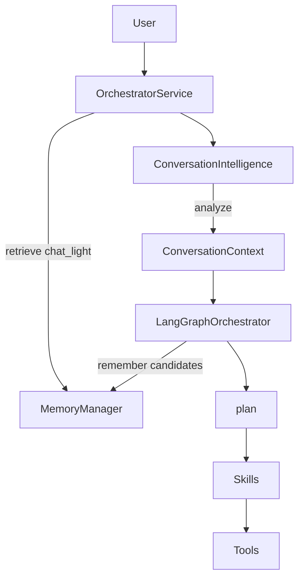

# 19 — Conversation Intelligence Architecture

**Status:** Canonical design (v0.5 Conversation Intelligence revision)  
**Product PRD:** [`docs/PRD_CONVERSATION_INTELLIGENCE.md`](../../PRD_CONVERSATION_INTELLIGENCE.md)

---

## 1. Core philosophy

**Conversation Intelligence interprets communication. It does not execute work.**

Bloggr must feel like a human content strategist: it understands intent, implied meaning, tone, humor, urgency, and appropriate next actions — not only literal commands.

```
User Message
  ↓
Conversation Intelligence Layer
  ↓
Structured ConversationContext
  ↓
LangGraph Orchestrator (plan → skills → tools)
```

| Layer | Owns | Does not own |
|-------|------|--------------|
| **Conversation Intelligence** | Intent, action, affect, ambiguity, mode, initiative, style | Skills, tools, workflows, Mongo belief writes |
| **LangGraph Orchestrator** | Plan, skill select, recovery, human interrupts | Raw NLU / re-classifying communicative intent from scratch |
| **Memory Manager** | Retrieve / remember / summarize | Interpreting user jokes or urgency |
| **Skills** | Domain execution | Conversation orchestration |

**Rejected**

| Approach | Why |
|----------|-----|
| CI as a LangGraph skill peer | Skills execute domain work; CI is infrastructure NLU |
| Intent only inside `plan` | Collapses understanding with workflow policy |
| CI invokes Research/Writing/Optimize | Breaks boundary; CI must only interpret |
| Graph `understand` as sole NLU | Underspecifies communicative vs literal meaning |

---

## 2. High-level architecture



**Turn sequence**

```
User message
  → MemoryManager.retrieve(chat_light)     // for CI context resolution
  → ConversationIntelligence.analyze(...)
  → LangGraph.invoke({ conversation_context, memory_views, ... })
      load_context (enrich **only if** profile ≠ chat_light)
      → plan (consumes ConversationContext; no re-NLU)
      → invoke_skill | compose | await_human | end
      → persist (+ rememberAsync when preferences/feedback)
```

**Retrieve policy:** do not double-fetch identical `chat_light`. See [14](./14-mvp-and-roadmap.md) §2.

The graph **`understand` node is retired**. Clarification is a **plan → compose** path when `requires_clarification` is true.

---

## 3. Public API

```typescript
interface ConversationIntelligence {
  analyze(input: ConversationIntelligenceInput): Promise<ConversationContext>;
}

interface ConversationIntelligenceInput {
  message: string;
  recent_messages?: Array<{ role: "user" | "assistant"; content: string }>;
  conversation_summary?: string;
  memory_views?: MemoryViews;           // chat_light from Memory Manager
  open_artifacts?: {
    draft_id?: string;
    research_package_id?: string;
    optimization_report_id?: string;
  };
  prior_context?: ConversationContext;  // mid-workflow continuity
  workspace_id: string;
  user_id: string;
  thread_id: string;
}
```

Internal stages (not skills): intent classify → action detect → entity/reference resolve → ambiguity → affect (emotion/tone/humor/urgency) → mode → initiative / style.

MVP: **one** structured LLM call (`ci.analyze.v1`) producing the full `ConversationContext`. Post-MVP may split stages.

---

## 4. Communicative categories

| Category | User examples | Expected behavior |
|----------|---------------|-------------------|
| `ask_information` | "How does SEO work?" | Explain; no content workflow |
| `request_action` | "Write a blog post about AI agents." | Start correct workflow; **do not** over-confirm |
| `brainstorm` | "I want to write something about AI." | Start ideation / planning (`strategy`) |
| `provide_feedback` | "This introduction feels boring." | Revise current artifact / Writing revise |
| `update_preferences` | "I prefer shorter articles." | Emit memory candidate; no blog workflow |
| `casual` | Jokes, greetings | Natural reply; no workflow |
| `unknown` | Unclear | Clarify only if blocking |

### Mapping to workflow `Intent`

| Communicative category | Typical `workflow_intent` |
|------------------------|---------------------------|
| `ask_information` | `explain` |
| `request_action` (create) | `create_content` |
| `request_action` (improve) | `optimize_content` / `update_content` |
| `request_action` (research) | `research` |
| `brainstorm` | `strategy` |
| `provide_feedback` | `update_content` |
| `update_preferences` | `update_memory` |
| `casual` | `casual` |
| `unknown` | `unknown` |

Existing `Intent` union remains the skill/workflow routing vocabulary. CI owns communicative meaning and **maps** into `workflow_intent`.

---

## 5. Communicative intent vs literal meaning

Users rarely speak in exact commands. CI must resolve **implied** intent.

| User | Literal | Communicative | System action |
|------|---------|---------------|---------------|
| "We should probably write something about AI agents." | Soft suggestion | Start content planning / create | `request_action` or `brainstorm` → `start_planning` / `start_content_workflow` |
| "This article feels too robotic." | Observation | Rewrite more human | `provide_feedback` → `revise_current_artifact` |
| "I need something for my client presentation tomorrow." | Information | Fast, professional deliverable | Raise `urgency=high`; prefer `quick_draft`; `tone_preference=professional` |
| "Write a blog post about AI agents." | Request | Create blog | `request_action` → start workflow (**not** "you can start writing now") |
| "Haha that headline is wild 😂" | Humor | Casual | `casual`; no workflow |

### Resolution rules

1. Prefer **communicative** over literal when signals conflict.
2. Soft modality ("should", "probably", "maybe we…") + concrete topic + no open question → treat as action/planning, not idle chat.
3. Critique language about an **open draft** → feedback/revise, not a new unrelated create.
4. Deadline / client / presentation cues → raise urgency and prefer shorter paths.
5. Preference language → memory candidates only; do not start Research/Writing.
6. Humor/greeting with no task → casual reply; do not force a workflow.
7. `requires_clarification=true` **only** when a **blocking** slot is missing for an action. Clear action + topic → proceed.

---

## 6. ConversationContext model

Canonical TypeScript (also in [05-state-schema.md](./05-state-schema.md)):

```typescript
type CommunicativeCategory =
  | "ask_information"
  | "request_action"
  | "brainstorm"
  | "provide_feedback"
  | "update_preferences"
  | "casual"
  | "unknown";

type ConversationMode =
  | "information"
  | "creation"
  | "planning"
  | "editing"
  | "feedback"
  | "casual";

type SuggestedNextAction =
  | "explain"
  | "start_content_workflow"
  | "start_planning"
  | "revise_current_artifact"
  | "emit_memory_candidate"
  | "casual_reply"
  | "clarify";

interface ConversationEntity {
  type: "topic" | "blog_id" | "url" | "audience" | "channel" | "other";
  value: string;
  confidence: number;
}

interface ConversationContext {
  communicative_category: CommunicativeCategory;
  workflow_intent: Intent; // existing Intent union
  confidence: number;
  action_required: boolean;
  conversation_mode: ConversationMode;
  emotional_state?: string;
  humor_detected: boolean;
  tone_preference: "casual" | "professional" | "technical" | "friendly";
  urgency?: "low" | "normal" | "high";
  entities: ConversationEntity[];
  references_previous_context: boolean;
  requires_clarification: boolean;
  clarification_question?: string;
  suggested_next_action: SuggestedNextAction;
  response_style: {
    brevity: "short" | "normal" | "detailed";
    formality: "casual" | "neutral" | "formal";
    initiative: "passive" | "suggest" | "lead";
  };
  slots_patch: Partial<DialogueSlots>;
  literal_interpretation?: string;
  communicative_rationale?: string;
}
```

### Deprecation

`UnderstandResult` is **absorbed**. During migration, adapters may map `ConversationContext` → legacy `UnderstandResult` shape. New code reads `conversation_context` only.

---

## 7. Initiative and response style

| Situation | `initiative` | Behavior |
|-----------|--------------|----------|
| Clear create request with topic | `lead` | Start workflow; brief acknowledgment |
| Vague brainstorm | `suggest` | Offer angles; start Strategy |
| Casual joke | `passive` | Match tone; no upsell of workflows |
| High urgency | `lead` + `brevity=short` | Prefer quick_draft; less ceremony |
| Preference update | `suggest` | Confirm preference; enqueue memory candidate |

Compose / Conversation skill must honor `response_style` and `tone_preference`.

---

## 8. Orchestrator handoff

`plan` **consumes** `ConversationContext` and applies policies:

| `suggested_next_action` | Plan tendency |
|-------------------------|---------------|
| `explain` / `casual_reply` | `compose` (Conversation skill) |
| `clarify` | `compose` with `clarification_question` |
| `start_content_workflow` | Pipeline or quick_draft skills |
| `start_planning` | ContentStrategy |
| `revise_current_artifact` | Writing revise / Content Optimization |
| `emit_memory_candidate` | Compose ack + enqueue `memory_candidates` |

Plan must **not** re-run full communicative classification. It may adjust skill choice for policy (destructive confirm, optimize loop caps) using CI fields as priors.

---

## 9. Memory interaction

- CI calls `MemoryManager.retrieve(chat_light)` (via turn entry or injected views) for brand/prefs/open refs.
- `update_preferences` / durable feedback patterns → candidates for Memory Manager (`rememberAsync`).
- CI **never** writes Mongo beliefs or calls `workspace.updateMemory` directly.

See [18-memory-manager.md](./18-memory-manager.md).

---

## 10. Folder structure

```
orchestrator/ai/conversation-intelligence/
  conversation-intelligence.ts       # public analyze API
  pipeline/
    intent.ts
    action.ts
    affect.ts
    ambiguity.ts
    initiative.ts
  models/conversation-context.ts
```

Prompts live in catalog / `ai/prompts/` as `ci.analyze.v1` (see [11](./11-prompts-and-context.md)).

**Migration:** wrap cognition `ConversationService` / dialogue models as adapters behind CI — not a parallel NLU brain.

---

## 11. Prompts

| Id | Role |
|----|------|
| `ci.analyze.v1` | Primary structured output → `ConversationContext` |
| `ci.affect.v1` | Post-MVP optional split |
| `ci.initiative.v1` | Post-MVP optional split |

`orchestrator.understand.v1` → **absorbed**; thin shim during migration only.

---

## 12. Observability

Events: `ci.analyze` with `communicative_category`, `workflow_intent`, `confidence`, `suggested_next_action`, `requires_clarification`, latency.

Do not log full message bodies with PII by default in production.

---

## 13. MVP vs post-MVP

**MVP**

- Single structured `analyze`
- Communicative categories + Intent mapping
- Humor / urgency / tone / response_style fields
- Action vs casual vs clarify rules
- Replace graph `understand` in architecture
- Plan prompts consume `ConversationContext`

**Post-MVP**

- Multi-stage CI pipeline
- Richer affect models
- Proactive initiative (calendars, content gaps)
- Voice-specific CI profiles

---

## 14. Trade-offs

| Choice | Trade-off |
|--------|-----------|
| CI before graph | Extra LLM call per turn; clearer separation |
| One analyze call (MVP) | Simpler; less specialized affect accuracy |
| Keep Intent mapping | Dual vocabulary; avoids rewriting all skill routers |

---

## Related

- PRD: [`PRD_CONVERSATION_INTELLIGENCE.md`](../../PRD_CONVERSATION_INTELLIGENCE.md)
- Graph: [04-langgraph-workflow.md](./04-langgraph-workflow.md)
- State: [05-state-schema.md](./05-state-schema.md)
- Prompts: [11-prompts-and-context.md](./11-prompts-and-context.md)
- Memory: [18-memory-manager.md](./18-memory-manager.md)
