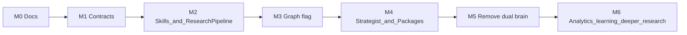

# MIGRATION — Current Dual Stack → Research Package Target

## 1. Starting point

| Path | Role today |
|------|------------|
| LLM Supervisor (`OrchestratorGraphService`) | Default chat brain; tools |
| Cognition (`CognitionTurnUseCase`) | Alternate brain behind `COGNITION_ENABLED` |
| Blog LangGraph | `validate → research → draft → review` with embedded Tavily |
| Workspace memory + context packs | Shared, production-ready |

**Target:** one LangGraph orchestrator + skills + tools + **Memory Manager** + **Conversation Intelligence** (pre-graph). Research Packages; Content Optimization; Writing never searches. Orchestrator never writes belief Mongo directly. Cognition ConversationService absorbed into CI. Supervisor removed after parity.

---

## 2. Principles of migration

1. **Strangler fig** — new graph behind flag; old path remains until parity.
2. **Reuse before rewrite** — wrap blog draft/review, Tavily under Research, memory ports.
3. **Contracts first** — `ResearchPackage` Zod before behavior flips.
4. **Do not finish cognition scaffolds** — delete empties; port useful logic.
5. **Kill writer-side search** — new paths must not call Tavily from Writing / `blogs.generateDraft` internals.
6. **Replace Review with Content Optimization** — stage `optimize`; retire `ReviewArtifact`.
7. **Memory Manager** — wrap extraction/digests/Qdrant; deprecate direct `workspace.updateMemory` from graph.
8. **Conversation Intelligence** — pre-graph NLU; retire graph `understand`; wrap cognition ConversationService.
9. **Docs update with code** — [16](./16-research-pipeline.md), [17](./17-content-optimization.md), [18](./18-memory-manager.md), [19](./19-conversation-intelligence.md).

---

## 3. Phase map

### M0 — Docs

Docs freeze incl. ICP. Exit: sign-off on [16](./16-research-pipeline.md)–[20](./20-go-to-market-architecture.md), MVP locks in [14](./14-mvp-and-roadmap.md), PRDs, prompts in [11](./11-prompts-and-context.md).

### M1 — Contracts

- `ResearchPackage`, `ContentOptimizationReport`, `MemoryRecord` / `MemoryCandidate`, `ConversationContext`
- OrchestratorState: package/optimize refs + `memory_views` / `memory_candidates` + `conversation_context`
- Exit: schema tests; provenance + score + memory importance invariants

### M2 — Skills + Research + Optimization pipelines

- Nested research + optimization pipelines
- Memory Manager facade wrapping existing memory services
- Conversation Intelligence facade; map cognition ConversationService as adapter
- Persist packages + optimization reports + memory_records
- Writing without search; wrap review runner as temporary adapter
- Exit: unit tests; retrieve/rememberAsync staging

### M3 — LangGraph orchestrator behind flag

- Wire nodes; flag routing; CI.analyze → load_context → plan (no understand)
- quick_draft = Research lite → Writing → Content Optimization → rememberAsync
- Exit: parity checklist in [14](./14-mvp-and-roadmap.md)

### M4 — Strategist + package + scorecard UX

- Full pipeline; coverage/contradictions + SEO/GAO scores in chat (Package panel visible)
- Retire blog graph embedded research; retire Review skill id
- Supervisor fallback still allowed
- Exit: staging demo with streamed research + optimize phases

### M5 — Remove dual brain

- Default flag on; delete cognition + supervisor
- Exit: single chat brain

### M6 — Analytics + learning + deeper research

- Closed loops; selective full-page fetch; optional HITL on low coverage

---

## 4. Feature flag matrix

| Flag | Meaning |
|------|---------|
| `COGNITION_ENABLED=true` | Legacy alternate brain (retire M5) |
| `LANGGRAPH_ORCHESTRATOR_ENABLED=true` | New graph (M3+) |
| both true | **Forbidden** — boot check |

---

## 5. Data migration

| Data | Action |
|------|--------|
| WorkspaceMemory | Evolve via Memory Manager; dual-write OK during migration |
| New `memory_records` | Create for preference/knowledge/learning/intelligence |
| Threads/messages | None |
| Cognition Redis checkpoints | Ignore; new `orch:ckpt:` keys |
| Blog drafts | None |
| Approvals | Keep confirmation shape |
| Research | **New** `research_packages` documents; no backfill required |

---

## 6. Mapping old behaviors → new

| Old behavior | New home |
|--------------|----------|
| `blogs.generateDraft` (search inside) | Research (`lite`/`full`) → Writing |
| Blog graph `research` node | Research pipeline Phases 4–6 |
| Flat research notes in draft prompt | Research Package slices |
| `next: request_confirmation` | `await_human` |
| Cognition content-writing | Writing skill |
| Cognition research (unwired) | Research skill (wired, nested graph) |
| Writing oneshot with embedded review | Writing draft + Content Optimization |
| Review skill / ReviewArtifact | `content_optimization` / ContentOptimizationReport |
| Combined SEO+GAO as vague scores | Scorecards + Optimization Planner ([17](./17-content-optimization.md)) |
| Direct WorkspaceMemory patches / context-pack calls | Memory Manager retrieve/remember ([18](./18-memory-manager.md)) |
| Graph `understand` / cognition regex goals | Conversation Intelligence ([19](./19-conversation-intelligence.md)) |
| Four thin memory ports | Six layers + artifact store behind MM |

---

## 7. Rollback

`LANGGRAPH_ORCHESTRATOR_ENABLED=false` → supervisor. Do not re-enable cognition as a third brain.

---

## 8. Success metrics

- p95 chat-ops latency ≤ current + 20%
- Zero duplicate drafts per intent
- Zero Writing tool calls to `search.web`
- Research coverage_score logged per package
- Optimization gate_pass_rate and overall score logged
- Zero Critical items on published posts when gate enforced
- Strategist completion rate + cost per article within budget

---

## 9. Related docs

- [16-research-pipeline.md](./16-research-pipeline.md)
- [17-content-optimization.md](./17-content-optimization.md)
- [18-memory-manager.md](./18-memory-manager.md)
- [19-conversation-intelligence.md](./19-conversation-intelligence.md)
- [PRD_CONTENT_OPTIMIZATION.md](../../PRD_CONTENT_OPTIMIZATION.md)
- [PRD_MEMORY_SYSTEM.md](../../PRD_MEMORY_SYSTEM.md)
- [PRD_CONVERSATION_INTELLIGENCE.md](../../PRD_CONVERSATION_INTELLIGENCE.md)
- [14-mvp-and-roadmap.md](./14-mvp-and-roadmap.md)
- [15-file-inventory.md](./15-file-inventory.md)
- [11-prompts-and-context.md](./11-prompts-and-context.md)
- Legacy: [BLOG_REVIEW_IMPLEMENTATION_SPEC.md](../../BLOG_REVIEW_IMPLEMENTATION_SPEC.md) (superseded for new paths)
